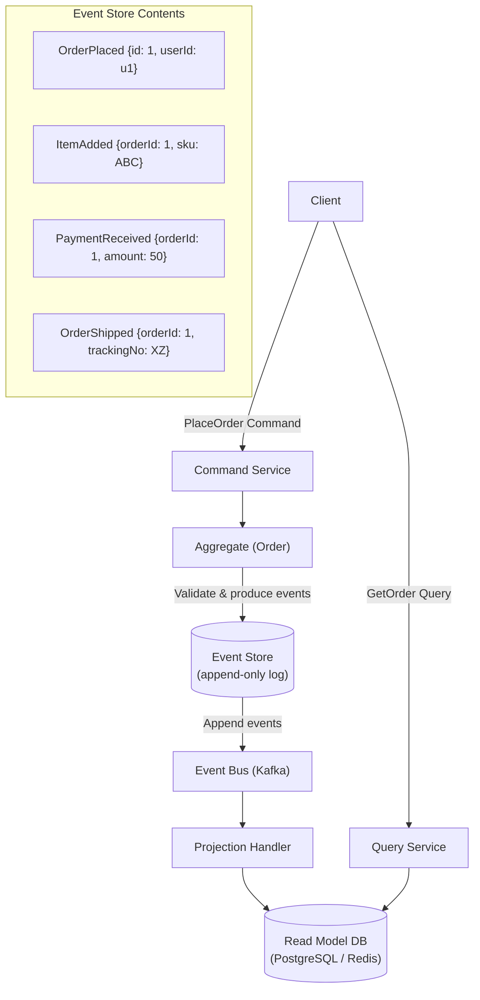

# Event Sourcing

## Category
Architectural, Data Management, Auditability

## Context

Event Sourcing is a data persistence pattern where instead of storing only the **current state** of an entity, the system stores a **sequence of events** that describe every change that has happened to that entity. The current state is derived by **replaying** all past events.

For example, a bank account stores "DepositMade(+100)", "WithdrawalMade(-30)" rather than just "balance: 70". Event Sourcing is often paired with CQRS; the event log is the write model, and projections build the read model.

---

## Pros

- **Complete audit trail**: Every state change is recorded as an immutable event — perfect for regulatory compliance and debugging.
- **Time travel**: Reconstruct the state of any entity at any point in history.
- **Event replay**: Rebuild read models or fix bugs by replaying events through corrected logic.
- **Natural integration with messaging**: Events are already published; other services can subscribe to them.
- **Append-only writes**: No UPDATE/DELETE — eliminates a class of concurrency bugs.
- **Supports multiple projections**: Same event stream can power dashboards, reports, and search indexes.

---

## Cons

- **Complexity**: Significantly more complex than traditional CRUD storage.
- **Eventual consistency**: Read models are updated asynchronously.
- **Event schema evolution**: Changing event schemas while maintaining backward compatibility is challenging.
- **Snapshots required**: For aggregates with many events, replaying all events on every read is expensive — snapshots must be periodically taken.
- **Querying the event store is hard**: Querying by state (e.g., "find all orders with status=PENDING") requires projections.
- **Steep learning curve**: Requires a significant shift in how developers think about data.

---

## Design Diagram



---

## Code Sample

### Event Definitions (TypeScript)

```typescript
// events/order.events.ts
export interface DomainEvent {
  eventId: string;
  aggregateId: string;
  eventType: string;
  version: number;
  timestamp: string;
  payload: unknown;
}

export interface OrderPlacedEvent extends DomainEvent {
  eventType: 'OrderPlaced';
  payload: { userId: string; items: OrderItem[] };
}

export interface OrderShippedEvent extends DomainEvent {
  eventType: 'OrderShipped';
  payload: { trackingNumber: string };
}
```

### Order Aggregate

```typescript
// aggregates/order.aggregate.ts
export class Order {
  private events: DomainEvent[] = [];

  id!: string;
  userId!: string;
  status!: 'PENDING' | 'PAID' | 'SHIPPED' | 'CANCELLED';
  items: OrderItem[] = [];
  version = 0;

  static rehydrate(events: DomainEvent[]): Order {
    const order = new Order();
    for (const event of events) {
      order.apply(event);
    }
    return order;
  }

  placeOrder(userId: string, items: OrderItem[]): void {
    const event: OrderPlacedEvent = {
      eventId: crypto.randomUUID(),
      aggregateId: crypto.randomUUID(),
      eventType: 'OrderPlaced',
      version: this.version + 1,
      timestamp: new Date().toISOString(),
      payload: { userId, items },
    };
    this.apply(event);
    this.events.push(event);
  }

  private apply(event: DomainEvent): void {
    switch (event.eventType) {
      case 'OrderPlaced':
        const e = event as OrderPlacedEvent;
        this.id = event.aggregateId;
        this.userId = e.payload.userId;
        this.items = e.payload.items;
        this.status = 'PENDING';
        break;
      case 'OrderShipped':
        this.status = 'SHIPPED';
        break;
    }
    this.version = event.version;
  }

  getPendingEvents(): DomainEvent[] {
    return [...this.events];
  }

  clearPendingEvents(): void {
    this.events = [];
  }
}
```

### Event Store (PostgreSQL-backed)

```typescript
// stores/event.store.ts
import { Pool } from 'pg';

export class EventStore {
  constructor(private readonly db: Pool) {}

  async appendEvents(
    aggregateId: string,
    events: DomainEvent[],
    expectedVersion: number
  ): Promise<void> {
    const client = await this.db.connect();
    try {
      await client.query('BEGIN');
      for (const event of events) {
        await client.query(
          `INSERT INTO events (event_id, aggregate_id, event_type, version, payload, timestamp)
           VALUES ($1, $2, $3, $4, $5, $6)`,
          [
            event.eventId,
            aggregateId,
            event.eventType,
            event.version,
            JSON.stringify(event.payload),
            event.timestamp,
          ]
        );
      }
      await client.query('COMMIT');
    } catch (err) {
      await client.query('ROLLBACK');
      throw err;
    } finally {
      client.release();
    }
  }

  async loadEvents(aggregateId: string): Promise<DomainEvent[]> {
    const { rows } = await this.db.query(
      'SELECT * FROM events WHERE aggregate_id = $1 ORDER BY version ASC',
      [aggregateId]
    );
    return rows.map((row) => ({
      eventId: row.event_id,
      aggregateId: row.aggregate_id,
      eventType: row.event_type,
      version: row.version,
      payload: row.payload,
      timestamp: row.timestamp,
    }));
  }
}
```

### Event Store Schema (SQL)

```sql
CREATE TABLE events (
  event_id      UUID        PRIMARY KEY,
  aggregate_id  UUID        NOT NULL,
  event_type    VARCHAR(100) NOT NULL,
  version       INT         NOT NULL,
  payload       JSONB       NOT NULL,
  timestamp     TIMESTAMPTZ NOT NULL DEFAULT NOW(),
  UNIQUE (aggregate_id, version)
);

CREATE INDEX idx_events_aggregate_id ON events (aggregate_id);
```

## Related Patterns

- [04 — CQRS](./04-cqrs.md) — Event Sourcing is the write model; CQRS builds the read projections
- [33 — CQRS + Event Sourcing Combined](./33-cqrs-event-sourcing-combined.md) — The canonical combined pattern
- [16 — Outbox Pattern](./16-outbox-pattern.md) — Outbox + CDC is an alternative to event sourcing for simpler systems
- [28 — Change Data Capture](./28-change-data-capture.md) — CDC can drive projections from relational stores
```
