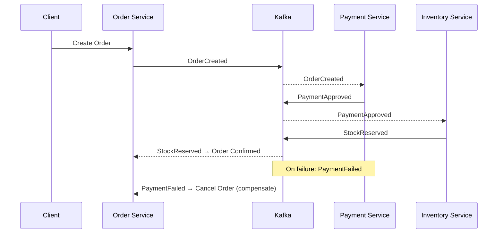
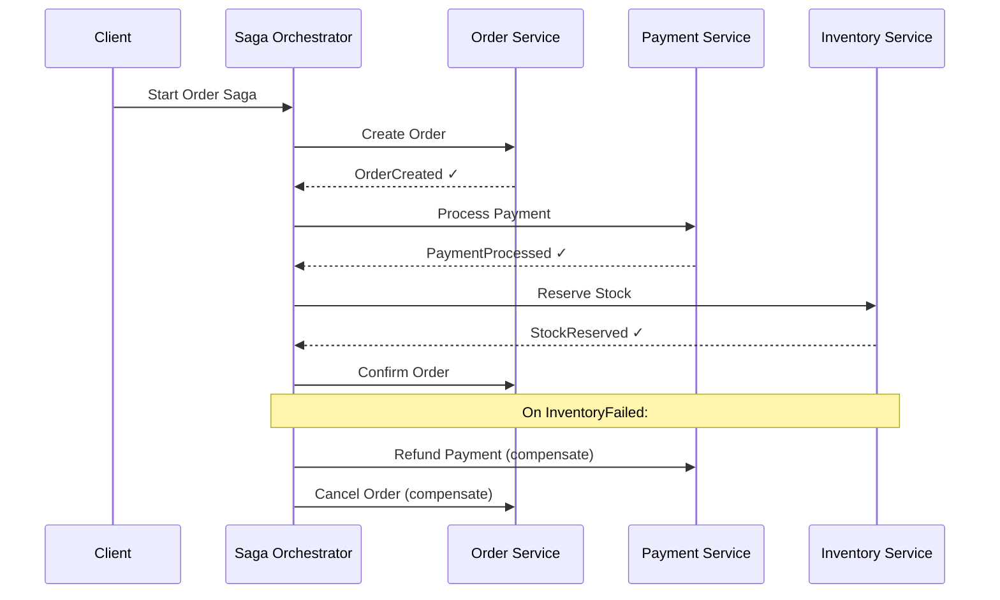

# Saga Pattern

## Category
Architectural, Data Management, Distributed Transactions, Resilience

## Context

The Saga pattern manages **data consistency across multiple microservices** without using distributed transactions (2PC). A saga is a sequence of local transactions, each publishing an event or message that triggers the next step. If any step fails, compensating transactions are executed to undo the work of previous steps.

There are two implementation approaches:
- **Choreography**: Each service listens to events and decides what to do next (decentralized).
- **Orchestration**: A central saga orchestrator tells each service what to do (centralized).

---

## Pros

- **No distributed locks**: Avoids the performance and availability problems of two-phase commit.
- **Works with polyglot persistence**: Each service can use its own database technology.
- **Resilience**: Compensating transactions ensure the system can recover from failures.
- **Scalability**: Asynchronous, event-driven communication enables high scalability.
- **Loose coupling (choreography)**: Services react to events without a central coordinator.

---

## Cons

- **Eventual consistency**: Data is not immediately consistent across services.
- **Compensating transactions complexity**: Designing and testing rollback logic is complex.
- **Hard to debug**: Tracing a saga across multiple services requires distributed tracing.
- **Idempotency required**: Consumers must handle duplicate events gracefully.
- **Orchestration creates a single point of coordinating logic**: The orchestrator can become a bottleneck or single point of failure.
- **No isolation**: Intermediate states are visible to other transactions (no "I" in ACID).

---

## Design Diagram

### Choreography-based Saga



### Orchestration-based Saga



---

## Code Sample

### Saga Orchestrator (TypeScript)

```typescript
// sagas/order.saga.ts
enum SagaState {
  STARTED = 'STARTED',
  ORDER_CREATED = 'ORDER_CREATED',
  PAYMENT_PROCESSED = 'PAYMENT_PROCESSED',
  STOCK_RESERVED = 'STOCK_RESERVED',
  COMPLETED = 'COMPLETED',
  COMPENSATING = 'COMPENSATING',
  FAILED = 'FAILED',
}

interface SagaContext {
  sagaId: string;
  orderId: string;
  userId: string;
  amount: number;
  state: SagaState;
}

export class OrderSagaOrchestrator {
  constructor(
    private readonly orderSvc: OrderServiceClient,
    private readonly paymentSvc: PaymentServiceClient,
    private readonly inventorySvc: InventoryServiceClient,
    private readonly sagaStore: SagaStore
  ) {}

  async execute(input: { userId: string; items: OrderItem[]; amount: number }): Promise<void> {
    const ctx: SagaContext = {
      sagaId: crypto.randomUUID(),
      orderId: '',
      userId: input.userId,
      amount: input.amount,
      state: SagaState.STARTED,
    };

    try {
      // Step 1: Create order
      ctx.orderId = await this.orderSvc.createOrder(input.userId, input.items);
      ctx.state = SagaState.ORDER_CREATED;
      await this.sagaStore.save(ctx);

      // Step 2: Process payment
      await this.paymentSvc.processPayment(ctx.orderId, input.amount);
      ctx.state = SagaState.PAYMENT_PROCESSED;
      await this.sagaStore.save(ctx);

      // Step 3: Reserve inventory
      await this.inventorySvc.reserveStock(ctx.orderId, input.items);
      ctx.state = SagaState.STOCK_RESERVED;
      await this.sagaStore.save(ctx);

      // Success
      await this.orderSvc.confirmOrder(ctx.orderId);
      ctx.state = SagaState.COMPLETED;
      await this.sagaStore.save(ctx);
    } catch (err) {
      await this.compensate(ctx);
    }
  }

  private async compensate(ctx: SagaContext): Promise<void> {
    ctx.state = SagaState.COMPENSATING;
    await this.sagaStore.save(ctx);

    if (ctx.state >= SagaState.PAYMENT_PROCESSED) {
      await this.paymentSvc.refundPayment(ctx.orderId).catch(console.error);
    }
    if (ctx.state >= SagaState.ORDER_CREATED) {
      await this.orderSvc.cancelOrder(ctx.orderId).catch(console.error);
    }

    ctx.state = SagaState.FAILED;
    await this.sagaStore.save(ctx);
  }
}
```

### Choreography — Compensating Event Consumer (Node.js)

```javascript
// payment-service/consumers/payment-failed.consumer.js
consumer.run({
  eachMessage: async ({ message }) => {
    const event = JSON.parse(message.value.toString());
    if (event.type === 'InventoryReservationFailed') {
      // Compensate: refund the payment
      await PaymentRepository.refund(event.orderId);
      await producer.send({
        topic: 'payment.refunded',
        messages: [{ value: JSON.stringify({ type: 'PaymentRefunded', orderId: event.orderId }) }],
      });
    }
  },
});
```
## Related Patterns

- [16 — Outbox Pattern](./16-outbox-pattern.md) — Reliable event publication for each saga step
- [27 — Two-Phase Commit](./27-two-phase-commit.md) — Alternative strong-consistency approach (with blocking trade-off)
- [03 — Event-Driven Architecture](./03-event-driven-architecture.md) — Choreography-style sagas use EDA as the backbone
- [32 — Anti-Corruption Layer](./32-anti-corruption-layer.md) — Translate domain models at saga boundaries