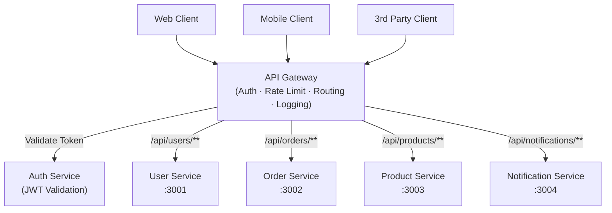

# API Gateway Pattern

## Category
Architectural, Security, Performance, Scalability

## Context

An API Gateway is a single entry point for all client requests to a microservices backend. It acts as a reverse proxy, routing requests to the appropriate downstream service, and can also provide cross-cutting concerns such as authentication, rate limiting, SSL termination, request/response transformation, caching, and observability.

Common implementations: AWS API Gateway, Kong, NGINX, Traefik, Envoy, Spring Cloud Gateway.

---

## Pros

- **Single entry point**: Clients talk to one address; internal topology is hidden.
- **Cross-cutting concerns in one place**: Auth, rate limiting, logging, tracing — implemented once, applied everywhere.
- **SSL/TLS termination**: Offloads encryption overhead from individual services.
- **Protocol translation**: Convert REST to gRPC, WebSocket, or GraphQL.
- **Request aggregation**: Combine results from multiple services in a single response.
- **Versioning**: Manage multiple API versions without changing downstream services.

---

## Cons

- **Single point of failure**: Must be highly available and fault-tolerant.
- **Potential bottleneck**: All traffic passes through; gateway must be capable of handling peak load.
- **Increased latency**: Additional network hop for every request.
- **Complexity**: Gateway configuration and maintenance adds operational burden.
- **Risk of overloading responsibilities**: Putting too much business logic in the gateway creates a new monolith.

---

## Design Diagram



---

## Code Sample

### Custom API Gateway (Node.js / http-proxy-middleware)

```javascript
// gateway/src/index.js
const express = require('express');
const { createProxyMiddleware } = require('http-proxy-middleware');
const rateLimit = require('express-rate-limit');
const jwt = require('jsonwebtoken');

const app = express();

// --- Rate Limiting ---
const limiter = rateLimit({
  windowMs: 60 * 1000, // 1 minute
  max: 100,
  message: { error: 'Too many requests' },
});
app.use(limiter);

// --- JWT Authentication Middleware ---
function authenticate(req, res, next) {
  const token = req.headers['authorization']?.split(' ')[1];
  if (!token) return res.status(401).json({ error: 'Unauthorized' });
  try {
    req.user = jwt.verify(token, process.env.JWT_SECRET);
    next();
  } catch {
    res.status(401).json({ error: 'Invalid token' });
  }
}

// --- Request Logging ---
app.use((req, _res, next) => {
  console.log(`[${new Date().toISOString()}] ${req.method} ${req.path}`);
  next();
});

// --- Routing ---
app.use(
  '/api/users',
  authenticate,
  createProxyMiddleware({ target: 'http://user-service:3001', changeOrigin: true })
);

app.use(
  '/api/orders',
  authenticate,
  createProxyMiddleware({ target: 'http://order-service:3002', changeOrigin: true })
);

app.use(
  '/api/products',
  createProxyMiddleware({ target: 'http://product-service:3003', changeOrigin: true })
);

app.listen(8080, () => console.log('API Gateway running on port 8080'));
```

### Kong Gateway declarative config (kong.yml)

```yaml
_format_version: "3.0"

services:
  - name: user-service
    url: http://user-service:3001
    routes:
      - name: user-routes
        paths: ["/api/users"]
    plugins:
      - name: jwt
      - name: rate-limiting
        config:
          minute: 100

  - name: order-service
    url: http://order-service:3002
    routes:
      - name: order-routes
        paths: ["/api/orders"]
    plugins:
      - name: jwt
      - name: rate-limiting
        config:
          minute: 50
```

### NGINX Reverse Proxy Config

```nginx
upstream user_service   { server user-service:3001; }
upstream order_service  { server order-service:3002; }
upstream product_service { server product-service:3003; }

server {
    listen 80;

    location /api/users/ {
        proxy_pass http://user_service/;
        proxy_set_header Authorization $http_authorization;
    }

    location /api/orders/ {
        proxy_pass http://order_service/;
        proxy_set_header Authorization $http_authorization;
    }

    location /api/products/ {
        proxy_pass http://product_service/;
    }
}
```
