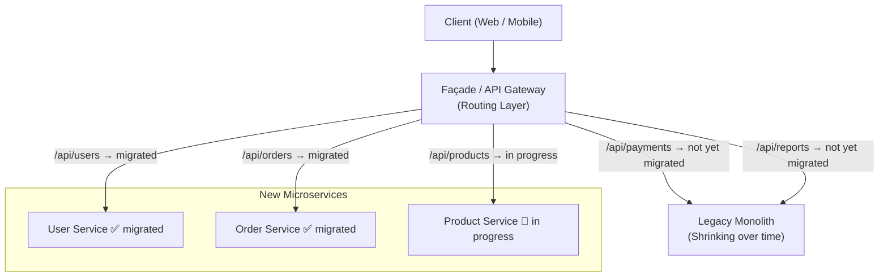

# Strangler Fig Pattern

## Category
Architectural, Migration, Maintainability

## Context

The Strangler Fig pattern is a migration strategy for incrementally replacing a legacy monolithic system with a new architecture (typically microservices) without a risky "big bang" rewrite. The new system grows around the old system, gradually taking over functionality feature by feature, until the old system can be safely retired — just as a strangler fig tree grows around and eventually replaces its host tree.

A **façade** (often an API Gateway or reverse proxy) intercepts all traffic and routes requests to either the legacy system or the new services.

---

## Pros

- **Low migration risk**: Incremental approach — the system remains operational throughout.
- **Continuous delivery**: New features can be built in the new system while the old one still runs.
- **Rollback capability**: If a new service has issues, traffic can be redirected back to the legacy system.
- **Team learning**: Teams learn microservices gradually rather than all at once.
- **Measurable progress**: Each migrated feature is a clear milestone.

---

## Cons

- **Dual maintenance overhead**: Both old and new systems must be maintained during migration.
- **Complex routing logic**: The façade can grow complex as routing rules multiply.
- **Data synchronization**: Both systems may need to share or synchronize their databases temporarily.
- **Long transition period**: Migration can take years for large systems.
- **Integration debt**: Integration between old and new parts can create hidden coupling.

---

## Design Diagram



---

## Code Sample

### Routing Façade (Node.js / Express)

```typescript
// facade/src/index.ts
import express from 'express';
import { createProxyMiddleware } from 'http-proxy-middleware';

const app = express();

const LEGACY_URL    = 'http://legacy-monolith:8080';
const NEW_USER_SVC  = 'http://user-service:3001';
const NEW_ORDER_SVC = 'http://order-service:3002';

// Migrated: route to new microservices
app.use('/api/users',  createProxyMiddleware({ target: NEW_USER_SVC,  changeOrigin: true }));
app.use('/api/orders', createProxyMiddleware({ target: NEW_ORDER_SVC, changeOrigin: true }));

// Not yet migrated: route to legacy system
app.use('/api/payments', createProxyMiddleware({ target: LEGACY_URL, changeOrigin: true }));
app.use('/api/reports',  createProxyMiddleware({ target: LEGACY_URL, changeOrigin: true }));

// Catch-all: legacy handles everything else
app.use('/', createProxyMiddleware({ target: LEGACY_URL, changeOrigin: true }));

app.listen(80, () => console.log('Strangler façade running on port 80'));
```

### Migration Tracker (simple config-driven approach)

```typescript
// facade/src/migration-config.ts
export const routeConfig: RouteConfig[] = [
  { path: '/api/users',    target: 'http://user-service:3001',  migrated: true },
  { path: '/api/orders',   target: 'http://order-service:3002', migrated: true },
  { path: '/api/products', target: 'http://product-service:3003', migrated: false }, // In progress
  { path: '/api/payments', target: 'http://legacy:8080',         migrated: false },
];

// facade/src/router.ts
import { routeConfig } from './migration-config';

const LEGACY_URL = 'http://legacy:8080';

export function buildRouter(app: Express) {
  for (const route of routeConfig) {
    const target = route.migrated ? route.target : LEGACY_URL;
    app.use(route.path, createProxyMiddleware({ target, changeOrigin: true }));
  }
}
```

### Data Synchronization (during transition)

```typescript
// During transition: dual-write to both legacy DB and new service DB
interface UserData { name: string; email: string; }
interface NewUser  { id: number; name: string; email: string; }

declare const newUserService: { create(data: UserData): Promise<NewUser> };
declare const legacyDB:       { query(sql: string, params: unknown[]): Promise<void> };

async function createUser(userData: UserData): Promise<NewUser> {
  // Write to new service first (source of truth going forward)
  const newUser = await newUserService.create(userData);

  // Sync to legacy DB for backward compatibility
  await legacyDB.query(
    'INSERT INTO users (id, name, email) VALUES (?, ?, ?)',
    [newUser.id, newUser.name, newUser.email],
  );

  return newUser;
}
```

## Related Patterns

- [32 — Anti-Corruption Layer](./32-anti-corruption-layer.md) — Translate between legacy and new domain models during migration
- [07 — API Gateway](./07-api-gateway.md) — Route traffic to old vs new system during migration
- [02 — Monolithic Architecture](./02-monolithic.md) — The starting point of a strangler fig migration
- [01 — Microservices](./01-microservices.md) — The target architecture after strangler fig migration
