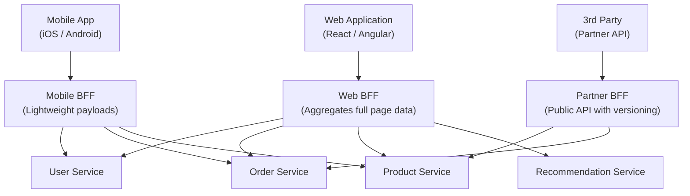

# Backends for Frontends (BFF)

## Category
Architectural, Performance, API Design

## Context

Backends for Frontends (BFF) is an architectural pattern that creates **separate backend services for each type of frontend client** (web, mobile, third-party). Each BFF is tailored to the specific needs of its client — aggregating and transforming data from multiple downstream microservices into the exact shape required, without over-fetching or under-fetching.

This pattern was popularized by SoundCloud and described by Sam Newman. It solves the "one-size-fits-all" API problem where a single generic API struggles to serve the different requirements of diverse clients.

---

## Pros

- **Optimized API contracts**: Each BFF returns exactly what its client needs — no more, no less.
- **Team autonomy**: Each frontend team can own and evolve their BFF independently.
- **Client-specific optimizations**: Mobile BFF can reduce payload size; web BFF can aggregate more data.
- **Security isolation**: Different authentication strategies per client type (cookie-based for web, token-based for mobile).
- **Faster iteration**: Frontend teams can change their BFF without coordinating with other frontend teams.
- **Simplified downstream services**: Core services don't need to handle client-specific concerns.

---

## Cons

- **Code duplication**: Similar aggregation logic may be duplicated across multiple BFFs.
- **More services to maintain**: Each BFF is an additional deployable unit.
- **Risk of coupling**: BFFs can become tightly coupled to specific frontend views.
- **Coordination still needed**: Common logic changes in downstream services still affect all BFFs.
- **Infrastructure overhead**: More services mean more deployments, monitoring, and scaling configurations.

---

## Design Diagram



---

## Code Sample

### Web BFF — Dashboard aggregation (Node.js / Express)

```javascript
// web-bff/src/routes/dashboard.js
const express = require('express');
const axios = require('axios');
const router = express.Router();

// Web needs full dashboard data in one request
router.get('/dashboard', async (req, res) => {
  const userId = req.user.id;

  const [user, recentOrders, recommendations, notifications] = await Promise.all([
    axios.get(`http://user-service/users/${userId}`),
    axios.get(`http://order-service/orders?userId=${userId}&limit=5`),
    axios.get(`http://recommendation-service/recommendations?userId=${userId}`),
    axios.get(`http://notification-service/notifications?userId=${userId}&unreadOnly=true`),
  ]);

  // Compose full web dashboard payload
  res.json({
    user: user.data,
    recentOrders: recentOrders.data,
    recommendations: recommendations.data,
    unreadNotifications: notifications.data,
  });
});

module.exports = router;
```

### Mobile BFF — Lightweight response (Node.js / Express)

```javascript
// mobile-bff/src/routes/home.js
const express = require('express');
const axios = require('axios');
const router = express.Router();

// Mobile needs a minimal payload to save bandwidth and battery
router.get('/home', async (req, res) => {
  const userId = req.user.id;

  const [user, orders] = await Promise.all([
    axios.get(`http://user-service/users/${userId}`),
    axios.get(`http://order-service/orders?userId=${userId}&limit=3`),
  ]);

  // Light response: only fields the mobile app needs
  res.json({
    name: user.data.firstName,
    avatarUrl: user.data.avatarUrl,
    activeOrders: orders.data.map(o => ({
      id: o.id,
      status: o.status,
      summary: o.itemCount + ' item(s)',
    })),
  });
});

module.exports = router;
```

### TypeScript BFF with type-safe contracts

```typescript
// web-bff/src/types/dashboard.ts
export interface DashboardResponse {
  user: { id: string; name: string; email: string };
  recentOrders: OrderSummary[];
  recommendations: Product[];
  unreadNotifications: number;
}

// web-bff/src/services/dashboard.service.ts
import axios from 'axios';
import { DashboardResponse } from '../types/dashboard';

export async function buildDashboard(userId: string): Promise<DashboardResponse> {
  const [userRes, ordersRes, recsRes, notifRes] = await Promise.allSettled([
    axios.get(`${process.env.USER_SVC}/users/${userId}`),
    axios.get(`${process.env.ORDER_SVC}/orders?userId=${userId}&limit=5`),
    axios.get(`${process.env.REC_SVC}/recommendations?userId=${userId}`),
    axios.get(`${process.env.NOTIF_SVC}/notifications?userId=${userId}&unreadOnly=true`),
  ]);

  return {
    user: userRes.status === 'fulfilled' ? userRes.value.data : null,
    recentOrders: ordersRes.status === 'fulfilled' ? ordersRes.value.data : [],
    recommendations: recsRes.status === 'fulfilled' ? recsRes.value.data : [],
    unreadNotifications: notifRes.status === 'fulfilled' ? notifRes.value.data.length : 0,
  };
}
```
