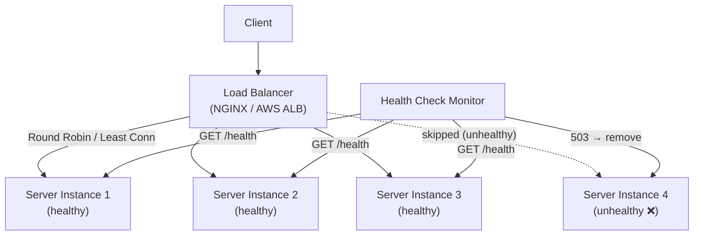

# Load Balancing

## Category
Scalability, Availability, Performance

## Context

Load balancing distributes incoming network traffic across multiple servers or service instances to ensure no single server becomes a bottleneck. A load balancer sits between clients and a pool of backend servers, forwarding each request to an appropriate server according to a configured algorithm.

Load balancing operates at **Layer 4** (transport — TCP/UDP) or **Layer 7** (application — HTTP/HTTPS) of the OSI model. Common tools: NGINX, HAProxy, AWS ALB/NLB, Traefik, Envoy.

---

## Pros

- **High availability**: If one server fails, traffic is automatically redirected to healthy servers.
- **Horizontal scalability**: Add more servers to the pool to handle more traffic.
- **Improved throughput**: Distributes load prevents any single server from being overloaded.
- **Session offloading**: SSL termination and compression can be handled at the load balancer.
- **Health checks**: Unhealthy instances are automatically removed from the pool.
- **Zero-downtime deployments**: Rolling updates without taking the service offline.

---

## Cons

- **Single point of failure**: The load balancer itself must be made highly available (active-passive or active-active pairs).
- **Session affinity complexity**: Stateful applications may require sticky sessions, which reduces balancing effectiveness.
- **Added latency**: An additional network hop for every request.
- **Configuration complexity**: Setting up health checks, SSL, and routing rules requires expertise.
- **Cost**: Hardware or cloud load balancers add operational cost.

---

## Design Diagram



---

## Code Sample

### NGINX Load Balancer Config (Round Robin)

```nginx
upstream app_servers {
    # Round Robin (default)
    server app1:3000;
    server app2:3000;
    server app3:3000;

    # Health check (NGINX Plus) or use passive checks
    # keepalive 32;
}

server {
    listen 80;

    location / {
        proxy_pass http://app_servers;
        proxy_set_header Host $host;
        proxy_set_header X-Real-IP $remote_addr;
        proxy_set_header X-Forwarded-For $proxy_add_x_forwarded_for;
        proxy_connect_timeout 5s;
        proxy_read_timeout 30s;
    }

    location /health {
        return 200 "OK";
    }
}
```

### NGINX — Least Connections Algorithm

```nginx
upstream app_servers {
    least_conn;
    server app1:3000;
    server app2:3000;
    server app3:3000;
}
```

### NGINX — IP Hash (Sticky Sessions)

```nginx
upstream app_servers {
    ip_hash;  # Same client IP always goes to same server
    server app1:3000;
    server app2:3000;
    server app3:3000;
}
```

### Custom Software Load Balancer (Node.js)

```javascript
// load-balancer/src/index.js
const http = require('http');
const httpProxy = require('http-proxy');

const servers = [
  { url: 'http://app1:3000', healthy: true },
  { url: 'http://app2:3000', healthy: true },
  { url: 'http://app3:3000', healthy: true },
];

const proxy = httpProxy.createProxyServer();
let currentIndex = 0;

// Round Robin selection skipping unhealthy servers
function getNextServer() {
  const healthyServers = servers.filter(s => s.healthy);
  if (healthyServers.length === 0) throw new Error('No healthy servers available');
  const server = healthyServers[currentIndex % healthyServers.length];
  currentIndex++;
  return server;
}

// Health check loop
setInterval(async () => {
  for (const server of servers) {
    try {
      const res = await fetch(`${server.url}/health`);
      server.healthy = res.ok;
    } catch {
      server.healthy = false;
    }
  }
}, 5000);

http.createServer((req, res) => {
  try {
    const target = getNextServer();
    proxy.web(req, res, { target: target.url });
  } catch (err) {
    res.writeHead(503);
    res.end('Service Unavailable');
  }
}).listen(80, () => console.log('Load Balancer running on port 80'));
```

### Health Check Endpoint (Express app)

```javascript
// Add to each app server
app.get('/health', (req, res) => {
  // Check DB, cache, or any critical dependency
  res.status(200).json({ status: 'healthy', uptime: process.uptime() });
});
```
