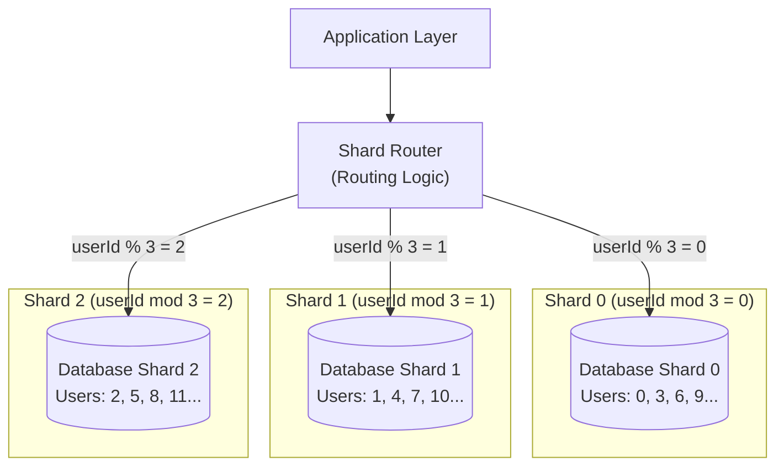

# Database Sharding

## Category
Scalability, Performance, Data Management

## Context

Database sharding is a horizontal scaling technique that partitions a large database into smaller, faster, more manageable pieces called **shards**. Each shard is a separate database that holds a subset of the data. A shard key (e.g., user ID, tenant ID, geographic region) determines which shard stores a given record.

Sharding is used when a single database instance can no longer handle the volume of data or query throughput required.

---

## Pros

- **Horizontal scalability**: Distribute data and load across many database servers.
- **Improved performance**: Smaller datasets per shard mean faster queries.
- **Fault isolation**: A failure in one shard does not affect data in other shards.
- **Geographic distribution**: Shards can be placed in different regions for latency optimization.
- **Cost efficiency**: Use many commodity servers instead of one expensive machine.

---

## Cons

- **Increased complexity**: Application must route queries to the correct shard.
- **Cross-shard queries**: Joins or aggregations across shards are difficult and expensive.
- **Rebalancing**: Adding new shards requires redistributing data, which is complex and disruptive.
- **Transactions**: Cross-shard ACID transactions are very hard to implement.
- **Hotspots**: Poor shard key choice can cause uneven load distribution.
- **Schema changes**: Must be applied to all shards consistently.

---

## Design Diagram



---

## Code Sample

### Shard Router (Node.js)

```javascript
// sharding/shard-router.js
const { Pool } = require('pg');

// Initialize connection pools for each shard
const shards = [
  new Pool({ connectionString: process.env.SHARD_0_URL }),
  new Pool({ connectionString: process.env.SHARD_1_URL }),
  new Pool({ connectionString: process.env.SHARD_2_URL }),
];

const SHARD_COUNT = shards.length;

/**
 * Determines which shard a userId belongs to.
 * Uses modulo hashing on the numeric userId.
 */
function getShardIndex(userId) {
  return parseInt(userId, 10) % SHARD_COUNT;
}

function getShardForUser(userId) {
  return shards[getShardIndex(userId)];
}

// Usage
async function getUserById(userId) {
  const shard = getShardForUser(userId);
  const { rows } = await shard.query('SELECT * FROM users WHERE id = $1', [userId]);
  return rows[0];
}

async function createUser(userId, name, email) {
  const shard = getShardForUser(userId);
  await shard.query(
    'INSERT INTO users (id, name, email) VALUES ($1, $2, $3)',
    [userId, name, email]
  );
}

module.exports = { getUserById, createUser };
```

### Hash-based Shard Key (consistent hashing for rebalancing)

```javascript
// sharding/consistent-hash.js
const crypto = require('crypto');

class ConsistentHashRing {
  constructor(nodes, virtualNodes = 150) {
    this.ring = new Map();
    this.sortedKeys = [];
    for (const node of nodes) {
      this.addNode(node, virtualNodes);
    }
  }

  addNode(node, virtualNodes) {
    for (let i = 0; i < virtualNodes; i++) {
      const hash = this._hash(`${node}:${i}`);
      this.ring.set(hash, node);
      this.sortedKeys.push(hash);
    }
    this.sortedKeys.sort((a, b) => a - b);
  }

  getNode(key) {
    const hash = this._hash(key);
    for (const k of this.sortedKeys) {
      if (hash <= k) return this.ring.get(k);
    }
    return this.ring.get(this.sortedKeys[0]); // Wrap around
  }

  _hash(key) {
    return parseInt(crypto.createHash('md5').update(key).digest('hex').slice(0, 8), 16);
  }
}

const ring = new ConsistentHashRing(['shard-0', 'shard-1', 'shard-2']);
console.log(ring.getNode('user-12345')); // → deterministic shard
```

### Cross-Shard Aggregation (fan-out query)

```javascript
// Fan out a query to all shards and merge results
async function getTotalUserCount() {
  const counts = await Promise.all(
    shards.map(async (shard) => {
      const { rows } = await shard.query('SELECT COUNT(*) AS cnt FROM users');
      return parseInt(rows[0].cnt, 10);
    })
  );
  return counts.reduce((sum, c) => sum + c, 0);
}
```
