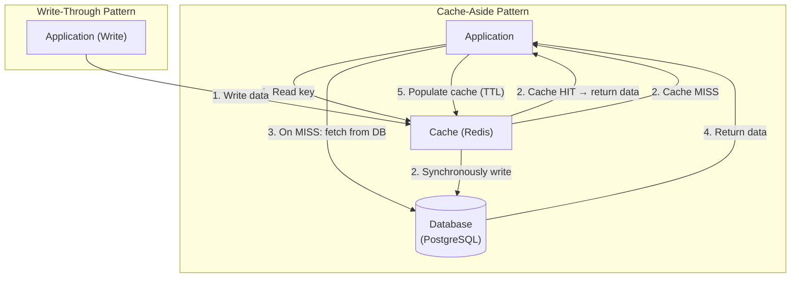

# Caching Patterns

## Category
Performance, Scalability

## Context

Caching stores the results of expensive computations or frequently accessed data in a fast-access store (e.g., Redis, Memcached) to reduce latency and database load. There are several patterns for populating and invalidating caches, each with different trade-offs.

**Key Patterns:**
- **Cache-Aside (Lazy Loading)**: Application checks cache first; on miss, loads from DB and populates cache.
- **Read-Through**: Cache sits in front of DB; on miss, cache itself fetches from DB.
- **Write-Through**: Every write goes to cache and DB simultaneously.
- **Write-Behind (Write-Back)**: Writes go to cache first; DB is updated asynchronously.
- **Refresh-Ahead**: Cache proactively refreshes entries before expiry.

---

## Pros

- **Reduced latency**: Cache reads are orders of magnitude faster than DB queries.
- **Reduced DB load**: Offloads read traffic from the primary database.
- **Higher throughput**: More requests served per second.
- **Cost savings**: Reduce expensive DB instance sizes.
- **Resilience**: Cache can serve data even during brief DB outages (read-through/write-behind).

---

## Cons

- **Stale data**: Cached data can become inconsistent with the source of truth.
- **Cache invalidation complexity**: Hard to know when to invalidate or update cache entries.
- **Cold start**: Cache is empty on startup; initial load hits the DB (thundering herd problem).
- **Memory cost**: Caches consume RAM, an expensive resource.
- **Eviction complexity**: LRU, LFU, and TTL-based eviction policies may not always be optimal.
- **Data consistency**: In distributed caches, nodes may serve different values temporarily.

---

## Design Diagram



---

## Code Sample

### Cache-Aside Pattern (Node.js / Redis)

```javascript
// cache/cache-aside.js
const { createClient } = require('redis');
const { Pool } = require('pg');

const redis = createClient({ url: process.env.REDIS_URL });
const db = new Pool({ connectionString: process.env.DATABASE_URL });

const CACHE_TTL = 300; // 5 minutes

async function getUserById(userId) {
  const cacheKey = `user:${userId}`;

  // 1. Try cache first
  const cached = await redis.get(cacheKey);
  if (cached) {
    return JSON.parse(cached); // Cache HIT
  }

  // 2. Cache MISS — fetch from database
  const { rows } = await db.query('SELECT * FROM users WHERE id = $1', [userId]);
  const user = rows[0];

  if (user) {
    // 3. Populate cache with TTL
    await redis.setEx(cacheKey, CACHE_TTL, JSON.stringify(user));
  }

  return user;
}

async function updateUser(userId, data) {
  await db.query('UPDATE users SET name=$1, email=$2 WHERE id=$3', [data.name, data.email, userId]);
  // Invalidate cache on write
  await redis.del(`user:${userId}`);
}
```

### Write-Through Pattern

```javascript
// cache/write-through.js
async function saveUser(user) {
  const cacheKey = `user:${user.id}`;

  // Write to DB
  await db.query(
    'INSERT INTO users (id, name, email) VALUES ($1, $2, $3) ON CONFLICT (id) DO UPDATE SET name=$2, email=$3',
    [user.id, user.name, user.email]
  );

  // Simultaneously write to cache
  await redis.setEx(cacheKey, CACHE_TTL, JSON.stringify(user));
}
```

### Write-Behind (Write-Back) Pattern

```javascript
// cache/write-behind.js
const writeQueue = [];

async function saveUserAsync(user) {
  const cacheKey = `user:${user.id}`;
  // Write to cache immediately (fast)
  await redis.setEx(cacheKey, CACHE_TTL, JSON.stringify(user));
  // Queue DB write for async processing
  writeQueue.push(user);
}

// Background process flushes write queue to DB
setInterval(async () => {
  const batch = writeQueue.splice(0, 100);
  if (batch.length === 0) return;
  for (const user of batch) {
    await db.query(
      'INSERT INTO users (id, name, email) VALUES ($1, $2, $3) ON CONFLICT (id) DO UPDATE SET name=$2, email=$3',
      [user.id, user.name, user.email]
    );
  }
}, 1000);
```

### Thundering Herd Protection (cache lock)

```javascript
// cache/cache-lock.js
async function getUserWithLock(userId) {
  const cacheKey = `user:${userId}`;
  const lockKey = `lock:user:${userId}`;

  const cached = await redis.get(cacheKey);
  if (cached) return JSON.parse(cached);

  // Acquire lock to prevent multiple simultaneous DB queries
  const locked = await redis.set(lockKey, '1', { NX: true, EX: 5 });
  if (!locked) {
    // Another request is fetching — wait and retry
    await new Promise(resolve => setTimeout(resolve, 100));
    return getUserWithLock(userId);
  }

  try {
    const { rows } = await db.query('SELECT * FROM users WHERE id = $1', [userId]);
    const user = rows[0];
    if (user) await redis.setEx(cacheKey, CACHE_TTL, JSON.stringify(user));
    return user;
  } finally {
    await redis.del(lockKey);
  }
}
```
