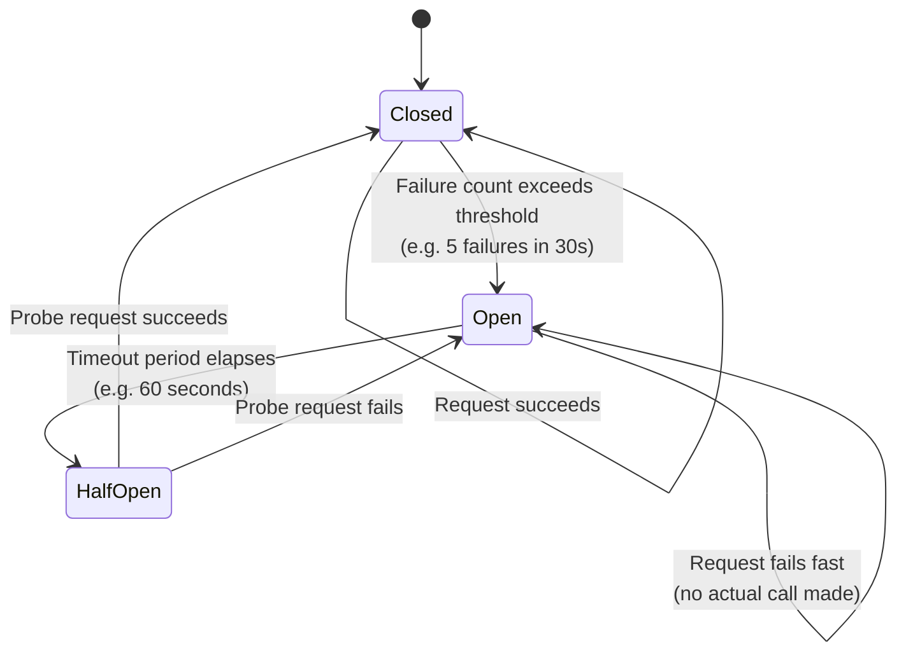

# Circuit Breaker Pattern

## Category
Resilience, Fault Tolerance, Stability

## Context

The Circuit Breaker pattern prevents an application from repeatedly trying to execute an operation that is likely to fail, allowing it to continue without waiting for the failing service to recover. It monitors failures and, when they exceed a threshold, "opens" the circuit — immediately returning an error or fallback response instead of calling the failing downstream service.

The pattern has three states:
- **Closed**: Normal operation; requests pass through. Failures are counted.
- **Open**: Failure threshold exceeded; requests are rejected immediately (fail-fast).
- **Half-Open**: After a timeout, a probe request is sent to test if the downstream service has recovered.

---

## Pros

- **Fail-fast**: Instead of waiting for timeouts on a failing service, circuits open and reject immediately.
- **Prevents cascade failures**: Stops failure propagation across a distributed system.
- **Automatic recovery**: The circuit transitions back to Closed when the downstream service recovers.
- **Allows fallbacks**: Open circuit returns a graceful fallback (cached data, default response).
- **Reduces load on failing services**: No traffic is sent, giving the service time to recover.

---

## Cons

- **Complexity**: Requires careful tuning of thresholds, timeout windows, and detection logic.
- **False positives**: A temporary spike in errors may open the circuit unnecessarily.
- **State management**: In distributed environments, circuit state must be shared across instances.
- **Partial failures**: The circuit is all-or-nothing; cannot handle partial unavailability.
- **Monitoring required**: Needs observability tooling to track circuit state transitions.

---

## Design Diagram



---

## Code Sample

### Circuit Breaker Implementation (TypeScript)

```typescript
// circuit-breaker/circuit-breaker.ts
enum CircuitState {
  CLOSED = 'CLOSED',
  OPEN = 'OPEN',
  HALF_OPEN = 'HALF_OPEN',
}

interface CircuitBreakerOptions {
  failureThreshold: number;  // Number of failures before opening
  recoveryTimeout: number;   // ms to wait before trying again (OPEN → HALF_OPEN)
  successThreshold: number;  // Successes in HALF_OPEN before closing
}

export class CircuitBreaker {
  private state = CircuitState.CLOSED;
  private failureCount = 0;
  private successCount = 0;
  private nextAttemptAt = 0;

  constructor(private readonly options: CircuitBreakerOptions) {}

  async execute<T>(fn: () => Promise<T>, fallback?: () => T): Promise<T> {
    if (this.state === CircuitState.OPEN) {
      if (Date.now() < this.nextAttemptAt) {
        console.warn('[CircuitBreaker] OPEN — failing fast');
        if (fallback) return fallback();
        throw new Error('Circuit is OPEN — service unavailable');
      }
      // Transition to HALF_OPEN for a probe request
      this.state = CircuitState.HALF_OPEN;
      console.info('[CircuitBreaker] → HALF_OPEN');
    }

    try {
      const result = await fn();
      this.onSuccess();
      return result;
    } catch (err) {
      this.onFailure();
      if (fallback) return fallback();
      throw err;
    }
  }

  private onSuccess(): void {
    this.failureCount = 0;
    if (this.state === CircuitState.HALF_OPEN) {
      this.successCount++;
      if (this.successCount >= this.options.successThreshold) {
        this.state = CircuitState.CLOSED;
        this.successCount = 0;
        console.info('[CircuitBreaker] → CLOSED');
      }
    }
  }

  private onFailure(): void {
    this.failureCount++;
    if (this.state === CircuitState.HALF_OPEN || this.failureCount >= this.options.failureThreshold) {
      this.state = CircuitState.OPEN;
      this.nextAttemptAt = Date.now() + this.options.recoveryTimeout;
      this.failureCount = 0;
      this.successCount = 0;
      console.warn('[CircuitBreaker] → OPEN');
    }
  }

  getState(): CircuitState {
    return this.state;
  }
}
```

### Usage in a Service

```typescript
// services/payment.service.ts
import axios from 'axios';
import { CircuitBreaker } from '../circuit-breaker/circuit-breaker';

const paymentCircuitBreaker = new CircuitBreaker({
  failureThreshold: 5,
  recoveryTimeout: 60_000, // 60 seconds
  successThreshold: 2,
});

export async function processPayment(orderId: string, amount: number) {
  return paymentCircuitBreaker.execute(
    () => axios.post('http://payment-service/pay', { orderId, amount }),
    () => ({ status: 'DEFERRED', message: 'Payment queued for retry' }) // Fallback
  );
}
```

### Using the `opossum` library (production-grade)

```javascript
// circuit-breaker/opossum-example.js
const CircuitBreaker = require('opossum');
const axios = require('axios');

async function callPaymentService(orderId, amount) {
  return axios.post('http://payment-service/pay', { orderId, amount });
}

const breaker = new CircuitBreaker(callPaymentService, {
  timeout: 3000,           // 3 second timeout
  errorThresholdPercentage: 50,  // Open if 50% of requests fail
  resetTimeout: 30000,     // Try again after 30 seconds
});

breaker.fallback(() => ({ status: 'DEFERRED' }));
breaker.on('open', () => console.warn('Circuit OPENED'));
breaker.on('close', () => console.info('Circuit CLOSED'));
breaker.on('halfOpen', () => console.info('Circuit HALF-OPEN'));

module.exports = { breaker };
```
