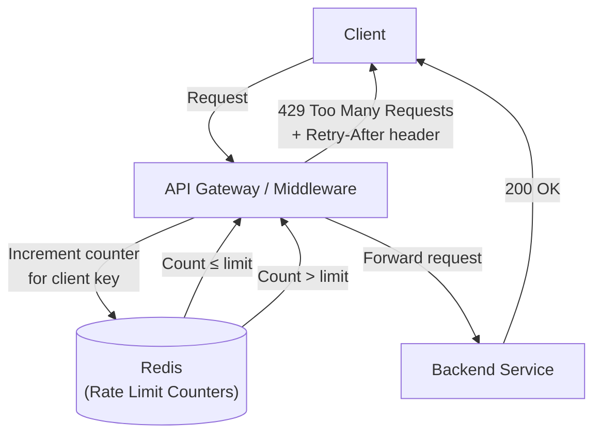

# Rate Limiting / Throttling

## Category
Security, Scalability, Reliability

## Context

Rate limiting controls how many requests a client can make to an API or service within a given time window. Throttling is a related concept where excessive requests are slowed down rather than rejected. These patterns protect services from abuse, DoS attacks, and accidental excessive usage.

**Common algorithms:**
- **Fixed Window Counter**: Count requests per fixed time window (e.g., 100 req/minute).
- **Sliding Window Log**: Precise per-request tracking using sorted timestamps.
- **Sliding Window Counter**: Hybrid of fixed window and sliding log — efficient and approximate.
- **Token Bucket**: Tokens accumulate over time; each request consumes a token. Allows bursts.
- **Leaky Bucket**: Requests are processed at a fixed rate; excess requests are queued or dropped.

---

## Pros

- **Protects services from overload**: Prevents any single client from exhausting resources.
- **Security**: Mitigates brute-force attacks, credential stuffing, and DoS attacks.
- **Fair use**: Ensures equitable access across all API consumers.
- **Cost control**: Limits external API calls and prevents runaway billing.
- **SLA enforcement**: Enforces contractual limits for API tiers.

---

## Cons

- **Legitimate users may be rejected**: Burst traffic from legitimate clients may be throttled.
- **State management**: Rate limit counters must be shared across distributed instances (redis).
- **Algorithm trade-offs**: Simple algorithms are not precise; precise algorithms are memory-intensive.
- **Client experience**: Poor rate-limit responses frustrate consumers without proper documentation.
- **Header management**: Must expose `Retry-After`, `X-RateLimit-*` headers correctly.

---

## Design Diagram



---

## Code Sample

### Fixed Window Counter (Node.js / Redis)

```javascript
// middleware/rate-limiter.js
const { createClient } = require('redis');
const redis = createClient({ url: process.env.REDIS_URL });

const WINDOW_SIZE_SECONDS = 60;
const MAX_REQUESTS = 100;

async function rateLimitMiddleware(req, res, next) {
  const clientKey = req.ip; // Or use API key: req.headers['x-api-key']
  const windowKey = `ratelimit:${clientKey}:${Math.floor(Date.now() / (WINDOW_SIZE_SECONDS * 1000))}`;

  const count = await redis.incr(windowKey);

  if (count === 1) {
    await redis.expire(windowKey, WINDOW_SIZE_SECONDS);
  }

  res.setHeader('X-RateLimit-Limit', MAX_REQUESTS);
  res.setHeader('X-RateLimit-Remaining', Math.max(0, MAX_REQUESTS - count));

  if (count > MAX_REQUESTS) {
    return res.status(429).json({
      error: 'Too Many Requests',
      retryAfter: WINDOW_SIZE_SECONDS,
    });
  }

  next();
}

module.exports = rateLimitMiddleware;
```

### Token Bucket Algorithm (TypeScript / Redis)

```typescript
// middleware/token-bucket.ts
import { createClient } from 'redis';

const redis = createClient({ url: process.env.REDIS_URL });

interface BucketConfig {
  capacity: number;      // Max tokens (burst limit)
  refillRate: number;    // Tokens added per second
}

async function tokenBucketAllow(clientId: string, config: BucketConfig): Promise<boolean> {
  const now = Date.now() / 1000;
  const key = `bucket:${clientId}`;

  const data = await redis.hGetAll(key);
  let tokens = parseFloat(data.tokens ?? String(config.capacity));
  const lastRefill = parseFloat(data.lastRefill ?? String(now));

  // Refill tokens based on elapsed time
  const elapsed = now - lastRefill;
  tokens = Math.min(config.capacity, tokens + elapsed * config.refillRate);

  if (tokens < 1) {
    // No tokens available — reject
    await redis.hSet(key, { tokens: tokens.toFixed(4), lastRefill: now.toFixed(4) });
    await redis.expire(key, 3600);
    return false;
  }

  // Consume one token
  tokens -= 1;
  await redis.hSet(key, { tokens: tokens.toFixed(4), lastRefill: now.toFixed(4) });
  await redis.expire(key, 3600);
  return true;
}

export async function rateLimitMiddleware(req: Request, res: Response, next: NextFunction) {
  const allowed = await tokenBucketAllow(req.ip, { capacity: 10, refillRate: 1 });
  if (!allowed) {
    return res.status(429).json({ error: 'Rate limit exceeded' });
  }
  next();
}
```

### Using `express-rate-limit` library

```javascript
// app.js
const rateLimit = require('express-rate-limit');
const RedisStore = require('rate-limit-redis').default;
const { createClient } = require('redis');

const redis = createClient({ url: process.env.REDIS_URL });

const limiter = rateLimit({
  windowMs: 60 * 1000, // 1 minute
  max: 100,
  standardHeaders: true,  // Return RateLimit headers
  legacyHeaders: false,
  store: new RedisStore({
    sendCommand: (...args) => redis.sendCommand(args),
  }),
  handler: (req, res) => {
    res.status(429).json({
      error: 'Too many requests',
      retryAfter: Math.ceil(req.rateLimit.resetTime / 1000),
    });
  },
});

app.use('/api/', limiter);
```
