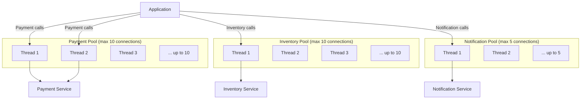

# Bulkhead Pattern

## Category

Resilience, Fault Isolation, Stability

## Context

The Bulkhead pattern isolates elements of an application into pools so that if one fails, the others continue to function. Named after the watertight compartments in a ship's hull — if one compartment floods, the ship doesn't sink.

In software, bulkheads prevent one slow or failing component from consuming all available resources (threads, connections, memory) and degrading the entire system. Resources are partitioned into separate pools per service, client, or use case.

---

## Pros

- **Fault isolation**: A failure or slowdown in one pool does not exhaust resources for other pools.
- **Predictable capacity**: Each consumer or service has guaranteed resources.
- **Prevents cascading failures**: Resource exhaustion in one area stays contained.
- **Better SLAs**: Critical paths get dedicated pools and can meet SLAs even under stress.
- **Pairs well with Circuit Breaker**: Combined, they offer strong resilience.

---

## Cons

- **Resource underutilization**: Pools sit idle when not fully utilized — resources can't be shared.
- **Configuration overhead**: Sizing each pool correctly requires load testing and tuning.
- **More complex thread/connection management**: Especially in polyglot or async environments.
- **Diminishing returns for small systems**: The complexity may not be worth it at low scale.

---

## Design Diagram



---

## Code Sample

### Thread Pool Bulkhead (Node.js — using worker threads)

```javascript
// bulkhead/pool.js
const { Worker } = require("worker_threads");
const os = require("os");

class BulkheadPool {
  constructor(maxConcurrent, queueSize) {
    this.maxConcurrent = maxConcurrent;
    this.queueSize = queueSize;
    this.activeCount = 0;
    this.queue = [];
  }

  async execute(fn) {
    if (this.activeCount >= this.maxConcurrent) {
      if (this.queue.length >= this.queueSize) {
        throw new Error("Bulkhead queue full — request rejected");
      }
      // Queue the request
      await new Promise((resolve, reject) => {
        this.queue.push({ resolve, reject });
      });
    }

    this.activeCount++;
    try {
      return await fn();
    } finally {
      this.activeCount--;
      if (this.queue.length > 0) {
        const next = this.queue.shift();
        next.resolve(); // Unblock next queued call
      }
    }
  }
}

// Separate pools per downstream service
const paymentPool = new BulkheadPool(10, 20); // Max 10 concurrent, queue 20
const inventoryPool = new BulkheadPool(10, 20);
const notificationPool = new BulkheadPool(5, 10);

module.exports = { paymentPool, inventoryPool, notificationPool };
```

### Usage with HTTP calls

```javascript
// services/payment.service.js
const { paymentPool } = require("../bulkhead/pool");
const axios = require("axios");

async function processPayment(orderId, amount) {
  return paymentPool.execute(async () => {
    const response = await axios.post("http://payment-service/pay", {
      orderId,
      amount,
    });
    return response.data;
  });
}

async function callInventory(orderId, items) {
  return inventoryPool.execute(async () => {
    const response = await axios.post("http://inventory-service/reserve", {
      orderId,
      items,
    });
    return response.data;
  });
}
```

### Connection Pool Bulkhead (PostgreSQL per service)

```javascript
// db/pools.js
const { Pool } = require("pg");

// Dedicated connection pools per domain — not one shared pool
const orderPool = new Pool({
  connectionString: process.env.ORDER_DB_URL,
  max: 20, // Dedicated 20 connections for order operations
  idleTimeoutMillis: 30000,
});

const reportPool = new Pool({
  connectionString: process.env.REPORT_DB_URL,
  max: 5, // Reports get fewer connections — lower priority
  idleTimeoutMillis: 60000,
  connectionTimeoutMillis: 3000,
});

module.exports = { orderPool, reportPool };
```

### Combining Bulkhead + Circuit Breaker

```typescript
// resilience/resilient-call.ts
import { CircuitBreaker } from "./circuit-breaker";
import { BulkheadPool } from "./bulkhead";

const pool = new BulkheadPool(10, 20);
const breaker = new CircuitBreaker({
  failureThreshold: 5,
  recoveryTimeout: 30_000,
  successThreshold: 2,
});

export async function resilientCall<T>(
  fn: () => Promise<T>,
  fallback?: () => T,
): Promise<T> {
  return pool.execute(() => breaker.execute(fn, fallback));
}
```
