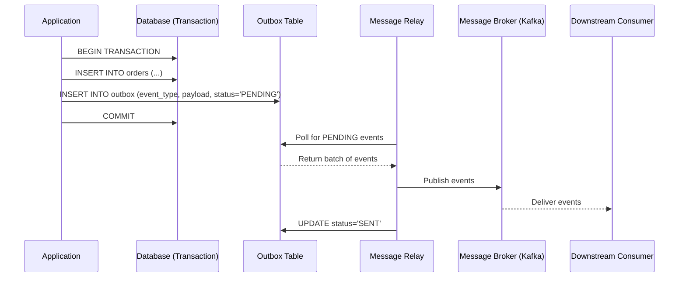

# Outbox Pattern

## Category

Data Management, Reliability, Messaging, Distributed Systems

## Context

The Outbox pattern solves the **dual-write problem** in microservices: when a service must both persist data to its database and publish an event to a message broker, it's impossible to make both operations atomic without a distributed transaction (2PC).

The pattern stores outgoing events in an **outbox table** within the same local database transaction as the business data update. A separate **message relay** process (or Change Data Capture) reads the outbox table and publishes events to the broker, then marks them as sent. This guarantees **at-least-once delivery** with exactly-once processing (when combined with idempotent consumers).

---

## Pros

- **Atomic writes**: Business data and event are written in a single local transaction — no partial state.
- **Guaranteed delivery**: No events are lost even if the message broker is temporarily unavailable.
- **Decoupled from broker availability**: Service operations succeed regardless of broker state.
- **Reliable ordering**: Events are published in the order they were written.
- **Standard tooling**: Works with any relational database.

---

## Cons

- **Added complexity**: Requires an outbox table, relay process, and idempotent consumers.
- **Latency**: Events are published with a slight delay (relay polling interval or CDC lag).
- **Duplicate delivery**: Relay may publish an event more than once — consumers must be idempotent.
- **Database overhead**: Outbox table grows and needs regular cleanup.
- **Relay is a new moving part**: Must be monitored and kept highly available.

---

## Design Diagram



---

## Code Sample

### Database Schema (PostgreSQL)

```sql
CREATE TABLE orders (
  id         UUID        PRIMARY KEY DEFAULT gen_random_uuid(),
  user_id    UUID        NOT NULL,
  status     VARCHAR(50) NOT NULL,
  created_at TIMESTAMPTZ NOT NULL DEFAULT NOW()
);

CREATE TABLE outbox (
  id           UUID        PRIMARY KEY DEFAULT gen_random_uuid(),
  event_type   VARCHAR(100) NOT NULL,
  aggregate_id UUID        NOT NULL,
  payload      JSONB       NOT NULL,
  status       VARCHAR(20) NOT NULL DEFAULT 'PENDING', -- PENDING | SENT | FAILED
  created_at   TIMESTAMPTZ NOT NULL DEFAULT NOW(),
  sent_at      TIMESTAMPTZ
);

CREATE INDEX idx_outbox_status ON outbox (status, created_at);
```

### Application — Atomic write (Node.js / PostgreSQL)

```javascript
// services/order.service.js
const { Pool } = require("pg");
const db = new Pool({ connectionString: process.env.DATABASE_URL });

async function placeOrder(userId, items) {
  const client = await db.connect();
  try {
    await client.query("BEGIN");

    // 1. Insert business data
    const { rows } = await client.query(
      "INSERT INTO orders (user_id, status) VALUES ($1, $2) RETURNING id",
      [userId, "PENDING"],
    );
    const orderId = rows[0].id;

    // 2. Insert event into outbox — same transaction!
    await client.query(
      `INSERT INTO outbox (event_type, aggregate_id, payload)
       VALUES ($1, $2, $3)`,
      [
        "OrderPlaced",
        orderId,
        JSON.stringify({
          orderId,
          userId,
          items,
          timestamp: new Date().toISOString(),
        }),
      ],
    );

    await client.query("COMMIT");
    return orderId;
  } catch (err) {
    await client.query("ROLLBACK");
    throw err;
  } finally {
    client.release();
  }
}
```

### Message Relay (polling-based)

```javascript
// relay/message-relay.js
const { Kafka } = require("kafkajs");
const { Pool } = require("pg");

const db = new Pool({ connectionString: process.env.DATABASE_URL });
const kafka = new Kafka({ brokers: ["kafka:9092"] });
const producer = kafka.producer();

const POLL_INTERVAL_MS = 500;
const BATCH_SIZE = 100;

async function relay() {
  await producer.connect();

  setInterval(async () => {
    const client = await db.connect();
    try {
      await client.query("BEGIN");

      // Fetch and lock pending events
      const { rows } = await client.query(
        `SELECT * FROM outbox WHERE status = 'PENDING'
         ORDER BY created_at ASC LIMIT $1
         FOR UPDATE SKIP LOCKED`,
        [BATCH_SIZE],
      );

      if (rows.length === 0) {
        await client.query("ROLLBACK");
        return;
      }

      // Publish to Kafka
      await producer.send({
        topic: "domain-events",
        messages: rows.map((row) => ({
          key: row.aggregate_id,
          value: JSON.stringify({
            eventType: row.event_type,
            payload: row.payload,
          }),
          headers: { eventId: row.id },
        })),
      });

      // Mark as sent
      const ids = rows.map((r) => r.id);
      await client.query(
        `UPDATE outbox SET status = 'SENT', sent_at = NOW() WHERE id = ANY($1)`,
        [ids],
      );

      await client.query("COMMIT");
    } catch (err) {
      await client.query("ROLLBACK");
      console.error("Relay error:", err);
    } finally {
      client.release();
    }
  }, POLL_INTERVAL_MS);
}

relay().catch(console.error);
```

### Outbox Cleanup Job

```sql
-- Run periodically to prevent unbounded outbox growth
DELETE FROM outbox
WHERE status = 'SENT'
  AND sent_at < NOW() - INTERVAL '7 days';
```
