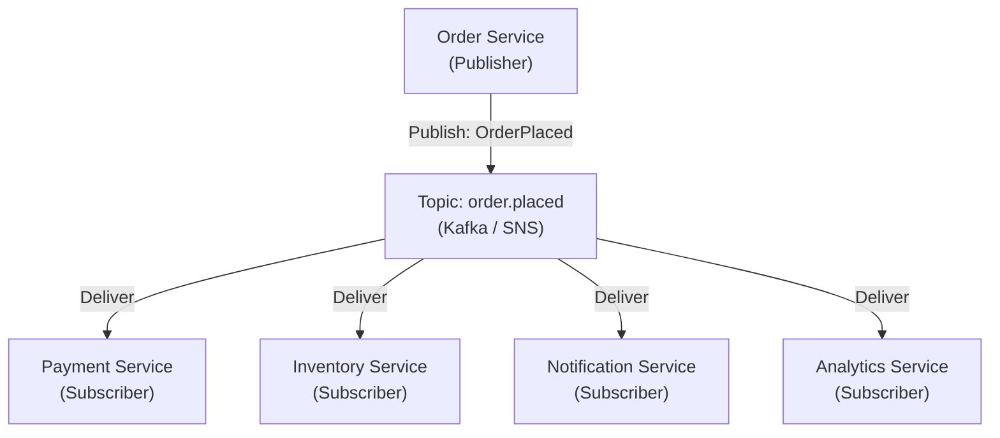

# Publish-Subscribe Pattern (Pub/Sub)

## Category
Messaging, Decoupling, Scalability, Event-Driven

## Context

Publish-Subscribe (Pub/Sub) is a messaging pattern where **publishers** emit messages to named **topics** or **channels** without knowing who the recipients are. **Subscribers** declare interest in specific topics and receive messages that match their subscriptions. The message broker decouples publishers from subscribers.

Pub/Sub differs from point-to-point messaging: in point-to-point, a message is consumed by exactly one receiver; in Pub/Sub, a message can be consumed by **many subscribers** simultaneously.

Common Pub/Sub systems: Apache Kafka, Google Pub/Sub, AWS SNS, Redis Pub/Sub, RabbitMQ (fan-out exchanges).

---

## Pros

- **Decoupling**: Publishers and subscribers are completely independent — neither knows about the other.
- **Fan-out**: One event can trigger actions in multiple services simultaneously.
- **Extensibility**: New subscribers can be added without modifying publishers.
- **Scalability**: Subscribers can scale independently to process their partition of events.
- **Asynchronous**: Publishers don't wait for subscribers to process — high throughput.

---

## Cons

- **Eventual consistency**: Subscribers process messages asynchronously; state diverges temporarily.
- **No delivery guarantee by default**: Fire-and-forget unless the broker supports persistence.
- **Message ordering**: Ordering across partitions/topics is not always guaranteed.
- **Subscriber overload**: A slow subscriber may fall behind; needs dead-letter queue and backpressure.
- **Debugging complexity**: Tracing a message from publisher to multiple subscribers is hard.
- **Duplicate messages**: Brokers may redeliver — subscribers must be idempotent.

---

## Design Diagram



---

## Code Sample

### Publisher (Node.js / Kafka)

```javascript
// publisher/order.publisher.js
const { Kafka } = require('kafkajs');

const kafka = new Kafka({ clientId: 'order-service', brokers: ['kafka:9092'] });
const producer = kafka.producer();

async function publishOrderPlaced(order) {
  await producer.send({
    topic: 'order.placed',
    messages: [
      {
        key: order.id,
        value: JSON.stringify({
          eventId: crypto.randomUUID(),
          eventType: 'OrderPlaced',
          timestamp: new Date().toISOString(),
          data: order,
        }),
      },
    ],
  });
}

(async () => {
  await producer.connect();
  // Simulate publishing
  await publishOrderPlaced({ id: 'order-1', userId: 'user-42', total: 99.99 });
})();
```

### Subscriber — Payment Service (Node.js / Kafka)

```javascript
// subscribers/payment.subscriber.js
const { Kafka } = require('kafkajs');

const kafka = new Kafka({ clientId: 'payment-service', brokers: ['kafka:9092'] });
const consumer = kafka.consumer({ groupId: 'payment-service-group' });

(async () => {
  await consumer.connect();
  await consumer.subscribe({ topic: 'order.placed', fromBeginning: false });

  await consumer.run({
    eachMessage: async ({ topic, partition, message }) => {
      const event = JSON.parse(message.value.toString());
      console.log(`[Payment] Processing: ${event.eventType} for order ${event.data.id}`);
      await processPayment(event.data);
    },
  });
})();
```

### Subscriber — Notification Service (separate consumer group)

```javascript
// subscribers/notification.subscriber.js
const consumer = kafka.consumer({ groupId: 'notification-service-group' });

(async () => {
  await consumer.connect();
  await consumer.subscribe({ topic: 'order.placed', fromBeginning: false });

  await consumer.run({
    eachMessage: async ({ message }) => {
      const event = JSON.parse(message.value.toString());
      console.log(`[Notification] Sending email for order: ${event.data.id}`);
      await sendOrderConfirmationEmail(event.data);
    },
  });
})();
```

### AWS SNS + SQS Fan-out (Infrastructure as code — AWS CDK / TypeScript)

```typescript
// infrastructure/pubsub-stack.ts
import * as cdk from 'aws-cdk-lib';
import * as sns from 'aws-cdk-lib/aws-sns';
import * as sqs from 'aws-cdk-lib/aws-sqs';
import * as snsSubscriptions from 'aws-cdk-lib/aws-sns-subscriptions';

export class PubSubStack extends cdk.Stack {
  constructor(scope: cdk.App, id: string) {
    super(scope, id);

    // Topic (Publisher sends here)
    const orderTopic = new sns.Topic(this, 'OrderPlacedTopic', {
      topicName: 'order-placed',
    });

    // Queues per subscriber (Fanout)
    const paymentQueue     = new sqs.Queue(this, 'PaymentQueue');
    const inventoryQueue   = new sqs.Queue(this, 'InventoryQueue');
    const notificationQueue = new sqs.Queue(this, 'NotificationQueue');

    // Subscribe each queue to the topic
    orderTopic.addSubscription(new snsSubscriptions.SqsSubscription(paymentQueue));
    orderTopic.addSubscription(new snsSubscriptions.SqsSubscription(inventoryQueue));
    orderTopic.addSubscription(new snsSubscriptions.SqsSubscription(notificationQueue));
  }
}
```
