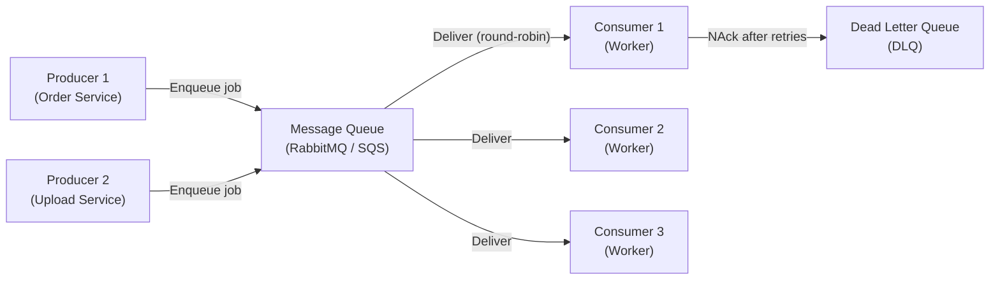

# Message Queue Pattern

## Category
Messaging, Decoupling, Reliability, Scalability

## Context

A Message Queue is a **point-to-point** asynchronous communication mechanism where a producer sends messages to a queue and a consumer reads and processes them. Unlike Pub/Sub (fan-out), each message in a queue is processed by **exactly one consumer** (in a consumer group). This enables work distribution, load leveling, and decoupling of producers from consumers.

Common queue systems: RabbitMQ, AWS SQS, Redis Lists/Streams, Azure Service Bus.

---

## Pros

- **Decoupling**: Producer and consumer don't need to run at the same time.
- **Load leveling**: Queue buffers bursts of work; consumers process at their own pace.
- **Reliability**: Messages persist until acknowledged — no work is lost even if a consumer crashes.
- **Work distribution**: Multiple consumers share the queue workload (competing consumers).
- **Retry support**: Failed messages can be re-queued or sent to a Dead Letter Queue (DLQ).
- **Backpressure**: Natural backpressure through queue depth visibility.

---

## Cons

- **Increased latency**: Asynchronous processing adds delay vs. synchronous calls.
- **Ordering challenges**: Parallel consumers may process messages out of order.
- **Message duplication**: At-least-once delivery means consumers must be idempotent.
- **Queue management**: Requires monitoring queue depth, retention, and DLQ handling.
- **Debugging**: Tracing a message through a queue is harder than a direct call.

---

## Design Diagram



---

## Code Sample

### Producer (Node.js / RabbitMQ with amqplib)

```typescript
// producer/job.producer.ts
import amqp from 'amqplib';

const QUEUE = 'email-jobs';

interface EmailJob { to: string; template: string; orderId: string; }

export async function sendEmailJob(job: EmailJob): Promise<void> {
  const connection = await amqp.connect(process.env.RABBITMQ_URL!);
  const channel    = await connection.createChannel();

  await channel.assertQueue(QUEUE, {
    durable:              true,
    deadLetterExchange:   'dlx',
    deadLetterRoutingKey: 'email-jobs.dlq',
  });

  channel.sendToQueue(
    QUEUE,
    Buffer.from(JSON.stringify(job)),
    { persistent: true },
  );

  console.log(`[Producer] Queued job: ${JSON.stringify(job)}`);
  await channel.close();
  await connection.close();
}

sendEmailJob({ to: 'user@example.com', template: 'order-confirmation', orderId: 'order-1' });
```

### Consumer (Node.js / RabbitMQ — competing consumers)

```typescript
// consumer/job.consumer.ts
import amqp, { Message } from 'amqplib';

const QUEUE       = 'email-jobs';
const MAX_RETRIES = 3;

async function processEmailJob(job: EmailJob): Promise<void> {
  console.log(`Sending ${job.template} email to ${job.to}`);
}

export async function startWorker(): Promise<void> {
  const connection = await amqp.connect(process.env.RABBITMQ_URL!);
  const channel    = await connection.createChannel();

  await channel.assertQueue(QUEUE, { durable: true });
  channel.prefetch(5); // Process max 5 messages concurrently per worker

  console.log(`[Worker] Waiting for jobs on ${QUEUE}`);

  channel.consume(QUEUE, async (msg: Message | null) => {
    if (!msg) return;

    const job: EmailJob = JSON.parse(msg.content.toString());
    const retries: number = (msg.properties.headers['x-retry-count'] ?? 0) as number;

    try {
      await processEmailJob(job);
      channel.ack(msg);
    } catch (err) {
      console.error(`[Worker] Failed: ${(err as Error).message}`);
      if (retries < MAX_RETRIES) {
        channel.nack(msg, false, false); // Send to DLQ for retry logic
      } else {
        channel.nack(msg, false, false); // Final failure → DLQ
      }
    }
  });
}

startWorker().catch(console.error);
```

### AWS SQS Queue (Node.js / AWS SDK v3)

```typescript
// sqs/sqs-producer.ts
import { SQSClient, SendMessageCommand } from '@aws-sdk/client-sqs';

const sqs       = new SQSClient({ region: 'us-east-1' });
const QUEUE_URL = process.env.SQS_QUEUE_URL!;

interface SqsJob { userId: string; jobId: string; [key: string]: unknown; }

export async function enqueueJob(job: SqsJob): Promise<void> {
  await sqs.send(new SendMessageCommand({
    QueueUrl:               QUEUE_URL,
    MessageBody:            JSON.stringify(job),
    MessageGroupId:         job.userId,   // FIFO queue: group by user
    MessageDeduplicationId: job.jobId,   // Prevent duplicates
  }));
}

declare function processJob(job: SqsJob): Promise<void>;

// sqs/sqs-consumer.ts
import { ReceiveMessageCommand, DeleteMessageCommand } from '@aws-sdk/client-sqs';

async function pollQueue(): Promise<void> {
  for (;;) {
    const { Messages } = await sqs.send(new ReceiveMessageCommand({
      QueueUrl:            QUEUE_URL,
      MaxNumberOfMessages: 10,
      WaitTimeSeconds:     20, // Long polling
    }));

    for (const msg of Messages ?? []) {
      const job = JSON.parse(msg.Body!) as SqsJob;
      await processJob(job);
      // Delete after successful processing
      await sqs.send(new DeleteMessageCommand({
        QueueUrl:      QUEUE_URL,
        ReceiptHandle: msg.ReceiptHandle!,
      }));
    }
  }
}

pollQueue().catch(console.error);
```

## Related Patterns

- [17 — Publish-Subscribe](./17-publish-subscribe.md) — Fan-out to multiple subscribers vs queue's single-consumer model
- [30 — Dead Letter Queue](./30-dead-letter-queue.md) — Route failed messages from the main queue
- [16 — Outbox Pattern](./16-outbox-pattern.md) — Reliably produce messages into the queue from a transaction
- [15 — Bulkhead Pattern](./15-bulkhead-pattern.md) — Separate queue per consumer type for isolation
