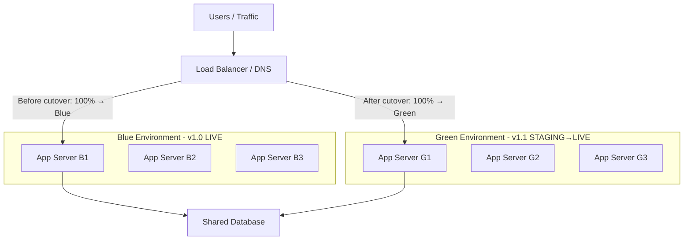

# Blue-Green Deployment

## Category
Deployment, Availability, Risk Management

## Context

Blue-Green Deployment is a release strategy that reduces downtime and deployment risk by maintaining two identical production environments: **Blue** (current live) and **Green** (new version). Traffic is routed to the Blue environment while the Green environment is prepared, tested, and warmed up. When the Green environment is ready, traffic is switched instantly (or gradually) from Blue to Green. If the Green deployment fails, traffic can be switched back to Blue immediately.

---

## Pros

- **Zero downtime deployments**: Traffic switch is near-instant; users experience no interruption.
- **Instant rollback**: If Green fails, switch traffic back to Blue immediately.
- **Smoke testing in production**: Green can be tested with real infrastructure before receiving traffic.
- **Clean environments**: No in-place upgrade risks — Green is a fresh deployment.
- **Confidence**: Operations teams can validate the new version thoroughly before go-live.

---

## Cons

- **Double infrastructure cost**: Two identical environments must run simultaneously (cost spikes during deployment).
- **Database schema compatibility**: Both Blue and Green must be compatible with the same database during transition.
- **Stateful sessions**: Active sessions in Blue must be handled during traffic switch (sticky sessions or shared session store).
- **Long-running connections**: WebSocket or long-poll connections on Blue will be interrupted.
- **Complexity**: Requires orchestration tooling, load balancer control plane access.

---

## Design Diagram



---

## Code Sample

### NGINX Traffic Switch Script (Bash)

```bash
#!/bin/bash
# blue-green-switch.sh
# Usage: ./blue-green-switch.sh green

TARGET=$1  # 'blue' or 'green'

BLUE_UPSTREAM="app-blue:3000"
GREEN_UPSTREAM="app-green:3000"

if [ "$TARGET" == "green" ]; then
  ACTIVE=$GREEN_UPSTREAM
  echo "Switching traffic to GREEN (v1.1)"
else
  ACTIVE=$BLUE_UPSTREAM
  echo "Rolling back to BLUE (v1.0)"
fi

# Update NGINX upstream and reload (zero-downtime)
cat > /etc/nginx/conf.d/upstream.conf <<EOF
upstream active_app {
    server ${ACTIVE};
}
EOF

nginx -t && nginx -s reload && echo "Switch complete: traffic → ${TARGET}"
```

### Docker Compose — Blue-Green Setup

```yaml
# docker-compose.yml
version: '3.8'

services:
  nginx:
    image: nginx:alpine
    ports: ['80:80']
    volumes:
      - ./nginx.conf:/etc/nginx/nginx.conf:ro
      - ./conf.d:/etc/nginx/conf.d
    depends_on: [app-blue, app-green]

  app-blue:
    image: myapp:v1.0
    environment:
      - APP_VERSION=v1.0
    expose: ['3000']

  app-green:
    image: myapp:v1.1
    environment:
      - APP_VERSION=v1.1
    expose: ['3000']
```

### Kubernetes Blue-Green with Service Selector

```yaml
# blue-deployment.yaml
apiVersion: apps/v1
kind: Deployment
metadata:
  name: app-blue
spec:
  replicas: 3
  selector:
    matchLabels:
      app: myapp
      version: blue
  template:
    metadata:
      labels:
        app: myapp
        version: blue
    spec:
      containers:
        - name: app
          image: myapp:v1.0
          ports: [{containerPort: 3000}]
---
# green-deployment.yaml
apiVersion: apps/v1
kind: Deployment
metadata:
  name: app-green
spec:
  replicas: 3
  selector:
    matchLabels:
      app: myapp
      version: green
  template:
    metadata:
      labels:
        app: myapp
        version: green
    spec:
      containers:
        - name: app
          image: myapp:v1.1
          ports: [{containerPort: 3000}]
---
# service.yaml — switch by changing selector
apiVersion: v1
kind: Service
metadata:
  name: app-service
spec:
  selector:
    app: myapp
    version: green   # Change to 'blue' to rollback instantly
  ports:
    - port: 80
      targetPort: 3000
```

### Automated Switch Script (kubectl)

```bash
#!/bin/bash
# switch-to-green.sh
kubectl patch service app-service \
  -p '{"spec": {"selector": {"version": "green"}}}'

echo "Traffic switched to GREEN. Monitor for 5 minutes..."
sleep 300

# Health check
if kubectl rollout status deployment/app-green; then
  echo "Green is healthy. Scaling down Blue."
  kubectl scale deployment/app-blue --replicas=0
else
  echo "Issues detected! Rolling back to Blue."
  kubectl patch service app-service \
    -p '{"spec": {"selector": {"version": "blue"}}}'
fi
```
