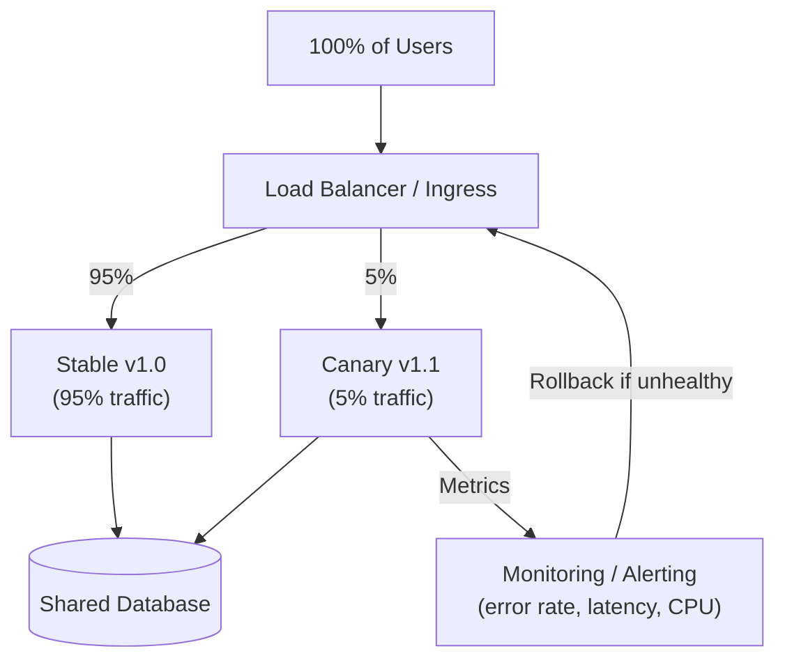

# Canary Deployment

## Category
Deployment, Risk Management, Availability

## Context

Canary Deployment is a release strategy that rolls out a new version to a **small subset of users or servers** first, monitors for errors and regressions, and then gradually increases traffic to the new version. If problems are detected, rollback only affects the small canary percentage — the majority of users are unaffected.

Named after the "canary in a coal mine" — the canary detects problems before they affect everyone.

---

## Pros

- **Reduced risk**: Failures only impact a small percentage of users.
- **Real-world validation**: New version is tested against real production traffic.
- **Gradual rollout control**: Traffic shifted in controlled increments (1% → 5% → 25% → 100%).
- **Performance comparison**: A/B comparison of old vs. new version on real metrics.
- **Automatic rollback**: Automated rollback if error rates or latency exceed thresholds.

---

## Cons

- **Complexity**: Requires traffic splitting infrastructure (Kubernetes Ingress, service mesh, feature flags).
- **Multiple versions in production**: Debugging is harder when two versions serve traffic simultaneously.
- **Database compatibility**: Both versions must be compatible with the same database schema.
- **Observability required**: Without good metrics and alerting, canary issues may go undetected.
- **Slower than blue-green**: Full rollout takes longer due to incremental progression.

---

## Design Diagram



---

## Code Sample

### NGINX Weighted Traffic Split

```nginx
upstream app {
    server app-stable:3000 weight=95;  # v1.0 gets 95%
    server app-canary:3000  weight=5;  # v1.1 gets 5%
}

server {
    listen 80;
    location / {
        proxy_pass http://app;
    }
}
```

### Kubernetes — Canary with Argo Rollouts

```yaml
# rollout.yaml
apiVersion: argoproj.io/v1alpha1
kind: Rollout
metadata:
  name: app-rollout
spec:
  replicas: 10
  strategy:
    canary:
      steps:
        - setWeight: 5      # 5% to canary
        - pause: {duration: 10m}
        - setWeight: 25
        - pause: {duration: 10m}
        - setWeight: 50
        - pause: {duration: 10m}
        - setWeight: 100
      analysis:
        templates:
          - templateName: success-rate
        startingStep: 1
        args:
          - name: service-name
            value: app-canary
  selector:
    matchLabels:
      app: myapp
  template:
    metadata:
      labels:
        app: myapp
    spec:
      containers:
        - name: app
          image: myapp:v1.1
          ports: [{containerPort: 3000}]
```

### Kubernetes — Manual Canary via Two Deployments

```yaml
# stable-deployment.yaml
apiVersion: apps/v1
kind: Deployment
metadata:
  name: app-stable
spec:
  replicas: 9   # 90% of pods
  selector:
    matchLabels: {app: myapp, track: stable}
  template:
    metadata:
      labels: {app: myapp, track: stable}
    spec:
      containers:
        - name: app
          image: myapp:v1.0
---
# canary-deployment.yaml
apiVersion: apps/v1
kind: Deployment
metadata:
  name: app-canary
spec:
  replicas: 1   # 10% of pods
  selector:
    matchLabels: {app: myapp, track: canary}
  template:
    metadata:
      labels: {app: myapp, track: canary}
    spec:
      containers:
        - name: app
          image: myapp:v1.1
---
# service routes to BOTH via common label
apiVersion: v1
kind: Service
metadata:
  name: app-service
spec:
  selector:
    app: myapp   # Matches both stable and canary pods
  ports:
    - port: 80
      targetPort: 3000
```

### Automated Canary Analysis (Node.js monitoring loop)

```javascript
// canary-monitor.js
const CANARY_ERROR_THRESHOLD = 0.05;  // 5% error rate
const STABLE_BASELINE = 0.01;         // 1% baseline

async function analyzeCanary() {
  const [canaryMetrics, stableMetrics] = await Promise.all([
    getErrorRate('app-canary'),
    getErrorRate('app-stable'),
  ]);

  console.log(`Canary error rate: ${(canaryMetrics * 100).toFixed(2)}%`);
  console.log(`Stable error rate: ${(stableMetrics * 100).toFixed(2)}%`);

  if (canaryMetrics > CANARY_ERROR_THRESHOLD || canaryMetrics > stableMetrics * 3) {
    console.error('CANARY FAILING — initiating rollback');
    await rollback();
  } else {
    console.log('Canary healthy — promoting to next step');
    await promoteCanary();
  }
}

setInterval(analyzeCanary, 60_000); // Check every minute
```

## Related Patterns

- [19 — Blue-Green Deployment](./19-blue-green-deployment.md) — Instant full-traffic switch alternative to canary's gradual rollout
- [25 — Feature Flags](./25-feature-flags.md) — Control feature exposure at the user level without traffic splitting
- [10 — Load Balancing](./10-load-balancing.md) — Weighted routing between stable and canary instances
