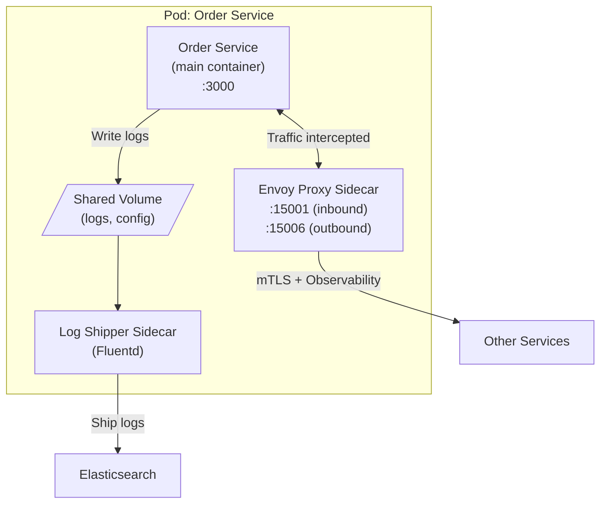

# Sidecar Pattern

## Category
Architectural, Observability, Networking, Service Mesh

## Context

The Sidecar pattern deploys a **helper container alongside the main application container** in the same pod (Kubernetes) or deployment unit. The sidecar handles cross-cutting concerns — logging, monitoring, proxying, security (TLS), configuration, service discovery — so the main application doesn't need to implement these itself.

The pattern is the foundation of **Service Mesh** (Istio, Linkerd), where every service gets a proxy sidecar (Envoy) that handles all network traffic.

---

## Pros

- **Separation of concerns**: Application code focuses on business logic; infrastructure concerns are delegated to the sidecar.
- **Language agnostic**: The sidecar handles networking, observability regardless of the application's language.
- **Reusability**: Same sidecar configuration applied uniformly across all services.
- **Independent updates**: Sidecar can be updated without redeploying the application.
- **Transparent to the application**: Main app doesn't need to know the sidecar exists.

---

## Cons

- **Resource overhead**: Every service gets a sidecar container consuming extra CPU and memory.
- **Increased pod count**: More containers to manage, monitor, and troubleshoot.
- **Startup dependency**: Application may need to wait for the sidecar to be ready.
- **Debugging complexity**: Network traffic goes through the sidecar — adds a layer to debug.
- **Not suitable for all environments**: Works best with container orchestration (Kubernetes).

---

## Design Diagram



---

## Code Sample

### Kubernetes Pod with Envoy Sidecar (Istio-injected)

```yaml
# order-service-deployment.yaml
apiVersion: apps/v1
kind: Deployment
metadata:
  name: order-service
  labels:
    app: order-service
spec:
  replicas: 3
  selector:
    matchLabels:
      app: order-service
  template:
    metadata:
      labels:
        app: order-service
      annotations:
        sidecar.istio.io/inject: "true"   # Istio auto-injects Envoy sidecar
    spec:
      containers:
        - name: order-service
          image: mycompany/order-service:1.0.0
          ports: [{containerPort: 3000}]
          resources:
            requests: {cpu: '100m', memory: '128Mi'}
            limits:   {cpu: '500m', memory: '512Mi'}
```

### Manual Sidecar — Log Shipper

```yaml
# pod-with-log-sidecar.yaml
apiVersion: v1
kind: Pod
metadata:
  name: app-with-log-sidecar
spec:
  volumes:
    - name: shared-logs
      emptyDir: {}

  containers:
    # Main application
    - name: app
      image: myapp:1.0.0
      volumeMounts:
        - name: shared-logs
          mountPath: /var/log/app

    # Log shipper sidecar
    - name: log-shipper
      image: fluent/fluentd:v1.16
      volumeMounts:
        - name: shared-logs
          mountPath: /var/log/app
      env:
        - name: FLUENTD_ARGS
          value: "-c /fluentd/etc/fluent.conf"
```

### Sidecar for Configuration Reloading

```yaml
# pod-with-config-sidecar.yaml
apiVersion: v1
kind: Pod
metadata:
  name: app-with-config-reloader
spec:
  volumes:
    - name: config
      configMap:
        name: app-config

  containers:
    - name: app
      image: myapp:1.0.0
      volumeMounts:
        - name: config
          mountPath: /etc/app/config

    # Config watcher sidecar — reloads app config on changes
    - name: config-reloader
      image: jimmidyson/configmap-reload:v0.9.0
      args:
        - --volume-dir=/etc/config
        - --webhook-url=http://localhost:3000/-/reload
      volumeMounts:
        - name: config
          mountPath: /etc/config
          readOnly: true
```

### Sidecar Proxy Pattern (Node.js example)

```javascript
// sidecar-proxy.js — A lightweight proxy that adds auth header and logging
const http = require('http');
const httpProxy = require('http-proxy');

const proxy = httpProxy.createProxyServer({ target: 'http://localhost:3000' });

http.createServer((req, res) => {
  // Add observability
  const start = Date.now();

  // Add auth header from secret store
  req.headers['x-internal-token'] = process.env.INTERNAL_TOKEN;

  proxy.web(req, res, {}, (err) => {
    res.writeHead(502);
    res.end('Bad Gateway');
  });

  res.on('finish', () => {
    console.log(JSON.stringify({
      method: req.method,
      path: req.url,
      status: res.statusCode,
      duration: Date.now() - start,
    }));
  });
}).listen(8080, () => console.log('Sidecar proxy on port 8080'));
```
