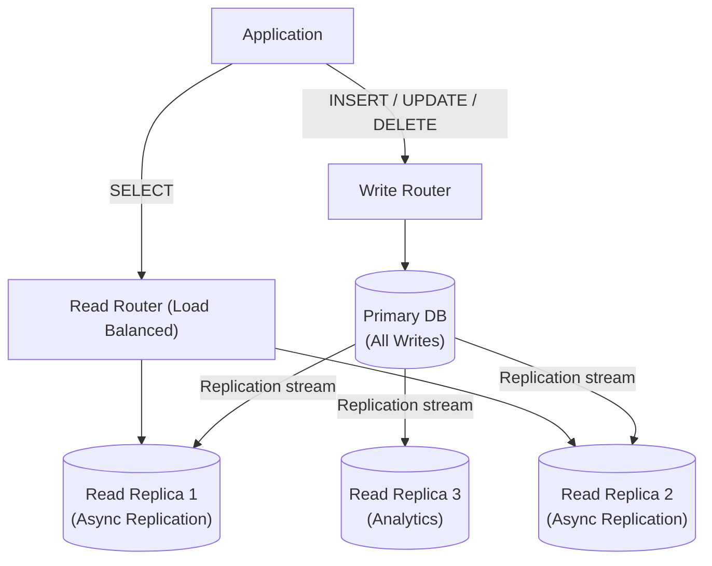

# Read Replicas (Database Replication)

## Category
Scalability, Performance, Availability

## Context

Read Replicas is a database scaling pattern where a **primary (master) database** handles all writes, and one or more **replica (read) databases** receive a copy of all data asynchronously. Read traffic is routed to replicas, offloading the primary and dramatically improving read throughput.

Most modern databases support replication natively: PostgreSQL streaming replication, MySQL binary log replication, MongoDB replica sets, AWS RDS read replicas.

---

## Pros

- **Horizontal read scaling**: Multiple replicas can serve read traffic in parallel.
- **Reduced primary load**: Offloads read queries, freeing primary resources for writes.
- **High availability**: Replicas can be promoted to primary if the primary fails.
- **Geographic distribution**: Place replicas closer to read-heavy regions for lower latency.
- **Analytics isolation**: Run slow analytical queries on a dedicated replica without impacting production.
- **Backups without downtime**: Take backups from the replica instead of the primary.

---

## Cons

- **Replication lag**: Replicas may be slightly behind the primary — stale reads.
- **Consistency issues**: Users may read their own writes as stale if not handled correctly.
- **Write bottleneck remains**: All writes still go to a single primary.
- **Failover complexity**: Promoting a replica to primary requires coordination.
- **Increased operational cost**: More database instances to manage and pay for.

---

## Design Diagram



---

## Code Sample

### Read/Write Splitting (Node.js / PostgreSQL)

```typescript
// db/connection.ts
import { Pool } from 'pg';

// Primary: handles all writes
const primaryPool = new Pool({ connectionString: process.env.PRIMARY_DB_URL });

// Read replicas: round-robin read distribution
const replicaPools: Pool[] = [
  new Pool({ connectionString: process.env.REPLICA_1_URL }),
  new Pool({ connectionString: process.env.REPLICA_2_URL }),
];

let replicaIndex = 0;

export function getReadPool(): Pool {
  const pool = replicaPools[replicaIndex % replicaPools.length];
  replicaIndex++;
  return pool;
}

export function getWritePool(): Pool {
  return primaryPool;
}
```

### Repository with Read/Write Routing

```typescript
// repositories/user.repository.ts
import { getReadPool, getWritePool } from '../db/connection';

interface User { id: number; name: string; email: string; created_at: Date; }

export async function getUserById(id: number): Promise<User | undefined> {
  const db = getReadPool(); // Route to replica
  const { rows } = await db.query('SELECT * FROM users WHERE id = $1', [id]);
  return rows[0] as User | undefined;
}

export async function createUser(name: string, email: string): Promise<User> {
  const db = getWritePool(); // Route to primary
  const { rows } = await db.query(
    'INSERT INTO users (name, email) VALUES ($1, $2) RETURNING *',
    [name, email],
  );
  return rows[0] as User;
}

export async function listUsers(limit = 50): Promise<User[]> {
  const db = getReadPool();
  const { rows } = await db.query(
    'SELECT * FROM users ORDER BY created_at DESC LIMIT $1',
    [limit],
  );
  return rows as User[];
}
```

### Read-Your-Writes Consistency (sticky session or synchronous read from primary)

```typescript
// After a write, read from primary to guarantee freshness
export async function updateUserAndReturn(userId: number, data: { name: string }): Promise<User> {
  const writeDb = getWritePool();

  await writeDb.query('UPDATE users SET name = $1 WHERE id = $2', [data.name, userId]);

  // Read fresh data from primary (not replica) to avoid stale read
  const { rows } = await writeDb.query('SELECT * FROM users WHERE id = $1', [userId]);
  return rows[0] as User;
}
```

### AWS RDS Read Replica (Terraform)

```hcl
# terraform/rds-replica.tf
resource "aws_db_instance" "primary" {
  identifier        = "myapp-primary"
  engine            = "postgres"
  engine_version    = "15.4"
  instance_class    = "db.r6g.large"
  allocated_storage = 100
  db_name           = "myapp"
  username          = "admin"
  password          = var.db_password
  multi_az          = true
}

resource "aws_db_instance" "replica_1" {
  identifier          = "myapp-replica-1"
  replicate_source_db = aws_db_instance.primary.identifier
  instance_class      = "db.r6g.large"
  publicly_accessible = false
}

resource "aws_db_instance" "replica_2" {
  identifier          = "myapp-replica-2"
  replicate_source_db = aws_db_instance.primary.identifier
  instance_class      = "db.r6g.large"
  publicly_accessible = false
}
```

## Related Patterns

- [11 — Database Sharding](./11-database-sharding.md) — Horizontal data partitioning to scale both reads and writes
- [04 — CQRS](./04-cqrs.md) — Read replicas are the natural backing store for the CQRS read model
- [12 — Caching Patterns](./12-caching-patterns.md) — Place a cache in front of replicas for sub-millisecond hot reads
- [31 — Database per Service](./31-database-per-service.md) — Each service DB can independently have its own replica set
