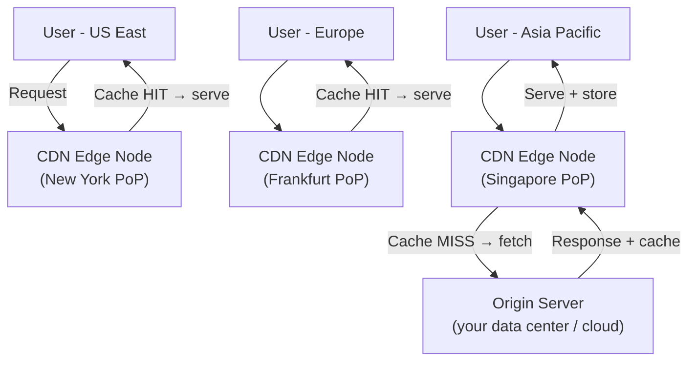

# CDN — Content Delivery Network

## Category
Performance, Scalability, Availability

## Context

A Content Delivery Network (CDN) is a geographically distributed network of proxy servers (edge nodes / Points of Presence — PoPs) that cache and serve content close to the end user. Instead of every request traveling to the origin server, static assets (images, CSS, JS, video) and even dynamic responses are served from the nearest edge node, drastically reducing latency.

Common CDN providers: Cloudflare, AWS CloudFront, Fastly, Akamai, Azure CDN.

---

## Pros

- **Reduced latency**: Content served from the PoP nearest to the user (milliseconds vs. hundreds of milliseconds).
- **Reduced origin load**: Edge nodes absorb the majority of traffic; origin handles cache misses only.
- **Scalability**: CDNs have massive global capacity — handle traffic spikes without origin scaling.
- **DDoS protection**: Edge absorbs and mitigates volumetric attacks before they reach origin.
- **High availability**: If origin is temporarily unavailable, CDN can serve cached content.
- **SSL termination and HTTP/3 support**: Edge handles encryption, reducing origin compute.

---

## Cons

- **Cache invalidation complexity**: Pushing content updates to all edge nodes requires purge APIs.
- **Stale content**: Cached content may be outdated if TTL is too long and purge isn't triggered.
- **Dynamic content limitations**: Personalized or real-time content cannot be cached (or requires edge compute).
- **Cost**: High traffic volumes incur significant CDN egress costs.
- **Debugging**: Cache hits/misses and edge behavior add debugging complexity.
- **Vendor lock-in**: Migrating CDN providers requires configuration updates.

---

## Design Diagram



---

## Code Sample

### Cache-Control Headers (Express.js)

```javascript
// middleware/cache-headers.js
const express = require('express');
const path = require('path');
const app = express();

// Static assets — aggressive caching (fingerprinted filenames)
app.use('/static', express.static(path.join(__dirname, 'public'), {
  maxAge: '1y',             // Cache for 1 year (use filename hashing for cache busting)
  immutable: true,          // Content will never change at this URL
  etag: false,
}));

// HTML pages — short TTL, allow stale while revalidate
app.get('/', (req, res) => {
  res.setHeader('Cache-Control', 'public, max-age=60, stale-while-revalidate=300');
  res.send('<html>...</html>');
});

// API responses — no cache
app.get('/api/users/:id', (req, res) => {
  res.setHeader('Cache-Control', 'no-store');
  res.json({ id: req.params.id, name: 'Alice' });
});

// CDN-cacheable API endpoint (same for all users)
app.get('/api/products', (req, res) => {
  res.setHeader('Cache-Control', 'public, max-age=300, s-maxage=600'); // s-maxage for CDN
  res.json([{ id: 1, name: 'Widget', price: 9.99 }]);
});
```

### AWS CloudFront Distribution (Terraform)

```hcl
# terraform/cloudfront.tf
resource "aws_cloudfront_distribution" "cdn" {
  enabled             = true
  default_root_object = "index.html"
  aliases             = ["www.myapp.com"]

  origin {
    domain_name = aws_s3_bucket.assets.bucket_regional_domain_name
    origin_id   = "S3-assets"

    s3_origin_config {
      origin_access_identity = aws_cloudfront_origin_access_identity.oai.cloudfront_access_identity_path
    }
  }

  origin {
    domain_name = "api.myapp.com"
    origin_id   = "API-origin"
    custom_origin_config {
      http_port              = 80
      https_port             = 443
      origin_protocol_policy = "https-only"
    }
  }

  # Static assets cache behavior
  ordered_cache_behavior {
    path_pattern           = "/static/*"
    target_origin_id       = "S3-assets"
    viewer_protocol_policy = "redirect-to-https"
    allowed_methods        = ["GET", "HEAD"]
    cached_methods         = ["GET", "HEAD"]
    compress               = true

    forwarded_values {
      query_string = false
      cookies { forward = "none" }
    }

    min_ttl     = 31536000   # 1 year
    default_ttl = 31536000
    max_ttl     = 31536000
  }

  # API — no cache
  ordered_cache_behavior {
    path_pattern           = "/api/*"
    target_origin_id       = "API-origin"
    viewer_protocol_policy = "https-only"
    allowed_methods        = ["GET", "HEAD", "OPTIONS", "PUT", "POST", "PATCH", "DELETE"]
    cached_methods         = ["GET", "HEAD"]

    forwarded_values {
      query_string = true
      headers      = ["Authorization", "Origin"]
      cookies { forward = "all" }
    }

    min_ttl     = 0
    default_ttl = 0
    max_ttl     = 0
  }

  viewer_certificate {
    acm_certificate_arn = var.acm_cert_arn
    ssl_support_method  = "sni-only"
  }

  restrictions {
    geo_restriction { restriction_type = "none" }
  }
}
```

### Cache Purge on Deployment (AWS CloudFront Invalidation)

```bash
#!/bin/bash
# purge-cdn.sh — Run after deploying new static assets
DISTRIBUTION_ID=$(aws cloudfront list-distributions --query \
  "DistributionList.Items[?Aliases.Items[?contains(@,'www.myapp.com')]].Id" \
  --output text)

aws cloudfront create-invalidation \
  --distribution-id "$DISTRIBUTION_ID" \
  --paths "/static/*" "/index.html"

echo "CDN cache purged for distribution: $DISTRIBUTION_ID"
```
