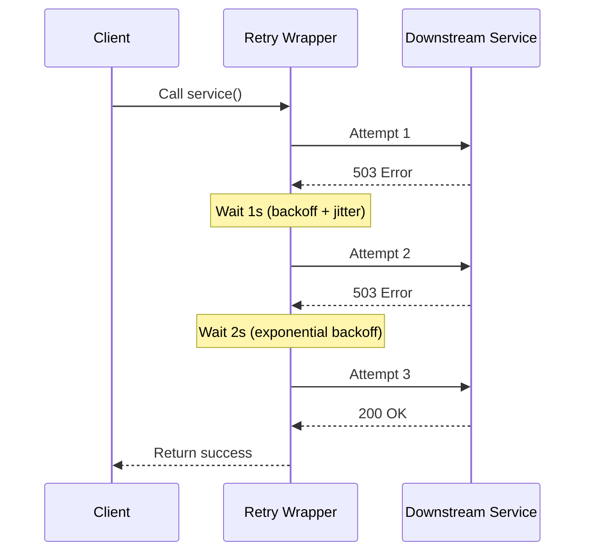

# Retry Pattern

## Category

Resilience, Fault Tolerance, Reliability

## Context

The Retry pattern automatically re-executes a failed operation after a delay, assuming that transient failures (network glitches, brief service unavailability, temporary throttling) will resolve quickly. It is one of the fundamental reliability patterns in distributed systems.

Retry should always be combined with:

- **Exponential backoff**: Increasing delay between retries to avoid overwhelming the target.
- **Jitter**: Randomized delay offset to prevent synchronized retry storms.
- **Max retries**: A cap to prevent infinite retry loops.
- **Circuit Breaker**: Stop retrying when a service is persistently down.

---

## Pros

- **Transparency**: Transient errors are automatically recovered without user awareness.
- **Increased resilience**: System handles brief network blips and transient service unavailability.
- **Simple to implement**: A few lines of code provide significant reliability improvement.
- **Pairs with backoff**: Exponential backoff + jitter prevents thundering herd on recovery.

---

## Cons

- **Increased latency**: Retries add delay before the error is surfaced (or the call succeeds).
- **Amplified load**: Retries multiply requests to an already struggling service.
- **Not idempotent operations**: Retrying non-idempotent operations (e.g., POST payment) may cause duplicate actions.
- **Retry storms**: Many clients retrying simultaneously can overwhelm a recovering service.
- **Masking real failures**: Excessive retries may hide persistent issues that need immediate attention.

---

## Design Diagram



---

## Code Sample

### Manual Retry with Exponential Backoff + Jitter (TypeScript)

```typescript
// resilience/retry.ts
interface RetryOptions {
  maxAttempts: number;
  baseDelayMs: number;
  maxDelayMs: number;
  retryableErrors?: (err: unknown) => boolean;
}

function sleep(ms: number): Promise<void> {
  return new Promise((resolve) => setTimeout(resolve, ms));
}

function calculateDelay(
  attempt: number,
  baseDelay: number,
  maxDelay: number,
): number {
  const exponential = baseDelay * Math.pow(2, attempt - 1);
  const jitter = Math.random() * exponential * 0.5; // ±50% jitter
  return Math.min(exponential + jitter, maxDelay);
}

export async function withRetry<T>(
  fn: () => Promise<T>,
  options: RetryOptions,
): Promise<T> {
  const isRetryable = options.retryableErrors ?? (() => true);
  let lastError: unknown;

  for (let attempt = 1; attempt <= options.maxAttempts; attempt++) {
    try {
      return await fn();
    } catch (err) {
      lastError = err;

      if (attempt === options.maxAttempts || !isRetryable(err)) {
        throw err;
      }

      const delay = calculateDelay(
        attempt,
        options.baseDelayMs,
        options.maxDelayMs,
      );
      console.warn(
        `[Retry] Attempt ${attempt} failed. Retrying in ${delay.toFixed(0)}ms...`,
      );
      await sleep(delay);
    }
  }

  throw lastError;
}
```

### Usage

```typescript
// services/payment.service.ts
import axios, { AxiosError } from "axios";
import { withRetry } from "../resilience/retry";

function isRetryableAxiosError(err: unknown): boolean {
  if (err instanceof AxiosError) {
    const status = err.response?.status;
    // Retry on 429, 503, 502, 504 — but NOT 400, 401, 403, 404
    return !status || status === 429 || status >= 500;
  }
  return true; // Network errors are always retryable
}

export async function processPayment(orderId: string, amount: number) {
  return withRetry(
    () => axios.post("http://payment-service/pay", { orderId, amount }),
    {
      maxAttempts: 3,
      baseDelayMs: 500,
      maxDelayMs: 5000,
      retryableErrors: isRetryableAxiosError,
    },
  );
}
```

### Using `axios-retry` library

```typescript
// http/axios-client.ts
import axios from 'axios';
import axiosRetry from 'axios-retry';

const client = axios.create({ timeout: 5_000 });

axiosRetry(client, {
  retries:        3,
  retryDelay:     axiosRetry.exponentialDelay,
  retryCondition: (error) =>
    axiosRetry.isNetworkError(error) ||
    axiosRetry.isRetryableError(error) ||
    error.response?.status === 429,
  onRetry: (retryCount, error) => {
    console.warn(`Retry attempt #${retryCount}: ${error.message}`);
  },
});

export default client;
```

### Idempotency Key (safe retries for non-idempotent operations)

```typescript
// Attach an idempotency key to prevent duplicate side effects on retry
import axios from 'axios';

declare function withRetry<T>(fn: () => Promise<T>, opts: unknown): Promise<T>;

export async function createPaymentSafely(orderId: string, amount: number) {
  const idempotencyKey = `payment-${orderId}`; // Stable key per business operation

  return withRetry(
    () => axios.post(
      'http://payment-service/pay',
      { orderId, amount },
      { headers: { 'Idempotency-Key': idempotencyKey } },
    ),
    { maxAttempts: 3, baseDelayMs: 500, maxDelayMs: 5_000 },
  );
}
```

## Related Patterns

- [13 — Circuit Breaker](./13-circuit-breaker.md) — Wrap retries with a circuit breaker: stop retrying when the circuit opens
- [30 — Dead Letter Queue](./30-dead-letter-queue.md) — Route messages that exceed max retry attempts to a DLQ
- [15 — Bulkhead Pattern](./15-bulkhead-pattern.md) — Combine for full defence-in-depth: bulkhead + CB + retry
