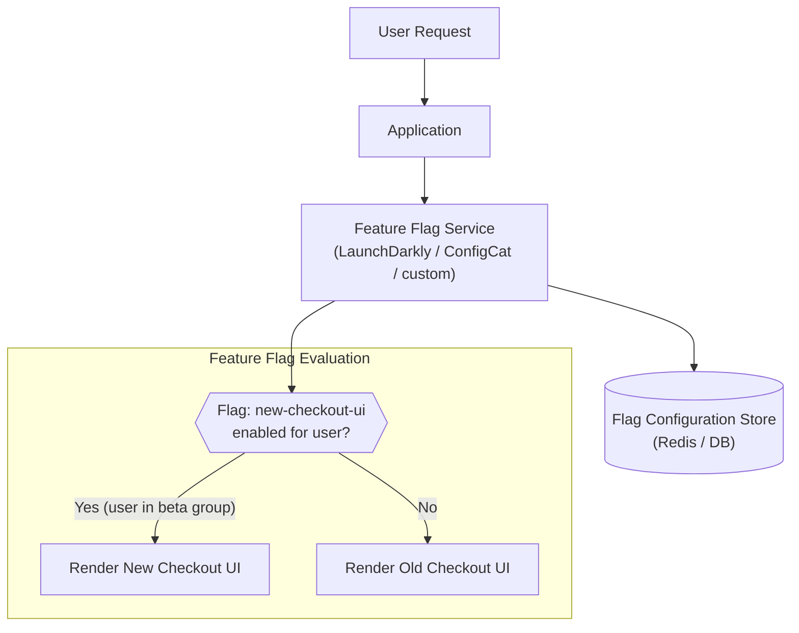

# Feature Flags (Feature Toggles)

## Category
Deployment, Risk Management, Experimentation

## Context

Feature Flags (also called Feature Toggles) allow teams to enable or disable functionality at runtime without deploying new code. A flag check is placed around new or experimental code; the feature is turned on slowly for specific user segments (canary users, beta testers, specific tenants) or turned off instantly if problems arise.

Categories:
- **Release toggles**: Control rollout of incomplete features.
- **Experiment toggles**: A/B testing.
- **Ops toggles**: Kill switches for degraded-mode operation.
- **Permission toggles**: Expose features to specific user tiers or roles.

---

## Pros

- **Decouple deployment from release**: Code ships to production but is off — released on business schedule, not deployment schedule.
- **Instant rollback**: Turn off a broken feature without a deployment.
- **Gradual rollout**: Enable for 1% → 10% → 100% of users progressively.
- **A/B testing**: Run controlled experiments in production with real user data.
- **Dark launches**: Deploy and test under production load before enabling for users.
- **Kill switches**: Disable non-critical features under high load to protect core functionality.

---

## Cons

- **Technical debt**: Old feature flags that are never cleaned up clutter the codebase.
- **Testing complexity**: Feature combinations create exponential test cases.
- **Stale flags**: Forgotten flags may cause unexpected behavior long after a feature is fully released.
- **Coordination overhead**: Requires a management system and process discipline.
- **Conditional logic pollution**: Too many flags make code hard to follow.

---

## Design Diagram



---

## Code Sample

### Simple Feature Flag Service (Node.js / Redis)

```javascript
// feature-flags/flag-service.js
const { createClient } = require('redis');

const redis = createClient({ url: process.env.REDIS_URL });
redis.connect();

async function isEnabled(flagName, userId = null) {
  const flagKey = `feature:${flagName}`;
  const config = await redis.hGetAll(flagKey);

  if (!config || config.enabled === 'false') return false;
  if (config.enabled === 'true' && !config.userPercentage && !config.userIds) return true;

  // Percentage rollout
  if (config.userPercentage && userId) {
    const hash = hashCode(userId) % 100;
    if (hash < parseInt(config.userPercentage, 10)) return true;
  }

  // Allowlist
  if (config.userIds && userId) {
    const allowed = config.userIds.split(',');
    if (allowed.includes(userId)) return true;
  }

  return false;
}

function hashCode(str) {
  let hash = 0;
  for (const ch of str) {
    hash = ((hash << 5) - hash + ch.charCodeAt(0)) | 0;
  }
  return Math.abs(hash);
}

module.exports = { isEnabled };
```

### Usage in a Route

```javascript
// routes/checkout.js
const { isEnabled } = require('../feature-flags/flag-service');

app.get('/checkout', async (req, res) => {
  const userId = req.user.id;
  const useNewUI = await isEnabled('new-checkout-ui', userId);

  if (useNewUI) {
    res.render('checkout-v2', { user: req.user });
  } else {
    res.render('checkout-v1', { user: req.user });
  }
});
```

### Flag Configuration Admin API

```javascript
// admin/flags.router.js
const express = require('express');
const { createClient } = require('redis');
const router = express.Router();
const redis = createClient({ url: process.env.REDIS_URL });

// Enable flag for percentage of users
router.put('/flags/:name', async (req, res) => {
  const { name } = req.params;
  const { enabled, userPercentage, userIds } = req.body;

  await redis.hSet(`feature:${name}`, {
    enabled: String(enabled),
    ...(userPercentage !== undefined && { userPercentage: String(userPercentage) }),
    ...(userIds && { userIds: userIds.join(',') }),
  });

  res.json({ message: `Flag '${name}' updated`, enabled, userPercentage, userIds });
});

// Get all flags
router.get('/flags', async (req, res) => {
  const keys = await redis.keys('feature:*');
  const flags = await Promise.all(
    keys.map(async (key) => ({ name: key.replace('feature:', ''), ...await redis.hGetAll(key) }))
  );
  res.json(flags);
});

module.exports = router;
```

### Using LaunchDarkly SDK

```javascript
// feature-flags/launchdarkly.js
const LaunchDarkly = require('@launchdarkly/node-server-sdk');

const client = LaunchDarkly.init(process.env.LD_SDK_KEY);

async function isFeatureEnabled(flagKey, user) {
  await client.waitForInitialization();
  return client.variation(flagKey, user, false); // false = default off
}

// Usage
const user = { key: 'user-123', email: 'alice@example.com', custom: { plan: 'premium' } };
const enabled = await isFeatureEnabled('new-checkout-ui', user);
```
