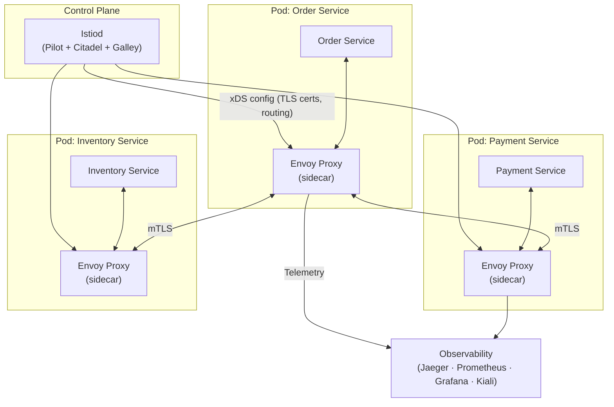

# Service Mesh

## Category
Architectural, Networking, Observability, Security, Scalability

## Context

A Service Mesh is a dedicated infrastructure layer for managing **service-to-service communication** in a microservices architecture. It is implemented using a sidecar proxy (typically Envoy) injected into every service pod. The proxies form the **data plane**, handling all traffic. A centralized **control plane** (Istio, Linkerd, Consul Connect) manages and configures the proxies.

The service mesh handles: mutual TLS (mTLS), circuit breaking, retries, timeouts, traffic splitting, canary deployments, observability (metrics, tracing, logs) — all without application code changes.

---

## Pros

- **Zero-trust security**: mTLS automatically encrypts and authenticates all service-to-service traffic.
- **Observability**: Distributed tracing, metrics (latency, error rate, throughput) for every service call out of the box.
- **Traffic management**: Fine-grained routing, canary deployments, A/B testing at the infrastructure level.
- **Resilience**: Circuit breaking, retries, timeouts — applied globally without code changes.
- **Language agnostic**: Works for services written in any language.
- **Centralized policy**: Security and traffic policies managed from the control plane.

---

## Cons

- **Operational complexity**: Service meshes are complex to install, configure, and troubleshoot.
- **Resource overhead**: Every pod requires a sidecar proxy (Envoy), consuming CPU and memory.
- **Latency overhead**: An extra network hop through the sidecar proxy adds microseconds.
- **Steep learning curve**: Understanding DestinationRules, VirtualServices, PeerAuthentication takes time.
- **Overkill for small systems**: Not justified for a small number of services.
- **Debugging**: When things go wrong inside the mesh, it can be very hard to diagnose.

---

## Design Diagram



---

## Code Sample

### Istio VirtualService — Traffic Splitting (Canary)

```yaml
# istio/virtualservice-canary.yaml
apiVersion: networking.istio.io/v1beta1
kind: VirtualService
metadata:
  name: order-service
spec:
  hosts:
    - order-service
  http:
    - route:
        - destination:
            host: order-service
            subset: v1
          weight: 90
        - destination:
            host: order-service
            subset: v2
          weight: 10
```

### Istio DestinationRule — Subsets and Circuit Breaking

```yaml
# istio/destination-rule.yaml
apiVersion: networking.istio.io/v1beta1
kind: DestinationRule
metadata:
  name: order-service
spec:
  host: order-service
  trafficPolicy:
    connectionPool:
      tcp:
        maxConnections: 100
      http:
        h2UpgradePolicy: UPGRADE
        http1MaxPendingRequests: 50
        maxRequestsPerConnection: 10
    outlierDetection:                # Circuit breaking
      consecutive5xxErrors: 5
      interval: 10s
      baseEjectionTime: 30s
      maxEjectionPercent: 50
  subsets:
    - name: v1
      labels:
        version: v1
    - name: v2
      labels:
        version: v2
```

### Istio PeerAuthentication — Enforce mTLS

```yaml
# istio/peer-authentication.yaml
apiVersion: security.istio.io/v1beta1
kind: PeerAuthentication
metadata:
  name: default
  namespace: production
spec:
  mtls:
    mode: STRICT   # Reject all plaintext traffic between services
```

### Istio AuthorizationPolicy — Zero-Trust Access Control

```yaml
# istio/authorization-policy.yaml
apiVersion: security.istio.io/v1beta1
kind: AuthorizationPolicy
metadata:
  name: payment-policy
  namespace: production
spec:
  selector:
    matchLabels:
      app: payment-service
  rules:
    - from:
        - source:
            principals:
              - "cluster.local/ns/production/sa/order-service"  # Only Order Service allowed
      to:
        - operation:
            methods: ["POST"]
            paths: ["/pay"]
```

### Linkerd Service Mesh Installation

```bash
# Install Linkerd (simpler alternative to Istio)
curl --proto '=https' --tlsv1.2 -sSfL https://run.linkerd.io/install | sh
linkerd check --pre
linkerd install --crds | kubectl apply -f -
linkerd install | kubectl apply -f -
linkerd check

# Inject sidecar into a deployment
kubectl get deploy order-service -o yaml | \
  linkerd inject - | \
  kubectl apply -f -

# View real-time metrics
linkerd viz dashboard
```
