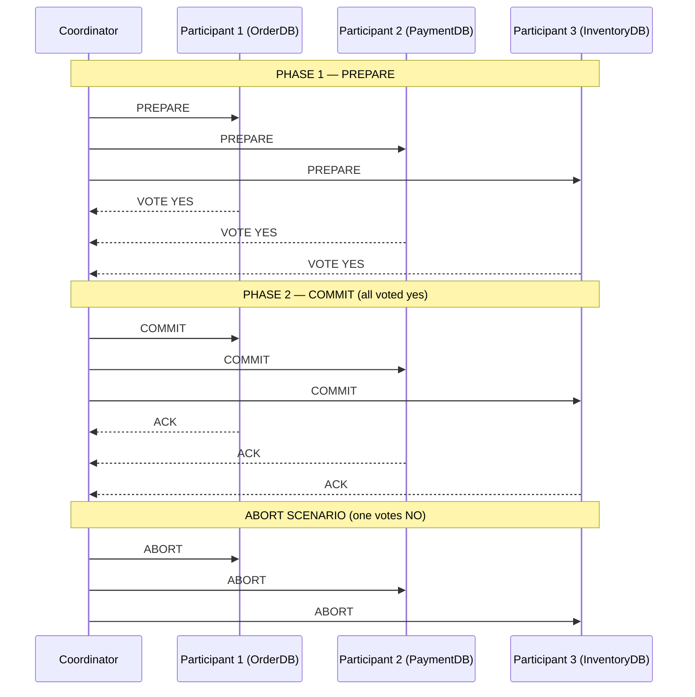

# Two-Phase Commit (2PC)

## Category
Data Management, Distributed Transactions, Consistency

## Context

Two-Phase Commit (2PC) is a distributed transaction protocol that ensures **atomicity across multiple participants** (databases, services). A **coordinator** node manages the protocol in two phases:

1. **Prepare phase**: Coordinator asks all participants to prepare and lock resources. Each participant votes "Yes" (can commit) or "No" (abort).
2. **Commit phase**: If all vote Yes, coordinator sends Commit. If any vote No, coordinator sends Abort to all.

2PC is the classic approach to distributed atomicity but is generally avoided in modern microservices in favor of the Saga pattern.

---

## Pros

- **Strong consistency**: All participants either commit or abort together — true ACID across distributed nodes.
- **No compensating transactions needed**: Unlike Saga, there's no need to design explicit rollback logic.
- **Well understood protocol**: Decades of implementation in enterprise systems (XA transactions).
- **Transparent to application**: Middleware (JTA, XA) handles protocol details.

---

## Cons

- **Blocking protocol**: Participants hold locks during both phases — reduces throughput.
- **Coordinator is a single point of failure**: If coordinator crashes after Prepare but before Commit, participants are stuck (blocking problem).
- **Performance**: Network round-trips and lock contention add significant latency.
- **Scalability**: Lock contention prevents horizontal scaling.
- **Not suitable for microservices**: Different teams' owned databases need to participate — creates tight coupling.
- **Modern rejection**: Cloud-native systems prefer Saga + Outbox over 2PC.

---

## Design Diagram



---

## Code Sample

### Coordinator Implementation (TypeScript)

```typescript
// two-phase-commit/coordinator.ts
enum ParticipantVote {
  YES = 'YES',
  NO = 'NO',
}

interface Participant {
  name: string;
  prepare: (txId: string) => Promise<ParticipantVote>;
  commit: (txId: string) => Promise<void>;
  abort: (txId: string) => Promise<void>;
}

export class TwoPhaseCommitCoordinator {
  private readonly transactionLog: Map<string, string> = new Map();

  async execute(txId: string, participants: Participant[]): Promise<boolean> {
    console.log(`[2PC] Phase 1 — PREPARE (txId: ${txId})`);
    this.transactionLog.set(txId, 'PREPARING');

    // Phase 1: Collect votes
    const votes = await Promise.all(
      participants.map(async (p) => {
        try {
          const vote = await p.prepare(txId);
          console.log(`[2PC] ${p.name} voted: ${vote}`);
          return vote;
        } catch (err) {
          console.error(`[2PC] ${p.name} prepare failed:`, err);
          return ParticipantVote.NO;
        }
      })
    );

    const allYes = votes.every(v => v === ParticipantVote.YES);

    // Phase 2: Commit or Abort
    if (allYes) {
      console.log(`[2PC] Phase 2 — COMMIT (txId: ${txId})`);
      this.transactionLog.set(txId, 'COMMITTING');
      await Promise.all(participants.map(p => p.commit(txId).catch(console.error)));
      this.transactionLog.set(txId, 'COMMITTED');
      return true;
    } else {
      console.log(`[2PC] Phase 2 — ABORT (txId: ${txId})`);
      this.transactionLog.set(txId, 'ABORTING');
      await Promise.all(participants.map(p => p.abort(txId).catch(console.error)));
      this.transactionLog.set(txId, 'ABORTED');
      return false;
    }
  }
}
```

### Participant Implementation (PostgreSQL-backed)

```typescript
// two-phase-commit/db-participant.ts
import { Pool, PoolClient } from 'pg';

export class DatabaseParticipant implements Participant {
  private preparedClients: Map<string, PoolClient> = new Map();

  constructor(public readonly name: string, private readonly pool: Pool) {}

  async prepare(txId: string): Promise<ParticipantVote> {
    const client = await this.pool.connect();
    try {
      await client.query('BEGIN');
      // Execute the local operation
      await client.query(
        `INSERT INTO transactions (tx_id, status) VALUES ($1, 'PREPARED')`,
        [txId]
      );
      // Use PostgreSQL PREPARE TRANSACTION (part of XA spec)
      await client.query(`PREPARE TRANSACTION '${txId}'`);
      this.preparedClients.set(txId, client);
      return ParticipantVote.YES;
    } catch (err) {
      await client.query('ROLLBACK');
      client.release();
      return ParticipantVote.NO;
    }
  }

  async commit(txId: string): Promise<void> {
    const client = this.preparedClients.get(txId);
    await client!.query(`COMMIT PREPARED '${txId}'`);
    client!.release();
    this.preparedClients.delete(txId);
  }

  async abort(txId: string): Promise<void> {
    const client = this.preparedClients.get(txId);
    if (client) {
      await client.query(`ROLLBACK PREPARED '${txId}'`);
      client.release();
      this.preparedClients.delete(txId);
    }
  }
}
```

### Usage

```typescript
// main.ts
const coordinator = new TwoPhaseCommitCoordinator();

const orderParticipant = new DatabaseParticipant('OrderDB', orderPool);
const paymentParticipant = new DatabaseParticipant('PaymentDB', paymentPool);

const txId = `tx-${Date.now()}`;
const success = await coordinator.execute(txId, [orderParticipant, paymentParticipant]);

if (success) {
  console.log('Distributed transaction committed successfully');
} else {
  console.log('Distributed transaction aborted — all participants rolled back');
}
```

## Related Patterns

- [06 — Saga Pattern](./06-saga-pattern.md) — Preferred alternative; choreography or orchestration without blocking locks
- [16 — Outbox Pattern](./16-outbox-pattern.md) — Local transaction + outbox avoids 2PC entirely
- [28 — Change Data Capture](./28-change-data-capture.md) — CDC can synchronise state across services after a 2PC commit
