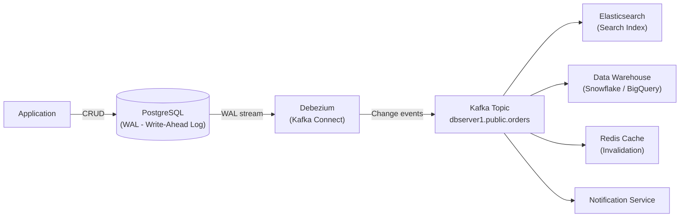

# Change Data Capture (CDC)

## Category
Data Management, Integration, Event-Driven, Streaming

## Context

Change Data Capture (CDC) is a technique for tracking row-level changes (INSERT, UPDATE, DELETE) in a database and streaming those changes to downstream systems in near real-time. Instead of application-level dual writes or periodic batch polling, CDC reads the database's internal transaction log (WAL for PostgreSQL, binlog for MySQL) to capture changes with minimal performance impact.

Common tools: Debezium (open-source, Kafka-based), AWS DMS, Google Datastream, Maxwell's Daemon.

---

## Pros

- **Non-invasive**: No application code changes required; CDC reads the database log directly.
- **Low overhead**: Log tailing is low-impact compared to triggers or polling.
- **Complete change history**: Captures every INSERT/UPDATE/DELETE, not just current state.
- **Real-time streaming**: Changes stream with millisecond latency.
- **Works for any downstream**: Feed data warehouses, search indexes, caches, other services.
- **Outbox alternative**: Can replace the application-level Outbox pattern.

---

## Cons

- **Database-specific**: Each database has a different log format; tooling must support it.
- **Schema evolution complexity**: Column renames or type changes can break CDC consumers.
- **Replication slot overhead (PostgreSQL)**: Unconsumed WAL may accumulate and fill disk.
- **Operational complexity**: Requires Debezium/Kafka Connect cluster management.
- **Initial snapshot load**: Bootstrapping is complex for large existing tables.
- **Sensitive data exposure**: Change events may contain sensitive data flowing through the pipeline.

---

## Design Diagram



---

## Code Sample

### Debezium PostgreSQL Connector Config

```json
{
  "name": "orders-cdc-connector",
  "config": {
    "connector.class": "io.debezium.connector.postgresql.PostgresConnector",
    "database.hostname": "postgres",
    "database.port": "5432",
    "database.user": "debezium",
    "database.password": "debezium",
    "database.dbname": "myapp",
    "database.server.name": "dbserver1",
    "table.include.list": "public.orders,public.users",
    "plugin.name": "pgoutput",
    "publication.name": "debezium_pub",
    "slot.name": "debezium_slot",
    "heartbeat.interval.ms": "10000",
    "transforms": "unwrap",
    "transforms.unwrap.type": "io.debezium.transforms.ExtractNewRecordState",
    "transforms.unwrap.add.fields": "op,table,ts_ms",
    "key.converter": "org.apache.kafka.connect.json.JsonConverter",
    "value.converter": "org.apache.kafka.connect.json.JsonConverter"
  }
}
```

### PostgreSQL Setup for Debezium

```sql
-- Enable logical replication
ALTER SYSTEM SET wal_level = logical;

-- Create replication user
CREATE USER debezium WITH REPLICATION LOGIN PASSWORD 'debezium';
GRANT SELECT ON ALL TABLES IN SCHEMA public TO debezium;

-- Create publication
CREATE PUBLICATION debezium_pub FOR TABLE orders, users;
```

### CDC Consumer — Syncing to Elasticsearch (Node.js / KafkaJS)

```typescript
// cdc-consumers/orders-to-elasticsearch.ts
import { Kafka } from 'kafkajs';
import { Client } from '@elastic/elasticsearch';

const kafka    = new Kafka({ brokers: ['kafka:9092'] });
const consumer = kafka.consumer({ groupId: 'es-sync-group' });
const esClient = new Client({ node: 'http://elasticsearch:9200' });

interface DebeziumEvent {
  __op: 'c' | 'u' | 'd' | 'r';
  id: string;
  user_id: string;
  status: string;
  total: number;
  created_at: string;
}

async function start(): Promise<void> {
  await consumer.connect();
  await consumer.subscribe({ topic: 'dbserver1.public.orders', fromBeginning: false });

  consumer.run({
    eachMessage: async ({ message }) => {
      const event  = JSON.parse(message.value!.toString()) as DebeziumEvent;
      const opCode = event.__op;

      if (opCode === 'd') {
        await esClient.delete({ index: 'orders', id: message.key!.toString() });
      } else {
        await esClient.index({
          index: 'orders',
          id:    event.id,
          body: {
            id:        event.id,
            userId:    event.user_id,
            status:    event.status,
            total:     event.total,
            createdAt: event.created_at,
            updatedAt: new Date().toISOString(),
          },
        });
      }
    },
  });
}

start().catch(console.error);
```

### CDC Consumer — Redis Cache Invalidation

```typescript
// cdc-consumers/orders-cache-invalidation.ts
// consumer already declared above
declare const redis: { del(key: string): Promise<void> };

consumer.run({
  eachMessage: async ({ message }) => {
    const event   = JSON.parse(message.value!.toString()) as DebeziumEvent;
    const orderId = event.id;

    if (['u', 'd'].includes(event.__op)) {
      await redis.del(`order:${orderId}`);
      console.log(`Cache invalidated for order: ${orderId}`);
    }
  },
});
```
## Related Patterns

- [16 — Outbox Pattern](./16-outbox-pattern.md) — Outbox writes application-level events; CDC reads lower-level DB change log
- [05 — Event Sourcing](./05-event-sourcing.md) — CDC can populate event-sourcing projections from existing databases
- [17 — Publish-Subscribe](./17-publish-subscribe.md) — CDC events are typically published onto a pub-sub broker
- [03 — Event-Driven Architecture](./03-event-driven-architecture.md) — CDC is a key integration bus technique in EDA