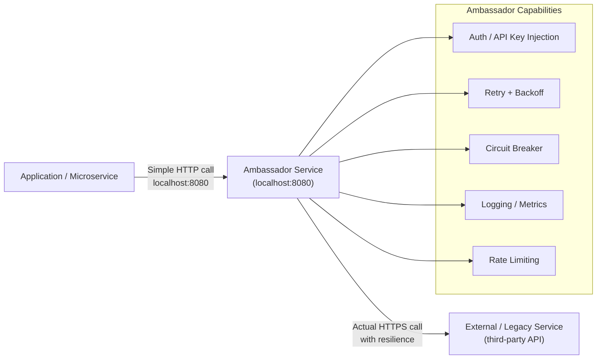

# Ambassador Pattern

## Category
Architectural, Networking, Resilience, Decoupling

## Context

The Ambassador pattern places a **helper service (ambassador)** in front of a legacy or third-party service to handle cross-cutting network concerns on behalf of the main application. The ambassador is a proxy that the application talks to as if it were the real service, while the ambassador handles retries, circuit breaking, authentication, protocol translation, logging, and rate limiting.

It is similar to the Sidecar pattern, but while a sidecar is co-located in the same pod, an ambassador can be a standalone service or a sidecar. The term is commonly used when the proxy specifically acts as a client-side ambassador to an external service.

---

## Pros

- **Decouples application from network concerns**: The app communicates via a simple local call; the ambassador handles complexity.
- **Language agnostic**: Legacy services written in any language get modern resilience patterns without code changes.
- **Reusable**: One ambassador configuration can be reused across many services.
- **Testable in isolation**: The ambassador can be swapped with a mock in testing.
- **Transparent upgrades**: Change resilience logic in the ambassador without touching the app.

---

## Cons

- **Additional network hop**: The ambassador adds latency (though minimal if co-located).
- **Operational overhead**: More services to deploy and monitor.
- **Complexity for simple cases**: Overkill if the application only calls one external service.
- **Ambassador becomes a bottleneck**: Must be scaled and managed carefully.
- **Debugging**: Tracing calls through an ambassador adds a layer.

---

## Design Diagram



---

## Code Sample

### Ambassador Service (Node.js / Express)

```typescript
// ambassador/src/index.ts
import express from 'express';
import axios from 'axios';
import axiosRetry from 'axios-retry';
import CircuitBreaker from 'opossum';

const app = express();
app.use(express.json());

// Configure axios with retry
const client = axios.create({ timeout: 5_000 });
axiosRetry(client, { retries: 3, retryDelay: axiosRetry.exponentialDelay });

// Circuit breaker around the external service
const breaker = new CircuitBreaker(
  (config: Parameters<typeof client.request>[0]) => client.request(config),
  { timeout: 5_000, errorThresholdPercentage: 50, resetTimeout: 30_000 },
);

breaker.fallback(() => ({ data: { error: 'Service temporarily unavailable' }, status: 503 }));

const EXTERNAL_SERVICE_URL = process.env.EXTERNAL_SERVICE_URL!;
const API_KEY              = process.env.EXTERNAL_SERVICE_API_KEY!;

// Proxy all requests to the external service
app.use('/', async (req, res) => {
  try {
    const response = await breaker.fire({
      method: req.method,
      url:    `${EXTERNAL_SERVICE_URL}${req.path}`,
      data:   req.body,
      params: req.query,
      headers: {
        'Authorization':  `Bearer ${API_KEY}`,
        'Content-Type':   'application/json',
        'X-Request-ID':   (req.headers['x-request-id'] as string) ?? crypto.randomUUID(),
      },
    }) as { status: number; data: unknown; };

    console.log(JSON.stringify({ method: req.method, path: req.path, status: response.status }));
    res.status(response.status).json(response.data);
  } catch (err) {
    res.status(502).json({ error: 'Ambassador proxy error', detail: (err as Error).message });
  }
});

app.listen(8080, () => console.log('Ambassador running on :8080'));
```

### Kubernetes Ambassador Sidecar

```yaml
# pod-with-ambassador.yaml
apiVersion: v1
kind: Pod
metadata:
  name: order-service
spec:
  containers:
    # Main application
    - name: order-service
      image: order-service:1.0.0
      env:
        # App calls ambassador on localhost instead of directly calling external service
        - name: PAYMENT_GATEWAY_URL
          value: "http://localhost:8080"

    # Ambassador sidecar for the payment gateway
    - name: payment-ambassador
      image: mycompany/payment-ambassador:1.0.0
      ports: [{containerPort: 8080}]
      env:
        - name: EXTERNAL_SERVICE_URL
          value: "https://api.payment-gateway.com"
        - name: EXTERNAL_SERVICE_API_KEY
          valueFrom:
            secretKeyRef:
              name: payment-secrets
              key: api-key
```

### Protocol Translation Ambassador (REST → gRPC)

```typescript
// ambassador/grpc-to-rest-bridge.ts
// App speaks REST; legacy service speaks gRPC — Ambassador translates transparently
import express from 'express';
import * as grpc from '@grpc/grpc-js';
import * as protoLoader from '@grpc/proto-loader';

const packageDef = protoLoader.loadSync('payment.proto');
const proto      = grpc.loadPackageDefinition(packageDef) as Record<string, grpc.GrpcObject>;
const grpcClient = new (proto.PaymentService as grpc.ServiceClientConstructor)(
  'legacy-service:50051',
  grpc.credentials.createInsecure(),
);

const app = express();
app.use(express.json());

// REST endpoint → gRPC call
app.post('/pay', (req, res) => {
  grpcClient.ProcessPayment(req.body, (err: Error | null, response: unknown) => {
    if (err) { res.status(500).json({ error: err.message }); return; }
    res.json(response);
  });
});

app.listen(8080, () => console.log('gRPC→REST Ambassador on :8080'));
```

## Related Patterns

- [13 — Circuit Breaker](./13-circuit-breaker.md) — Ambassador is the natural host for egress circuit-breaker logic
- [21 — Sidecar Pattern](./21-sidecar-pattern.md) — Ambassador uses the same sidecar deployment model
- [26 — Service Mesh](./26-service-mesh.md) — Mesh provides ambassador-like capabilities at the infrastructure level
