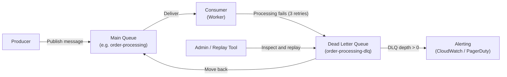

# Dead Letter Queue (DLQ)

## Category
Messaging, Resilience, Reliability, Error Handling

## Context

A Dead Letter Queue (DLQ) is a special queue where messages that cannot be processed successfully are automatically sent after a configured number of retries or due to a processing error. Instead of losing failed messages or blocking the main queue, the DLQ safely preserves them for later inspection, alerting, and reprocessing.

DLQs are supported natively in AWS SQS, RabbitMQ, Azure Service Bus, and Apache Kafka (via retry topics).

---

## Pros

- **No message loss**: Failed messages are preserved rather than discarded.
- **Non-blocking**: The main queue continues processing; problem messages don't block healthy ones.
- **Alerting**: DLQ depth can trigger alerts to notify engineers of processing problems.
- **Auditability**: Every failed message is available for inspection and debugging.
- **Manual reprocessing**: Engineers can investigate, fix the bug, and replay messages from the DLQ.
- **Separation of concerns**: Normal processing flow is not polluted with error handling complexity.

---

## Cons

- **Delayed failure detection**: Problems may only surface when DLQ depth grows.
- **Manual intervention required**: DLQ messages usually need human review and action.
- **Storage cost**: Large DLQs accumulate messages and consume storage.
- **Reprocessing complexity**: Replaying DLQ messages correctly (especially with ordering) requires care.
- **Schema issues**: If the consumer code changes, old DLQ messages may fail to deserialize.

---

## Design Diagram



---

## Code Sample

### AWS SQS — DLQ Configuration (Terraform)

```hcl
# terraform/sqs-with-dlq.tf
resource "aws_sqs_queue" "dlq" {
  name                      = "order-processing-dlq"
  message_retention_seconds = 1209600  # 14 days
}

resource "aws_sqs_queue" "main" {
  name                       = "order-processing"
  visibility_timeout_seconds  = 30
  message_retention_seconds   = 86400   # 1 day

  redrive_policy = jsonencode({
    deadLetterTargetArn = aws_sqs_queue.dlq.arn
    maxReceiveCount     = 3  # Move to DLQ after 3 failed attempts
  })
}

# CloudWatch alarm when DLQ receives messages
resource "aws_cloudwatch_metric_alarm" "dlq_alarm" {
  alarm_name          = "order-processing-dlq-not-empty"
  namespace           = "AWS/SQS"
  metric_name         = "ApproximateNumberOfMessagesVisible"
  dimensions          = { QueueName = aws_sqs_queue.dlq.name }
  statistic           = "Sum"
  period              = 60
  evaluation_periods  = 1
  threshold           = 1
  comparison_operator = "GreaterThanOrEqualToThreshold"
  alarm_actions       = [aws_sns_topic.alerts.arn]
}
```

### Consumer with proper DLQ behavior (Node.js / AWS SDK)

```javascript
// consumer/order-processor.js
const { SQSClient, ReceiveMessageCommand, DeleteMessageCommand, ChangeMessageVisibilityCommand } = require('@aws-sdk/client-sqs');

const sqs = new SQSClient({ region: 'us-east-1' });
const QUEUE_URL = process.env.ORDER_QUEUE_URL;

async function processMessages() {
  while (true) {
    const { Messages = [] } = await sqs.send(new ReceiveMessageCommand({
      QueueUrl: QUEUE_URL,
      MaxNumberOfMessages: 10,
      WaitTimeSeconds: 20,
    }));

    for (const msg of Messages) {
      try {
        const order = JSON.parse(msg.Body);
        await processOrder(order);

        // Success: delete from queue
        await sqs.send(new DeleteMessageCommand({
          QueueUrl: QUEUE_URL,
          ReceiptHandle: msg.ReceiptHandle,
        }));
      } catch (err) {
        console.error(`Failed to process message ${msg.MessageId}:`, err.message);
        // Do NOT delete — SQS will retry and eventually move to DLQ
        // Optionally extend visibility timeout to avoid immediate re-delivery
      }
    }
  }
}
```

### RabbitMQ DLQ Setup (Node.js / amqplib)

```javascript
// rabbitmq/setup.js
const amqp = require('amqplib');

async function setupQueues() {
  const connection = await amqp.connect(process.env.RABBITMQ_URL);
  const channel = await connection.createChannel();

  // 1. Create DLQ first
  await channel.assertQueue('order-processing-dlq', { durable: true });

  // 2. Create DLX (dead letter exchange) bound to DLQ
  await channel.assertExchange('order-dlx', 'direct', { durable: true });
  await channel.bindQueue('order-processing-dlq', 'order-dlx', 'order-processing');

  // 3. Create main queue with DLX configured
  await channel.assertQueue('order-processing', {
    durable: true,
    arguments: {
      'x-dead-letter-exchange': 'order-dlx',
      'x-dead-letter-routing-key': 'order-processing',
      'x-message-ttl': 30000,          // Optional: move to DLQ after 30s if unprocessed
    },
  });

  console.log('Queues configured with DLQ');
}
```

### DLQ Message Replay Script

```javascript
// scripts/replay-dlq.js
// Move messages from DLQ back to main queue for reprocessing
const { SQSClient, ReceiveMessageCommand, SendMessageCommand, DeleteMessageCommand } = require('@aws-sdk/client-sqs');
const sqs = new SQSClient({ region: 'us-east-1' });

const DLQ_URL = process.env.DLQ_URL;
const MAIN_QUEUE_URL = process.env.MAIN_QUEUE_URL;

async function replayDLQ(limit = 100) {
  let replayed = 0;

  while (replayed < limit) {
    const { Messages = [] } = await sqs.send(new ReceiveMessageCommand({
      QueueUrl: DLQ_URL,
      MaxNumberOfMessages: 10,
    }));

    if (Messages.length === 0) break;

    for (const msg of Messages) {
      await sqs.send(new SendMessageCommand({
        QueueUrl: MAIN_QUEUE_URL,
        MessageBody: msg.Body,
        MessageAttributes: msg.MessageAttributes ?? {},
      }));

      await sqs.send(new DeleteMessageCommand({
        QueueUrl: DLQ_URL,
        ReceiptHandle: msg.ReceiptHandle,
      }));

      replayed++;
      console.log(`Replayed message ${msg.MessageId}`);
    }
  }

  console.log(`Total replayed: ${replayed}`);
}

replayDLQ().catch(console.error);
```
