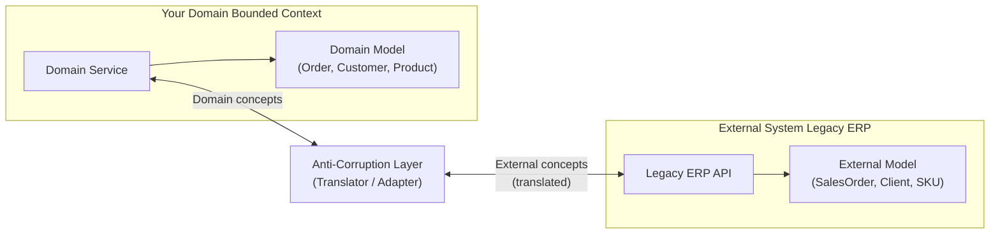

# Anti-Corruption Layer (ACL)

## Category
Architectural, Integration, Domain-Driven Design, Migration

## Context

The Anti-Corruption Layer (ACL) is a pattern from Domain-Driven Design (DDD) that places a **translation layer** between two systems with different domain models or bounded contexts. The ACL prevents the concepts, data structures, and semantics of a foreign system from "corrupting" or polluting your domain model. Instead of adapting your domain to fit the external system, the ACL translates between the two.

Common use cases: integrating with legacy systems, third-party APIs, or different bounded contexts within a microservices landscape.

---

## Pros

- **Domain model integrity**: Your core domain model remains clean and uninfluenced by external system concepts.
- **Decoupling**: Changes to the external system only require changes to the ACL, not the core domain.
- **Testability**: The ACL is a thin layer that can be mocked, enabling the domain to be tested in isolation.
- **Gradual migration**: Enables incremental migration away from legacy systems while maintaining functionality.
- **Encapsulation**: Hides the complexity and peculiarities of external APIs from the rest of the system.

---

## Cons

- **Additional code**: The ACL adds translation code that must be maintained.
- **Potential performance overhead**: Translation adds a processing step.
- **Two models to maintain**: Both the external model and the internal domain model need to be understood.
- **Leaky abstractions**: If the external model is very different, perfect translation may be impossible.
- **Discoverability**: Developers unfamiliar with the pattern may bypass the ACL and access external APIs directly.

---

## Design Diagram



---

## Code Sample

### External System Models (Legacy ERP)

```typescript
// external/erp.types.ts — Legacy system's model (don't let this into your domain!)
export interface SalesOrder {
  ord_num: string;
  cust_id: string;
  cust_nm: string;
  items: Array<{
    sku_cd: string;
    qty_ord: number;
    unit_prc: number;
  }>;
  ord_sts: 'PND' | 'CNF' | 'SHP' | 'DEL';
  cr_dt: string; // 'YYYYMMDD'
}
```

### Domain Models (Clean domain — no ERP concepts)

```typescript
// domain/order.ts — Your clean domain model
export interface Order {
  id: string;
  customerId: string;
  customerName: string;
  lineItems: LineItem[];
  status: 'PENDING' | 'CONFIRMED' | 'SHIPPED' | 'DELIVERED';
  createdAt: Date;
}

export interface LineItem {
  skuCode: string;
  quantity: number;
  unitPrice: number;
}
```

### Anti-Corruption Layer — Translator

```typescript
// acl/erp-translator.ts
import { SalesOrder } from '../external/erp.types';
import { Order } from '../domain/order';

export class ErpTranslator {
  toOrder(salesOrder: SalesOrder): Order {
    return {
      id: salesOrder.ord_num,
      customerId: salesOrder.cust_id,
      customerName: salesOrder.cust_nm,
      lineItems: salesOrder.items.map(item => ({
        skuCode: item.sku_cd,
        quantity: item.qty_ord,
        unitPrice: item.unit_prc,
      })),
      status: this.mapStatus(salesOrder.ord_sts),
      createdAt: this.parseDate(salesOrder.cr_dt),
    };
  }

  toSalesOrder(order: Order): SalesOrder {
    return {
      ord_num: order.id,
      cust_id: order.customerId,
      cust_nm: order.customerName,
      items: order.lineItems.map(li => ({
        sku_cd: li.skuCode,
        qty_ord: li.quantity,
        unit_prc: li.unitPrice,
      })),
      ord_sts: this.reverseMapStatus(order.status),
      cr_dt: order.createdAt.toISOString().slice(0, 10).replace(/-/g, ''),
    };
  }

  private mapStatus(erpStatus: SalesOrder['ord_sts']): Order['status'] {
    const map: Record<string, Order['status']> = {
      PND: 'PENDING', CNF: 'CONFIRMED', SHP: 'SHIPPED', DEL: 'DELIVERED',
    };
    return map[erpStatus] ?? 'PENDING';
  }

  private reverseMapStatus(status: Order['status']): SalesOrder['ord_sts'] {
    const map: Record<string, SalesOrder['ord_sts']> = {
      PENDING: 'PND', CONFIRMED: 'CNF', SHIPPED: 'SHP', DELIVERED: 'DEL',
    };
    return map[status];
  }

  private parseDate(dateStr: string): Date {
    const y = dateStr.slice(0, 4), m = dateStr.slice(4, 6), d = dateStr.slice(6, 8);
    return new Date(`${y}-${m}-${d}`);
  }
}
```

### ACL Service — Wraps the external API

```typescript
// acl/erp-order.service.ts
import axios from 'axios';
import { ErpTranslator } from './erp-translator';
import { Order } from '../domain/order';

export class ErpOrderService {
  private readonly translator = new ErpTranslator();
  private readonly erpBaseUrl = process.env.ERP_API_URL!;

  async getOrder(orderId: string): Promise<Order> {
    const { data } = await axios.get<SalesOrder>(
      `${this.erpBaseUrl}/sales-orders/${orderId}`,
      { headers: { 'x-api-key': process.env.ERP_API_KEY } }
    );
    // Translate foreign model → domain model
    return this.translator.toOrder(data);
  }

  async createOrder(order: Order): Promise<void> {
    // Translate domain model → foreign model
    const salesOrder = this.translator.toSalesOrder(order);
    await axios.post(`${this.erpBaseUrl}/sales-orders`, salesOrder, {
      headers: { 'x-api-key': process.env.ERP_API_KEY },
    });
  }
}
```

### Usage in Domain Service (no ERP concepts visible)

```typescript
// domain/order.domain.service.ts
import { ErpOrderService } from '../acl/erp-order.service';
import { Order } from './order';

export class OrderDomainService {
  constructor(private readonly erpService: ErpOrderService) {}

  async processOrder(orderId: string): Promise<void> {
    // Works with clean domain Order object — no ERP leakage
    const order: Order = await this.erpService.getOrder(orderId);
    console.log(`Processing order ${order.id} for ${order.customerName}`);
    // Pure domain logic here ...
  }
}
```
