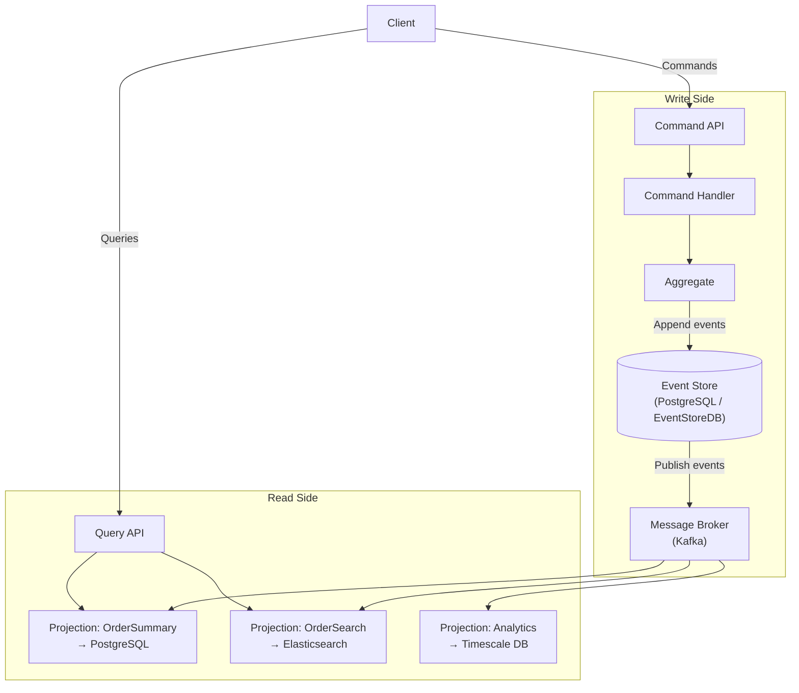

# CQRS + Event Sourcing Combined Pattern

## Category
Architectural, Performance, Data Management, Auditability

## Context

CQRS and Event Sourcing are frequently used together. CQRS separates reads and writes; Event Sourcing uses events as the write model. Combined, the event log is the authoritative write store, and multiple read projections are built from those events — each optimized for specific query needs.

This document covers the combined pattern as a unified architectural approach, showing how the two complement and reinforce each other.

---

## Pros

- **Complete audit trail with fast reads**: Events provide history; projections provide speed.
- **Multiple read models**: Same events can build dashboards, reports, real-time views simultaneously.
- **Time-travel queries**: Replay events up to any timestamp to see historical state.
- **Scalable reads and writes independently**: Each side scales based on its own demand.
- **Natural event-driven integration**: Events flow from the write side to other services.

---

## Cons

- **High complexity**: Combining two advanced patterns requires significant expertise.
- **Eventual consistency**: Read models are updated asynchronously after writes.
- **Projection rebuilds are costly**: Replaying millions of events to rebuild a projection takes time.
- **Snapshot management**: Long-lived aggregates need snapshots to avoid full replay on every load.
- **Testing difficulty**: Integration testing across command handlers, projections, and read services is complex.

---

## Design Diagram



---

## Code Sample

### Combined CQRS + Event Sourcing Setup (TypeScript)

```typescript
// write-side/order.aggregate.ts
export class Order {
  id!: string;
  status!: string;
  items: OrderItem[] = [];
  private uncommittedEvents: DomainEvent[] = [];

  static fromEvents(events: DomainEvent[]): Order {
    return events.reduce((agg, event) => { agg.apply(event); return agg; }, new Order());
  }

  placeOrder(id: string, userId: string, items: OrderItem[]): void {
    this.raise({ type: 'OrderPlaced', aggregateId: id, payload: { userId, items } });
  }

  shipOrder(trackingNo: string): void {
    if (this.status !== 'PAID') throw new Error('Order must be paid before shipping');
    this.raise({ type: 'OrderShipped', aggregateId: this.id, payload: { trackingNo } });
  }

  private raise(event: DomainEvent): void {
    this.apply(event);
    this.uncommittedEvents.push(event);
  }

  private apply(event: DomainEvent): void {
    switch (event.type) {
      case 'OrderPlaced':
        this.id = event.aggregateId;
        this.items = event.payload.items;
        this.status = 'PENDING';
        break;
      case 'OrderShipped':
        this.status = 'SHIPPED';
        break;
    }
  }

  flushEvents(): DomainEvent[] {
    const events = [...this.uncommittedEvents];
    this.uncommittedEvents = [];
    return events;
  }
}
```

### Command Handler

```typescript
// write-side/place-order.handler.ts
export class PlaceOrderHandler {
  constructor(private readonly eventStore: EventStore, private readonly broker: EventBroker) {}

  async handle(cmd: PlaceOrderCommand): Promise<void> {
    const order = new Order();
    order.placeOrder(cmd.orderId, cmd.userId, cmd.items);

    const events = order.flushEvents();
    await this.eventStore.append(cmd.orderId, events);
    await this.broker.publishAll(events);
  }
}
```

### Projection Handler (builds read model from events)

```typescript
// read-side/order-summary.projection.ts
import { Pool } from 'pg';

export class OrderSummaryProjection {
  constructor(private readonly db: Pool) {}

  async onOrderPlaced(event: OrderPlacedEvent): Promise<void> {
    await this.db.query(
      `INSERT INTO order_summaries (id, user_id, item_count, status, placed_at)
       VALUES ($1, $2, $3, 'PENDING', NOW())
       ON CONFLICT (id) DO NOTHING`,
      [event.aggregateId, event.payload.userId, event.payload.items.length]
    );
  }

  async onOrderShipped(event: OrderShippedEvent): Promise<void> {
    await this.db.query(
      `UPDATE order_summaries SET status = 'SHIPPED', tracking_no = $2, shipped_at = NOW() WHERE id = $1`,
      [event.aggregateId, event.payload.trackingNo]
    );
  }
}
```

### Projection Rebuild (replay from event store)

```typescript
// scripts/rebuild-projection.ts
async function rebuildOrderSummaryProjection(eventStore: EventStore, projection: OrderSummaryProjection) {
  console.log('Rebuilding OrderSummary projection...');
  await db.query('TRUNCATE TABLE order_summaries'); // Clear stale data

  const events = await eventStore.getAllEventsByType(['OrderPlaced', 'OrderShipped']);
  for (const event of events) {
    switch (event.type) {
      case 'OrderPlaced': await projection.onOrderPlaced(event as OrderPlacedEvent); break;
      case 'OrderShipped': await projection.onOrderShipped(event as OrderShippedEvent); break;
    }
  }
  console.log(`Rebuilt ${events.length} events`);
}
```
