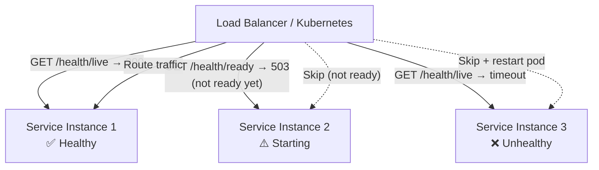

# Health Check / Heartbeat Pattern

## Category
Resilience, Observability, Availability

## Context

The Health Check pattern adds a dedicated endpoint or mechanism to a service that reports whether it is healthy and able to serve requests. Load balancers, orchestrators (Kubernetes), and monitoring systems poll health check endpoints to determine if a service should receive traffic. Liveness checks determine if the service process is alive; readiness checks determine if it is ready to accept requests.

**Types:**
- **Liveness**: Is the process alive? (Kubernetes restarts it if not.)
- **Readiness**: Is it ready to serve traffic? (Load balancer routes to it only when ready.)
- **Startup**: Has the application finished initializing? (For slow-starting apps.)

---

## Pros

- **Automatic failure detection**: Orchestrators and load balancers remove unhealthy instances automatically.
- **Self-healing**: Kubernetes restarts failing containers based on liveness probes.
- **Zero-traffic to degraded instances**: Readiness probes prevent traffic from reaching unready services.
- **Dependency validation**: Health checks can validate DB, cache, external APIs.
- **Observability**: Health state aggregated in dashboards (k8s dashboard, Prometheus, Datadog).

---

## Cons

- **False positives**: A poor health check may report healthy when the service is actually degraded.
- **Cascading restarts**: Overly strict liveness probes may restart services unnecessarily under load.
- **Sensitive data in responses**: Health responses should not expose internal system details.
- **Dependency health ≠ service health**: A dependency being slow may not mean the service is unhealthy.
- **Probe timing**: Misconfigured probe intervals or timeouts cause premature restarts or missed failures.

---

## Design Diagram



---

## Code Sample

### Comprehensive Health Check Endpoint (Node.js / Express)

```javascript
// health/health.router.js
const express = require('express');
const { Pool } = require('pg');
const { createClient } = require('redis');

const router = express.Router();
const db = new Pool({ connectionString: process.env.DATABASE_URL });
const redis = createClient({ url: process.env.REDIS_URL });

// Liveness — Is the process alive?
router.get('/live', (req, res) => {
  res.status(200).json({ status: 'alive' });
});

// Readiness — Can we serve requests?
router.get('/ready', async (req, res) => {
  const checks = await runChecks();
  const allPassed = checks.every(c => c.status === 'ok');

  res.status(allPassed ? 200 : 503).json({
    status: allPassed ? 'ready' : 'not-ready',
    checks,
    timestamp: new Date().toISOString(),
  });
});

async function runChecks() {
  return Promise.all([
    checkDatabase(),
    checkRedis(),
  ]);
}

async function checkDatabase() {
  try {
    await db.query('SELECT 1');
    return { name: 'database', status: 'ok' };
  } catch (err) {
    return { name: 'database', status: 'error', error: err.message };
  }
}

async function checkRedis() {
  try {
    await redis.ping();
    return { name: 'redis', status: 'ok' };
  } catch (err) {
    return { name: 'redis', status: 'error', error: err.message };
  }
}

module.exports = router;
```

### Kubernetes Probes Configuration

```yaml
# k8s/deployment.yaml
apiVersion: apps/v1
kind: Deployment
metadata:
  name: order-service
spec:
  replicas: 3
  template:
    spec:
      containers:
        - name: order-service
          image: order-service:1.0.0
          ports: [{containerPort: 3000}]

          # Startup probe — allow time for initialization
          startupProbe:
            httpGet:
              path: /health/live
              port: 3000
            failureThreshold: 30     # 30 * 10s = 5 minutes to start
            periodSeconds: 10

          # Liveness probe — restart if dead
          livenessProbe:
            httpGet:
              path: /health/live
              port: 3000
            initialDelaySeconds: 30
            periodSeconds: 10
            timeoutSeconds: 5
            failureThreshold: 3

          # Readiness probe — remove from load balancer if not ready
          readinessProbe:
            httpGet:
              path: /health/ready
              port: 3000
            initialDelaySeconds: 15
            periodSeconds: 5
            timeoutSeconds: 3
            failureThreshold: 3
            successThreshold: 1
```

### TypeScript Health Check with Dependency Status

```typescript
// health/health.service.ts
export interface HealthCheckResult {
  name: string;
  status: 'ok' | 'degraded' | 'error';
  responseTimeMs?: number;
  error?: string;
}

export class HealthService {
  constructor(
    private readonly db: Pool,
    private readonly redis: RedisClient
  ) {}

  async check(): Promise<{ healthy: boolean; checks: HealthCheckResult[] }> {
    const checks = await Promise.all([
      this.checkWithTimeout('database', () => this.db.query('SELECT 1'), 2000),
      this.checkWithTimeout('redis', () => this.redis.ping(), 1000),
    ]);

    return {
      healthy: checks.every(c => c.status === 'ok'),
      checks,
    };
  }

  private async checkWithTimeout(name: string, fn: () => Promise<unknown>, timeoutMs: number): Promise<HealthCheckResult> {
    const start = Date.now();
    try {
      await Promise.race([fn(), new Promise((_, rej) => setTimeout(() => rej(new Error('timeout')), timeoutMs))]);
      return { name, status: 'ok', responseTimeMs: Date.now() - start };
    } catch (err: any) {
      return { name, status: 'error', responseTimeMs: Date.now() - start, error: err.message };
    }
  }
}
```
