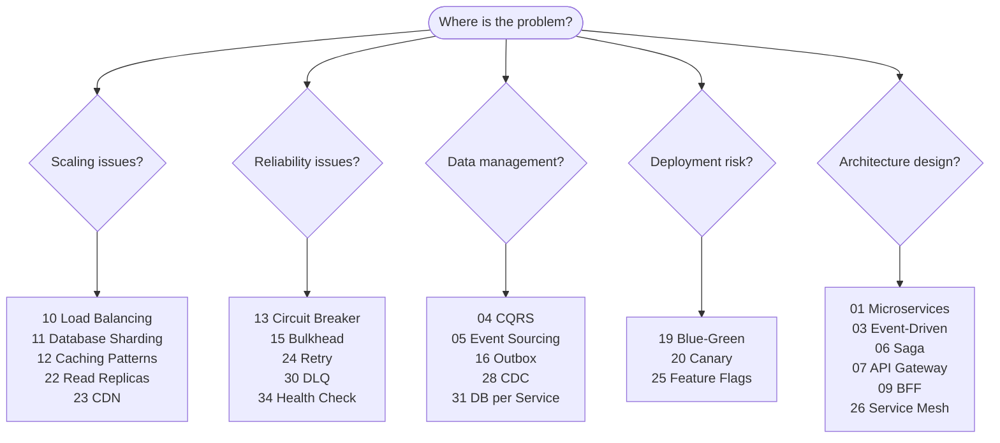

# System Design Patterns — Knowledge Base

A comprehensive reference library of system design patterns, each documenting context, pros, cons, a Mermaid architecture diagram, and working code samples.

---

## Pattern Index

### Architectural Patterns

| #   | Pattern                                                                | Category                                | Description                                                    |
| --- | ---------------------------------------------------------------------- | --------------------------------------- | -------------------------------------------------------------- |
| 01  | [Microservices](./01-microservices.md)                                 | Architectural, Scalability              | Decompose an app into small, independently deployable services |
| 02  | [Monolithic Architecture](./02-monolithic.md)                          | Architectural, Simplicity               | Single deployable unit — the right choice for many systems     |
| 03  | [Event-Driven Architecture](./03-event-driven-architecture.md)         | Architectural, Decoupling               | Services communicate via asynchronous events                   |
| 04  | [CQRS](./04-cqrs.md)                                                   | Architectural, Performance              | Separate read and write models for independent optimization    |
| 05  | [Event Sourcing](./05-event-sourcing.md)                               | Architectural, Auditability             | Store state as a sequence of immutable events                  |
| 06  | [Saga Pattern](./06-saga-pattern.md)                                   | Architectural, Distributed Transactions | Manage distributed transactions with compensating transactions |
| 07  | [API Gateway](./07-api-gateway.md)                                     | Architectural, Security                 | Single entry point for all client requests                     |
| 08  | [Strangler Fig](./08-strangler-fig.md)                                 | Architectural, Migration                | Incrementally replace a legacy system                          |
| 09  | [Backends for Frontends (BFF)](./09-backends-for-frontends.md)         | Architectural, API Design               | Dedicated backend per frontend client type                     |
| 32  | [Anti-Corruption Layer](./32-anti-corruption-layer.md)                 | Architectural, DDD                      | Translate between different domain models                      |
| 33  | [CQRS + Event Sourcing Combined](./33-cqrs-event-sourcing-combined.md) | Architectural, Performance              | Use both patterns together for maximum benefit                 |

---

### Scalability Patterns

| #   | Pattern                                        | Category                     | Description                                            |
| --- | ---------------------------------------------- | ---------------------------- | ------------------------------------------------------ |
| 10  | [Load Balancing](./10-load-balancing.md)       | Scalability, Availability    | Distribute traffic across multiple instances           |
| 11  | [Database Sharding](./11-database-sharding.md) | Scalability, Data Management | Horizontally partition data across multiple databases  |
| 12  | [Caching Patterns](./12-caching-patterns.md)   | Performance, Scalability     | Cache-Aside, Write-Through, Write-Behind, Read-Through |
| 22  | [Read Replicas](./22-read-replicas.md)         | Scalability, Performance     | Scale reads by replicating data to read-only databases |
| 23  | [CDN](./23-cdn.md)                             | Performance, Scalability     | Serve content from edge nodes close to users           |

---

### Resilience & Reliability Patterns

| #   | Pattern                                          | Category                    | Description                                                      |
| --- | ------------------------------------------------ | --------------------------- | ---------------------------------------------------------------- |
| 13  | [Circuit Breaker](./13-circuit-breaker.md)       | Resilience, Stability       | Fail fast and recover gracefully from downstream failures        |
| 14  | [Rate Limiting](./14-rate-limiting.md)           | Security, Scalability       | Protect services from excessive request volumes                  |
| 15  | [Bulkhead Pattern](./15-bulkhead-pattern.md)     | Resilience, Fault Isolation | Isolate resources per consumer to prevent cascade failures       |
| 24  | [Retry Pattern](./24-retry-pattern.md)           | Resilience, Reliability     | Automatically retry transient failures with backoff              |
| 34  | [Health Check / Heartbeat](./34-health-check.md) | Resilience, Observability   | Expose service health state for orchestrators and load balancers |

---

### Data Management Patterns

| #   | Pattern                                              | Category                       | Description                                                   |
| --- | ---------------------------------------------------- | ------------------------------ | ------------------------------------------------------------- |
| 16  | [Outbox Pattern](./16-outbox-pattern.md)             | Data Management, Reliability   | Guarantee event delivery with atomic local transactions       |
| 27  | [Two-Phase Commit](./27-two-phase-commit.md)         | Data Management, Consistency   | Distributed ACID transactions across multiple participants    |
| 28  | [Change Data Capture](./28-change-data-capture.md)   | Data Management, Integration   | Stream database changes to downstream systems via log tailing |
| 31  | [Database per Service](./31-database-per-service.md) | Data Management, Microservices | Each service owns its own dedicated database                  |

---

### Messaging Patterns

| #   | Pattern                                              | Category                  | Description                                                   |
| --- | ---------------------------------------------------- | ------------------------- | ------------------------------------------------------------- |
| 17  | [Publish-Subscribe](./17-publish-subscribe.md)       | Messaging, Decoupling     | Fan-out events to multiple independent subscribers            |
| 18  | [Message Queue](./18-message-queue.md)               | Messaging, Reliability    | Point-to-point async work distribution                        |
| 30  | [Dead Letter Queue (DLQ)](./30-dead-letter-queue.md) | Messaging, Error Handling | Handle failed messages safely without blocking the main queue |

---

### Deployment Patterns

| #   | Pattern                                                | Category                    | Description                                       |
| --- | ------------------------------------------------------ | --------------------------- | ------------------------------------------------- |
| 19  | [Blue-Green Deployment](./19-blue-green-deployment.md) | Deployment, Risk Management | Zero-downtime deployment with instant rollback    |
| 20  | [Canary Deployment](./20-canary-deployment.md)         | Deployment, Risk Management | Gradual traffic shift to detect regressions early |
| 25  | [Feature Flags](./25-feature-flags.md)                 | Deployment, Experimentation | Decouple code deployment from feature release     |

---

### Infrastructure & Networking Patterns

| #   | Pattern                                          | Category                  | Description                                                     |
| --- | ------------------------------------------------ | ------------------------- | --------------------------------------------------------------- |
| 21  | [Sidecar Pattern](./21-sidecar-pattern.md)       | Architectural, Networking | Helper container for cross-cutting networking and observability |
| 26  | [Service Mesh](./26-service-mesh.md)             | Networking, Security      | Infrastructure layer for service-to-service communication       |
| 29  | [Ambassador Pattern](./29-ambassador-pattern.md) | Networking, Resilience    | Client-side proxy to external or legacy services                |

---

## Patterns by Category

### Security

- [API Gateway](./07-api-gateway.md) — Centralize auth, SSL, and rate limiting
- [Rate Limiting](./14-rate-limiting.md) — Protect against abuse and DDoS
- [Service Mesh](./26-service-mesh.md) — mTLS and zero-trust network policies

### Performance

- [Caching Patterns](./12-caching-patterns.md) — Reduce latency and database load
- [CDN](./23-cdn.md) — Edge delivery for static and cacheable content
- [Read Replicas](./22-read-replicas.md) — Scale read throughput
- [CQRS](./04-cqrs.md) — Optimized read models

### Scalability

- [Microservices](./01-microservices.md) — Independent service scaling
- [Load Balancing](./10-load-balancing.md) — Horizontal scaling
- [Database Sharding](./11-database-sharding.md) — Write scalability
- [Message Queue](./18-message-queue.md) — Async work distribution

### Resilience

- [Circuit Breaker](./13-circuit-breaker.md) — Fail fast
- [Retry Pattern](./24-retry-pattern.md) — Handle transient failures
- [Bulkhead Pattern](./15-bulkhead-pattern.md) — Isolate failure domains
- [Dead Letter Queue](./30-dead-letter-queue.md) — Safe error handling
- [Health Check](./34-health-check.md) — Automatic failure detection

### Maintainability / Migration

- [Strangler Fig](./08-strangler-fig.md) — Incremental migration
- [Anti-Corruption Layer](./32-anti-corruption-layer.md) — Domain model protection

---

## Decision Guide

### Quick-pick reference

| Challenge | Start here | Then consider |
|-----------|-----------|---------------|
| "Break up a monolith" | [08 — Strangler Fig](./08-strangler-fig.md) | [32 — Anti-Corruption Layer](./32-anti-corruption-layer.md) → [01 — Microservices](./01-microservices.md) |
| "Distributed transaction across services" | [06 — Saga](./06-saga-pattern.md) + [16 — Outbox](./16-outbox-pattern.md) | Avoid [27 — Two-Phase Commit](./27-two-phase-commit.md) in most cases |
| "Read performance is the bottleneck" | [12 — Caching](./12-caching-patterns.md) → [22 — Read Replicas](./22-read-replicas.md) | [04 — CQRS](./04-cqrs.md) for full read/write split |
| "A downstream service causes failures" | [13 — Circuit Breaker](./13-circuit-breaker.md) | [15 — Bulkhead](./15-bulkhead-pattern.md), [24 — Retry](./24-retry-pattern.md) |
| "Need full audit trail / time travel" | [05 — Event Sourcing](./05-event-sourcing.md) | [33 — CQRS + Event Sourcing](./33-cqrs-event-sourcing-combined.md) |
| "Zero-downtime deployment" | [19 — Blue-Green](./19-blue-green-deployment.md) or [20 — Canary](./20-canary-deployment.md) | [25 — Feature Flags](./25-feature-flags.md) to decouple release |
| "Guaranteed event delivery" | [16 — Outbox](./16-outbox-pattern.md) (producer) | [30 — DLQ](./30-dead-letter-queue.md) (consumer) |
| "Service-to-service mTLS / observability" | [26 — Service Mesh](./26-service-mesh.md) | [21 — Sidecar](./21-sidecar-pattern.md) for lightweight alternative |
| "Scale reads only (no schema change)" | [22 — Read Replicas](./22-read-replicas.md) | [12 — Caching](./12-caching-patterns.md) in front of replicas |
| "Scale both reads and writes" | [11 — Sharding](./11-database-sharding.md) | [31 — DB per Service](./31-database-per-service.md) at service boundaries |
| "Decouple frontend from services" | [07 — API Gateway](./07-api-gateway.md) | [09 — BFF](./09-backends-for-frontends.md) per client type |
| "Real-time data sync without shared DB" | [28 — CDC](./28-change-data-capture.md) | [17 — Pub-Sub](./17-publish-subscribe.md) for fan-out to consumers |

---

## Frequently Combined Patterns

| Combination                             | Why                                                              |
| --------------------------------------- | ---------------------------------------------------------------- |
| **CQRS + Event Sourcing**               | Events are the write model; projections are the read model       |
| **Outbox + CDC**                        | CDC can serve as the relay mechanism for the Outbox pattern      |
| **Saga + Outbox**                       | Saga steps publish events atomically via the Outbox              |
| **Circuit Breaker + Retry**             | Retry transient failures; circuit breaks on persistent ones      |
| **Circuit Breaker + Bulkhead**          | Prevent cascade failure both by resource isolation and fail-fast |
| **Microservices + API Gateway + BFF**   | Full API layer for multi-client microservices architecture       |
| **Canary + Feature Flags**              | Feature flags control which canary users see the new feature     |
| **Sidecar + Service Mesh**              | Istio/Linkerd inject Envoy sidecars forming the mesh             |
| **Database per Service + Event-Driven** | Services own their data and communicate via events               |
