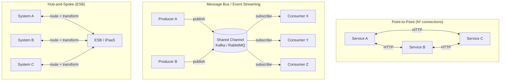

# Integration Styles

## Category

System Integration — Architecture Styles & Topology

## Context

Before connecting any two systems, choose the right integration topology. The choice determines coupling, operational complexity, observability, and how the system scales as new participants join.

### The Five Core Styles

| Style | Topology | Coupling | Latency | Ordering | Replay |
|-------|----------|---------|---------|---------|-------|
| **Point-to-Point (P2P)** | Direct HTTP / socket | High | Lowest | N/A | No |
| **Hub-and-Spoke (ESB)** | Central broker routes + transforms | Medium | Medium | Optional | Limited |
| **Message Bus** | Shared channel, no central authority | Low | Low | Partition-ordered | Optional |
| **Event Streaming** | Durable append-only log | Low | Low–Medium | Strict (offset) | Yes |
| **iPaaS / Workflow** | Managed connector flows | Low–Medium | Medium | Flow-defined | Partial |

### When to Use Each

| Style | Choose When |
|-------|------------|
| P2P | Stable, known pair of systems; latency-critical; simple request-reply |
| ESB | Large enterprise with many heterogeneous systems needing transformation and routing |
| Message Bus | Decoupled async microservices; fan-out; competing consumers |
| Event Streaming | Audit trail, event sourcing, replay, high throughput (>10k msg/s) |
| iPaaS | SaaS integrations, B2B flows, low-code automation, no custom infra |

### Spaghetti Risk: P2P at Scale

The core problem: N services × N services = N² point-to-point connections. At N=10, that is 45 connections. At N=20, it is 190. Every new service forces every other service to be updated.

The solution: move to a shared channel (bus or streaming platform) — adding a new service means connecting to one place.

## Pros

**Point-to-Point**
- Zero infrastructure overhead; direct call
- Simplest mental model for request-reply

**Hub-and-Spoke / ESB**
- Centralises transformation, routing, and monitoring
- Protocol bridging (HTTP → AMQP, REST → SOAP) in one place
- Ready-made connectors for legacy systems

**Message Bus**
- Producers and consumers are fully decoupled — deploy independently
- Competing consumers enable horizontal scaling
- Dead-letter queues capture poison messages

**Event Streaming**
- Consumer can replay from any offset — new services can backfill history
- Immutable log doubles as audit trail
- Multiple independent consumer groups with zero interference

**iPaaS**
- No infrastructure to run; pay-per-execution
- 300+ pre-built connectors (Salesforce, SAP, ServiceNow, etc.)
- Business teams can wire simple flows without engineering

## Cons

**Point-to-Point**
- N² connection explosion at scale
- Each caller must handle retries, auth, and timeouts individually
- Service discovery needed as endpoints change

**Hub-and-Spoke / ESB**
- Single point of failure if not HA
- Bus becomes a bottleneck under high throughput
- Complex bus logic is opaque and hard to test

**Message Bus**
- At-least-once delivery requires idempotent consumers
- Schema drift breaks consumers if not governed
- Debugging requires distributed tracing

**Event Streaming**
- Consumer lag monitoring is critical — un-consumed offsets pile up silently
- Exactly-once semantics require transactional producers and consumers
- Storage grows unbounded without log compaction / retention policies

**iPaaS**
- Vendor lock-in — migrating complex flows is expensive
- Limited custom code; non-trivial transformations hit the ceiling
- Data leaving your VPC for the iPaaS cloud is a compliance concern for regulated data

## Design Diagram



## Code Sample

### TypeScript — Choosing a style at runtime: strategy pattern

```typescript
// integration-style/transport.ts
// Demonstrates pluggable integration transport — swap P2P, Bus, or Stream per route

import { EventEmitter } from 'events';

export interface IntegrationMessage<T = unknown> {
  id: string;
  correlationId: string;
  topic: string;
  payload: T;
  timestamp: string;
}

// ── Transport interface ────────────────────────────────────────────────────────
export interface Transport {
  send(message: IntegrationMessage): Promise<void>;
}

// ── Point-to-Point transport ───────────────────────────────────────────────────
export class HttpTransport implements Transport {
  constructor(private readonly baseUrl: string) {}

  async send(message: IntegrationMessage): Promise<void> {
    const response = await fetch(`${this.baseUrl}/messages`, {
      method: 'POST',
      headers: {
        'Content-Type': 'application/json',
        'X-Correlation-ID': message.correlationId,
      },
      body: JSON.stringify(message),
    });
    if (!response.ok) {
      throw new Error(`HTTP ${response.status}: ${await response.text()}`);
    }
  }
}

// ── In-process Bus transport (swap for Kafka/RabbitMQ client in production) ───
export class MessageBusTransport implements Transport {
  private static readonly bus = new EventEmitter();

  async send(message: IntegrationMessage): Promise<void> {
    MessageBusTransport.bus.emit(message.topic, message);
    console.log(`[bus] published ${message.id} → ${message.topic}`);
  }

  static subscribe(topic: string, handler: (msg: IntegrationMessage) => void): void {
    MessageBusTransport.bus.on(topic, handler);
  }
}

// ── Router — picks transport based on topic namespace ─────────────────────────
export class IntegrationRouter {
  private transportMap = new Map<string, Transport>();

  register(topicPrefix: string, transport: Transport): this {
    this.transportMap.set(topicPrefix, transport);
    return this;
  }

  async route(message: IntegrationMessage): Promise<void> {
    const transport = [...this.transportMap.entries()]
      .find(([prefix]) => message.topic.startsWith(prefix))?.[1];

    if (!transport) throw new Error(`No transport for topic: ${message.topic}`);
    await transport.send(message);
  }
}

// ── Usage ─────────────────────────────────────────────────────────────────────
const router = new IntegrationRouter()
  .register('payments.', new MessageBusTransport())           // async events on bus
  .register('notifications.', new HttpTransport('https://notify.internal'));  // P2P

MessageBusTransport.subscribe('payments.created', (msg) => {
  console.log('[consumer] payment created:', msg.payload);
});

await router.route({
  id: crypto.randomUUID(),
  correlationId: 'req-001',
  topic: 'payments.created',
  payload: { amount: 150.00, currency: 'GBP' },
  timestamp: new Date().toISOString(),
});
```

### YAML — Choosing topology in a Kafka + HTTP hybrid (Kong declarative config)

```yaml
# kong.yml — route payments synchronously, pipe events to Kafka
_format_version: "3.0"

services:
  # Synchronous: client → Kong → Payment Service (P2P)
  - name: payment-service
    url: http://payment-svc:3000
    routes:
      - name: create-payment
        paths: [/v1/payments]
        methods: [POST]
    plugins:
      - name: rate-limiting
        config: { minute: 1000, policy: redis }
      - name: jwt
        config: { secret_is_base64: false }

  # Async: Kong publishes webhook events to Kafka (event streaming)
  - name: payment-events
    url: http://kafka-rest-proxy:8082
    routes:
      - name: publish-events
        paths: [/internal/events]
        methods: [POST]
    plugins:
      - name: request-transformer
        config:
          add:
            headers: ["X-Source-System:kong"]
```

## References

- [Enterprise Integration Patterns — Gregor Hohpe & Bobby Woolf](https://www.enterpriseintegrationpatterns.com/)
- [Martin Fowler — What is an ESB?](https://martinfowler.com/articles/enterpriseIntegration.html)
- [Confluent — Event Streaming vs Messaging](https://www.confluent.io/blog/event-streaming-vs-messaging/)
- [AWS — Choosing between SQS and Kinesis](https://docs.aws.amazon.com/streams/latest/dev/comparisons.html)
