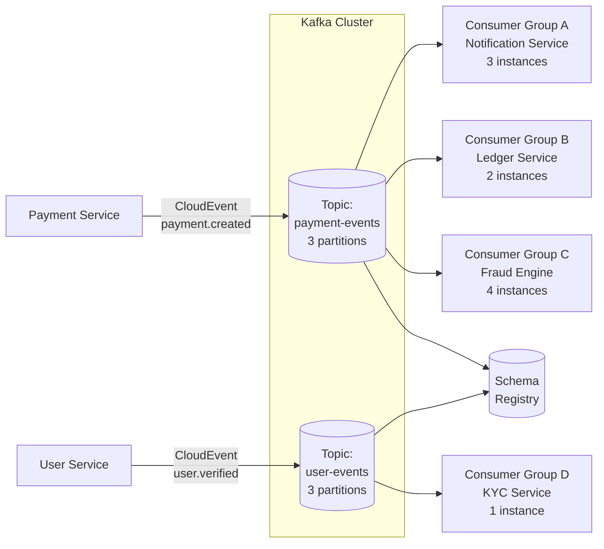

# Event-Driven Integration

## Category

System Integration — Event Streaming & Async Decoupling

## Context

Event-driven integration uses a **durable, ordered, replayable log** as the integration backbone. Producers append domain events; any number of consumers read them at their own pace, from any offset. Unlike message queues (where messages are consumed and removed), the log is immutable — events persist for the configured retention period and can be replayed to bootstrap new consumers or recover from failures.

### Key Concepts

| Concept | Description |
|---------|-------------|
| **Event** | An immutable fact that something happened: `payment.created`, `user.verified` |
| **Topic / Partition** | Logical channel; partitions enable parallelism; ordering guaranteed within a partition |
| **Consumer Group** | Set of consumers sharing work; each partition assigned to exactly one member |
| **Offset** | Pointer to position in partition log; consumer commits offset after processing |
| **CloudEvents** | CNCF standard schema for event metadata (id, source, type, time, datacontenttype) |
| **Schema Registry** | Central store for Avro/JSON schemas; enforces compatibility between producer and consumer |

### Pub/Sub (Queue) vs Event Streaming

| Dimension | Message Queue | Event Streaming |
|-----------|--------------|----------------|
| Retention | Deleted on consumption | Configurable (hours to forever) |
| Replay | Not possible | Yes — seek to any offset |
| Ordering | Single queue FIFO | Per-partition ordering |
| Consumer groups | Competing consumers | Independent groups, own offset |
| Throughput | Moderate | Very high (millions/sec) |
| Best for | Task dispatch, RPC-style | Audit log, CDC, event sourcing |

### CloudEvents 1.0 Envelope

```json
{
  "specversion": "1.0",
  "id": "a1b2c3d4-...",
  "source": "//payment-service/payments",
  "type": "com.example.payments.created",
  "datacontenttype": "application/json",
  "time": "2026-04-15T10:00:00Z",
  "subject": "pay_001",
  "data": {
    "amount": 150.00,
    "currency": "GBP",
    "accountId": "acc_xyz"
  }
}
```

## Pros

- Consumers are fully decoupled — add new consumers without changing producers
- Replay enables bootstrap of new services from existing event history
- Immutable log is a built-in audit trail
- Consumer groups process in parallel — linear horizontal scale
- Schema Registry prevents breaking schema changes reaching consumers
- Exactly-once semantics possible with transactional producers + idempotent consumers
- Event sourcing as integration: system of record is the event log, not a DB

## Cons

- Eventual consistency — consumer lags behind producer; reads-after-write require care
- Consumer lag must be actively monitored (Kafka Lag Exporter, CloudWatch)
- Schema evolution requires backward/forward compatibility disciplines
- Exactly-once end-to-end requires transactional outbox at the producer side
- Topic/partition design is hard to change after go-live (adding partitions reorders keys)
- Debugging: without correlation IDs + distributed tracing, event flows are invisible

## Design Diagram



## Code Sample

### TypeScript — CloudEvents producer and consumer with KafkaJS + Schema Registry

```typescript
// event-driven/payment-producer.ts
import { Kafka, Partitioners } from 'kafkajs';
import { SchemaRegistry } from '@kafkajs/confluent-schema-registry';
import { randomUUID } from 'crypto';

// ── Types ─────────────────────────────────────────────────────────────────────
interface PaymentCreatedEvent {
  amount: number;
  currency: string;
  accountId: string;
  paymentId: string;
}

// CloudEvents 1.0 envelope
interface CloudEvent<T> {
  specversion: '1.0';
  id: string;
  source: string;
  type: string;
  datacontenttype: 'application/json';
  time: string;
  subject: string;
  data: T;
}

// ── Kafka + Schema Registry setup ─────────────────────────────────────────────
const kafka = new Kafka({
  clientId: 'payment-service',
  brokers: (process.env.KAFKA_BROKERS ?? 'localhost:9092').split(','),
  ssl: process.env.NODE_ENV === 'production',
});

const registry = new SchemaRegistry({
  host: process.env.SCHEMA_REGISTRY_URL ?? 'http://localhost:8081',
});

// ── Producer ──────────────────────────────────────────────────────────────────
export async function publishPaymentCreated(
  payment: PaymentCreatedEvent,
  correlationId: string,
): Promise<void> {
  const producer = kafka.producer({
    createPartitioner: Partitioners.DefaultPartitioner,
    idempotent: true,        // exactly-once delivery guarantee at producer level
  });
  await producer.connect();

  const event: CloudEvent<PaymentCreatedEvent> = {
    specversion: '1.0',
    id: randomUUID(),
    source: '//payment-service/payments',
    type: 'com.example.payments.created',
    datacontenttype: 'application/json',
    time: new Date().toISOString(),
    subject: payment.paymentId,
    data: payment,
  };

  // Encode with Avro schema from registry
  const schemaId = await registry.getLatestSchemaId('payment-events-value');
  const encodedValue = await registry.encode(schemaId, event);

  await producer.send({
    topic: 'payment-events',
    messages: [
      {
        key: payment.accountId,            // partition by account — ordering per account
        value: encodedValue,
        headers: {
          'ce-correlationid': correlationId,
          'ce-source': '//payment-service',
        },
      },
    ],
  });

  await producer.disconnect();
  console.log(`[producer] published payment.created for ${payment.paymentId}`);
}

// ── Consumer ──────────────────────────────────────────────────────────────────
// event-driven/notification-consumer.ts
export async function startNotificationConsumer(): Promise<void> {
  const consumer = kafka.consumer({ groupId: 'notification-service' });
  await consumer.connect();
  await consumer.subscribe({ topic: 'payment-events', fromBeginning: false });

  await consumer.run({
    eachMessage: async ({ topic, partition, message }) => {
      const correlationId = message.headers?.['ce-correlationid']?.toString() ?? 'unknown';

      // Decode Avro
      const event = await registry.decode(message.value!) as CloudEvent<PaymentCreatedEvent>;

      console.log(`[consumer] ${event.type} partition=${partition} correlationId=${correlationId}`);

      // Idempotency: use event.id as deduplication key (check in Redis/DB before processing)
      await processNotification(event, correlationId);

      // Offset committed automatically after eachMessage resolves (autoCommit: true by default)
    },
  });
}

async function processNotification(
  event: CloudEvent<PaymentCreatedEvent>,
  correlationId: string,
): Promise<void> {
  console.log(`[notification] sending receipt for payment ${event.subject}`, {
    correlationId,
    amount: event.data.amount,
    currency: event.data.currency,
  });
}
```

### YAML — Kafka topic config + Schema Registry subject

```yaml
# kafka-topics.yaml (applied via Strimzi Kafka operator or kafka-topics.sh)
apiVersion: kafka.strimzi.io/v1beta2
kind: KafkaTopic
metadata:
  name: payment-events
  labels:
    strimzi.io/cluster: production
spec:
  partitions: 12        # parallelism bucket = max consumer instances per group
  replicas: 3           # tolerate 2 broker failures
  config:
    retention.ms: "604800000"          # 7 days
    min.insync.replicas: "2"           # writes require 2 in-sync replicas (durability)
    compression.type: lz4
    cleanup.policy: delete
---
# Schema Registry subject policy (Confluent Schema Registry REST API)
# POST /config/payment-events-value
# { "compatibility": "BACKWARD" }
#
# BACKWARD: new schema can read data written with old schema → safe for consumer-first rollouts
# FORWARD:  old schema can read data written with new schema → safe for producer-first rollouts
# FULL:     both directions → most restrictive, safest
```

## References

- [Apache Kafka Documentation](https://kafka.apache.org/documentation/)
- [CNCF CloudEvents Specification](https://cloudevents.io/)
- [Confluent Schema Registry](https://docs.confluent.io/platform/current/schema-registry/fundamentals/index.html)
- [Martin Fowler — What do you mean by Event-Driven?](https://martinfowler.com/articles/201701-event-driven.html)
- [KafkaJS](https://kafka.js.org/)
