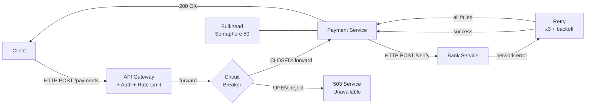

# Synchronous HTTP Integration

## Category

System Integration — Synchronous & Request-Reply

## Context

Synchronous HTTP integration is the simplest integration style: Service A sends an HTTP request and waits for a response from Service B. It is intuitive, well-tooled, and appropriate for real-time query-response flows. However, synchronous coupling means that if B is slow or unavailable, A is blocked or fails — making resilience patterns mandatory in production.

### Resilience Vocabulary

| Pattern | Problem Solved | Key Setting |
|---------|---------------|------------|
| **Timeout** | Prevent indefinite blocking | Per request: connect + read |
| **Retry with backoff** | Transient failures (network blip, 503) | Max retries, jitter |
| **Circuit Breaker** | Cascading failure when upstream is down | Open threshold, half-open probe |
| **Bulkhead** | Resource exhaustion from one slow upstream | Separate thread pool / semaphore per upstream |
| **Hedged request** | Tail-latency reduction | Send duplicate after P95 latency |
| **Cache** | Reduce dependency on upstream availability | TTL, stale-while-revalidate |

### Timeout Hierarchy

Every HTTP call travels a chain of hops. Each hop must set its own timeout:

```
Client → Load Balancer (30s) → API Gateway (25s) → Service A (20s) → Service B (15s)
```

Outer timeouts must always be longer than inner ones — otherwise the outer hop kills the request before the inner hop has finished retrying, producing `ETIMEOUT` errors that look like service failures but are actually misconfiguration.

### Circuit Breaker States

```
CLOSED (normal) ──[failure rate > threshold]──► OPEN (reject all)
                                                     │
                                          [after wait duration]
                                                     ▼
                                              HALF-OPEN (probe)
                                           ┌──[probe succeeds]──► CLOSED
                                           └──[probe fails]────► OPEN
```

## Pros

- Simplest mental model: call a function, get a response
- Strong consistency — response confirms the operation completed
- Easy to debug: HTTP logs, curl, status codes
- Excellent tooling: OpenAPI clients, Postman, Insomnia, distributed tracing
- No infrastructure beyond HTTP: no broker, no queue to manage

## Cons

- Temporal coupling: caller is blocked for the duration of the call
- Failures propagate upstream synchronously (cascading failures without resilience patterns)
- Hard to scale independently: if B slows down, A threads fill up
- Long dependency chains multiply latency (A→B→C→D: latencies add)
- Not suitable for fire-and-forget or fan-out scenarios

## Design Diagram



## Code Sample

### TypeScript — HTTP client with circuit breaker, retry, timeout, and bulkhead

```typescript
// http-integration/resilient-client.ts
import axios, { AxiosInstance, AxiosRequestConfig } from 'axios';
import axiosRetry from 'axios-retry';

// ── Simple circuit breaker ────────────────────────────────────────────────────
type BreakerState = 'CLOSED' | 'OPEN' | 'HALF_OPEN';

class CircuitBreaker {
  private state: BreakerState = 'CLOSED';
  private failures = 0;
  private lastFailureTime = 0;

  constructor(
    private readonly failureThreshold = 5,
    private readonly waitMs = 10_000,     // 10s in OPEN before trying HALF_OPEN
  ) {}

  canRequest(): boolean {
    if (this.state === 'CLOSED') return true;
    if (this.state === 'OPEN') {
      if (Date.now() - this.lastFailureTime >= this.waitMs) {
        this.state = 'HALF_OPEN';
        return true;
      }
      return false;
    }
    return true; // HALF_OPEN — allow one probe
  }

  onSuccess(): void {
    this.failures = 0;
    this.state = 'CLOSED';
  }

  onFailure(): void {
    this.failures++;
    this.lastFailureTime = Date.now();
    if (this.failures >= this.failureThreshold || this.state === 'HALF_OPEN') {
      this.state = 'OPEN';
      console.warn(`[circuit-breaker] OPEN after ${this.failures} failures`);
    }
  }

  get currentState(): BreakerState {
    return this.state;
  }
}

// ── Semaphore bulkhead ────────────────────────────────────────────────────────
class Semaphore {
  private count = 0;
  constructor(private readonly max: number) {}

  async acquire(): Promise<void> {
    if (this.count >= this.max) {
      throw new Error(`[bulkhead] max concurrent requests (${this.max}) reached`);
    }
    this.count++;
  }

  release(): void {
    this.count = Math.max(0, this.count - 1);
  }
}

// ── Resilient HTTP client ─────────────────────────────────────────────────────
export class ResilientHttpClient {
  private readonly http: AxiosInstance;
  private readonly breaker: CircuitBreaker;
  private readonly bulkhead: Semaphore;

  constructor(
    baseURL: string,
    options: { maxConcurrent?: number; breakerThreshold?: number } = {},
  ) {
    this.breaker  = new CircuitBreaker(options.breakerThreshold ?? 5);
    this.bulkhead = new Semaphore(options.maxConcurrent ?? 20);

    this.http = axios.create({
      baseURL,
      timeout: 5_000,                      // 5s total timeout per request
      headers: { 'Content-Type': 'application/json' },
    });

    // Exponential backoff: 3 retries, jitter, only on idempotent/network errors
    axiosRetry(this.http, {
      retries: 3,
      retryDelay: (retryCount) =>
        axiosRetry.exponentialDelay(retryCount) + Math.random() * 200,
      retryCondition: (error) =>
        axiosRetry.isNetworkOrIdempotentRequestError(error) ||
        error.response?.status === 503,
      onRetry: (retryCount, error) =>
        console.warn(`[retry] attempt ${retryCount} after ${error.message}`),
    });

    // Response interceptor — update circuit breaker
    this.http.interceptors.response.use(
      (res) => { this.breaker.onSuccess(); return res; },
      (err) => { this.breaker.onFailure(); return Promise.reject(err); },
    );
  }

  async request<T>(config: AxiosRequestConfig & { correlationId: string }): Promise<T> {
    if (!this.breaker.canRequest()) {
      throw new Error(`[circuit-breaker] ${this.breaker.currentState} — rejecting request`);
    }

    await this.bulkhead.acquire();
    try {
      const response = await this.http.request<T>({
        ...config,
        headers: {
          ...config.headers,
          'X-Correlation-ID': config.correlationId,
          'X-Request-ID': crypto.randomUUID(),
        },
      });
      return response.data;
    } finally {
      this.bulkhead.release();
    }
  }
}

// ── Usage ─────────────────────────────────────────────────────────────────────
interface VerificationResponse {
  verified: boolean;
  riskScore: number;
}

const bankClient = new ResilientHttpClient('https://bank-api.internal', {
  maxConcurrent: 50,
  breakerThreshold: 5,
});

const result = await bankClient.request<VerificationResponse>({
  method: 'POST',
  url: '/v1/verify',
  data: { accountId: 'acc_xyz', amount: 150 },
  correlationId: 'corr-req-001',
});

console.log('verified:', result.verified);
```

### YAML — Kubernetes readiness + liveness probes as integration health gates

```yaml
# deployment.yaml
spec:
  template:
    spec:
      containers:
        - name: payment-service
          livenessProbe:
            httpGet: { path: /health/live, port: 3000 }
            initialDelaySeconds: 10
            periodSeconds: 10
            failureThreshold: 3          # restart after 3 consecutive failures

          readinessProbe:
            httpGet: { path: /health/ready, port: 3000 }
            initialDelaySeconds: 5
            periodSeconds: 5
            failureThreshold: 1          # remove from load balancer immediately on failure

          # Circuit breaker at the proxy level (Envoy sidecar / Istio)
          # Configured via VirtualService + DestinationRule in Istio
```

```yaml
# istio destination rule — circuit breaker at service mesh level
apiVersion: networking.istio.io/v1alpha3
kind: DestinationRule
metadata:
  name: bank-service
spec:
  host: bank-service.payments.svc.cluster.local
  trafficPolicy:
    connectionPool:
      tcp:
        maxConnections: 100
      http:
        http1MaxPendingRequests: 50
        maxRequestsPerConnection: 10
    outlierDetection:
      consecutive5xxErrors: 5
      interval: 10s
      baseEjectionTime: 30s            # eject host for 30s after 5 consecutive 5xx
      maxEjectionPercent: 50
```

## References

- [Martin Fowler — Circuit Breaker](https://martinfowler.com/bliki/CircuitBreaker.html)
- [Netflix Tech Blog — Hystrix](https://netflixtechblog.com/fault-tolerance-in-a-high-volume-distributed-system-91ab4faae74a)
- [axios-retry](https://github.com/softonic/axios-retry)
- [Istio — Traffic Management](https://istio.io/latest/docs/concepts/traffic-management/)
- [Google Cloud — Handling retries](https://cloud.google.com/apis/design/errors#retrying_requests)
