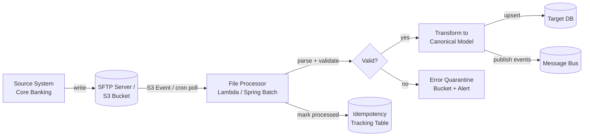

# File & Batch Integration

## Category

System Integration — File Transfer & Batch Processing

## Context

File-based integration is the oldest and most universal form of system-to-system exchange. It remains the dominant pattern in regulated industries (banking, healthcare, government) where partners cannot expose APIs, where bulk data must move between systems on a schedule, and where audit trails demand immutable files. Modern batch integration adds idempotency, exactly-once processing semantics, and structured error handling on top of the classic SFTP / AS2 transport layer.

### When File/Batch Is the Right Choice

| Scenario | Reason |
|---------|-------|
| Bulk end-of-day settlement files | No streaming protocol; counterparty is a legacy bank |
| Regulatory reporting (CAMT, MT94x) | Regulator mandates specific file format |
| Data warehouse load | Large nightly extraction — not latency-sensitive |
| Partner without API capability | EDI or CSV by SFTP is the only option |
| Offline re-processing | Files on S3 can be re-processed at any time |

### Common File Formats

| Format | Used By | Notes |
|--------|--------|-------|
| CSV | Almost everywhere | Simple, error-prone, no schema enforcement |
| JSON / NDJSON | Modern APIs | Streaming-friendly (NDJSON = one record per line) |
| XML (CAMT, PAIN) | SEPA / ISO 20022 payments | Strict schema, XSD validation |
| EDIFACT / X12 | Supply chain, banking | Fixed-width segments, specialized parsers |
| Parquet | Data engineering | Columnar, compressed, schema embedded |
| Fixed-width | Mainframe/legacy | Positional field layout, no delimiter |

### File Processing Risks

| Risk | Mitigation |
|------|-----------|
| Duplicate file processing | Idempotency by file hash or filename tracking table |
| Partial file (truncated transfer) | Validate row count / checksum file alongside data file |
| File arrives out of order | Sequence number in filename; hold-and-reorder logic |
| File never arrives | SLA alerting on expected arrival window |
| Sensitive data in transit | SFTP / AS2 / S3SSE; never plain FTP |

## Pros

- Works with any counterparty — no API capability required
- Batch processing is efficient for bulk data (no per-record HTTP overhead)
- Files on object storage are naturally durable, auditable, and replayable
- Simple error isolation — bad file rejected whole; good records in adjacent file unaffected
- Widely supported in regulated industries; often the mandated interchange format

## Cons

- High latency — data is delayed until the batch window (hourly, daily)
- No real-time feedback; errors discovered only when file is parsed
- File format versioning is manual — no schema registry
- Operational overhead: monitoring file arrival, SLA breach alerting, retry orchestration
- Security risk if partners use plain FTP or weak SFTP key management

## Design Diagram



## Code Sample

### TypeScript — Idempotent NDJSON file processor (S3 trigger pattern)

```typescript
// file-integration/s3-file-processor.ts
import { S3Client, GetObjectCommand } from '@aws-sdk/client-s3';
import { createHash } from 'crypto';
import { Readable } from 'stream';
import * as readline from 'readline';

// ── Types ─────────────────────────────────────────────────────────────────────
interface PaymentRecord {
  paymentId: string;
  amount: number;
  currency: string;
  accountId: string;
  valueDate: string;
}

interface ProcessingResult {
  fileKey: string;
  totalRows: number;
  successRows: number;
  errorRows: number;
  errors: Array<{ row: number; reason: string }>;
}

// ── Idempotency store (in production: DynamoDB or Postgres) ───────────────────
const processedFiles = new Set<string>();

async function isAlreadyProcessed(fileHash: string): Promise<boolean> {
  return processedFiles.has(fileHash);
}

async function markProcessed(fileHash: string, result: ProcessingResult): Promise<void> {
  processedFiles.add(fileHash);
  console.log(`[idempotency] marked ${fileHash} as processed`, result);
}

// ── Main processor ────────────────────────────────────────────────────────────
export async function processPaymentFile(
  bucket: string,
  key: string,
): Promise<ProcessingResult> {
  const s3 = new S3Client({ region: process.env.AWS_REGION ?? 'eu-west-1' });

  // 1. Fetch file from S3
  const { Body } = await s3.send(new GetObjectCommand({ Bucket: bucket, Key: key }));
  if (!Body) throw new Error(`Empty S3 object: s3://${bucket}/${key}`);

  // 2. Compute file hash for idempotency key
  const chunks: Buffer[] = [];
  for await (const chunk of Body as Readable) chunks.push(chunk as Buffer);
  const fileBuffer = Buffer.concat(chunks);
  const fileHash = createHash('sha256').update(fileBuffer).digest('hex');

  // 3. Skip if already processed (exactly-once guarantee)
  if (await isAlreadyProcessed(fileHash)) {
    console.log(`[processor] skipping duplicate file: ${key} (hash ${fileHash.slice(0, 8)})`);
    return { fileKey: key, totalRows: 0, successRows: 0, errorRows: 0, errors: [] };
  }

  // 4. Parse NDJSON line-by-line (memory-efficient for large files)
  const result: ProcessingResult = {
    fileKey: key,
    totalRows: 0,
    successRows: 0,
    errorRows: 0,
    errors: [],
  };

  const rl = readline.createInterface({ input: Readable.from(fileBuffer) });
  let rowNumber = 0;

  for await (const line of rl) {
    rowNumber++;
    if (!line.trim()) continue;            // skip blank lines

    try {
      const record: PaymentRecord = JSON.parse(line);
      validatePaymentRecord(record, rowNumber);
      await upsertPayment(record);
      result.successRows++;
    } catch (err) {
      result.errorRows++;
      result.errors.push({ row: rowNumber, reason: (err as Error).message });
      console.error(`[processor] row ${rowNumber} error:`, (err as Error).message);
      // Continue processing remaining rows (non-fatal row error)
    }

    result.totalRows = rowNumber;
  }

  // 5. Reject entire file if error rate exceeds 5%
  const errorRate = result.totalRows > 0 ? result.errorRows / result.totalRows : 0;
  if (errorRate > 0.05) {
    throw new Error(
      `File rejected: error rate ${(errorRate * 100).toFixed(1)}% exceeds 5% threshold for ${key}`,
    );
  }

  // 6. Mark file as processed
  await markProcessed(fileHash, result);

  console.log(
    `[processor] completed ${key}: ${result.successRows}/${result.totalRows} rows OK`,
  );
  return result;
}

// ── Validation helper ─────────────────────────────────────────────────────────
function validatePaymentRecord(record: PaymentRecord, row: number): void {
  if (!record.paymentId) throw new Error(`Row ${row}: missing paymentId`);
  if (typeof record.amount !== 'number' || record.amount <= 0)
    throw new Error(`Row ${row}: invalid amount ${record.amount}`);
  if (!/^[A-Z]{3}$/.test(record.currency))
    throw new Error(`Row ${row}: invalid currency ${record.currency}`);
}

async function upsertPayment(record: PaymentRecord): Promise<void> {
  // DB upsert logic here
  console.log(`[upsert] payment ${record.paymentId}`);
}

// ── Lambda handler entry point ────────────────────────────────────────────────
export const handler = async (event: {
  Records: Array<{ s3: { bucket: { name: string }; object: { key: string } } }>;
}): Promise<void> => {
  for (const record of event.Records) {
    const bucket = record.s3.bucket.name;
    const key = decodeURIComponent(record.s3.object.key.replace(/\+/g, ' '));
    await processPaymentFile(bucket, key);
  }
};
```

### YAML — S3 event notification + Lambda trigger (Terraform)

```hcl
# terraform/file-integration.tf

resource "aws_s3_bucket" "payment_files" {
  bucket = "payments-incoming-files-${var.env}"
}

# Server-side encryption — never store sensitive files unencrypted
resource "aws_s3_bucket_server_side_encryption_configuration" "payment_files" {
  bucket = aws_s3_bucket.payment_files.id
  rule {
    apply_server_side_encryption_by_default {
      sse_algorithm     = "aws:kms"
      kms_master_key_id = aws_kms_key.payments.arn
    }
  }
}

# Block all public access
resource "aws_s3_bucket_public_access_block" "payment_files" {
  bucket                  = aws_s3_bucket.payment_files.id
  block_public_acls       = true
  block_public_policy     = true
  ignore_public_acls      = true
  restrict_public_buckets = true
}

# S3 → Lambda trigger when a file lands in incoming/
resource "aws_s3_bucket_notification" "payment_files" {
  bucket = aws_s3_bucket.payment_files.id

  lambda_function {
    lambda_function_arn = aws_lambda_function.file_processor.arn
    events              = ["s3:ObjectCreated:*"]
    filter_prefix       = "incoming/"
    filter_suffix       = ".ndjson"
  }
}

resource "aws_lambda_function" "file_processor" {
  function_name = "payment-file-processor-${var.env}"
  runtime       = "nodejs22.x"
  handler       = "dist/s3-file-processor.handler"
  timeout       = 300          # 5 minutes for large files
  memory_size   = 512

  environment {
    variables = {
      AWS_REGION           = var.region
      DB_SECRET_ARN        = aws_secretsmanager_secret.db.arn
    }
  }
}

# SLA alerting — alarm if no file arrives within the expected window
resource "aws_cloudwatch_metric_alarm" "file_missing" {
  alarm_name          = "payment-file-not-received-${var.env}"
  comparison_operator = "LessThanThreshold"
  evaluation_periods  = 1
  metric_name         = "NumberOfObjects"
  namespace           = "AWS/S3"
  period              = 3600   # 1 hour window
  statistic           = "Sum"
  threshold           = 1
  alarm_actions       = [aws_sns_topic.alerts.arn]
  dimensions = {
    BucketName  = aws_s3_bucket.payment_files.bucket
    StorageType = "AllStorageTypes"
  }
}
```

## References

- [AWS S3 Event Notifications](https://docs.aws.amazon.com/AmazonS3/latest/userguide/NotificationHowTo.html)
- [Spring Batch — Reference Guide](https://spring.io/projects/spring-batch)
- [ISO 20022 Message Catalogue](https://www.iso20022.org/catalogue-messages/iso-20022-messages-archive)
- [AS2 Protocol (RFC 4130)](https://datatracker.ietf.org/doc/html/rfc4130)
- [Enterprise Integration Patterns — File Transfer](https://www.enterpriseintegrationpatterns.com/FileTransferIntegration.html)
