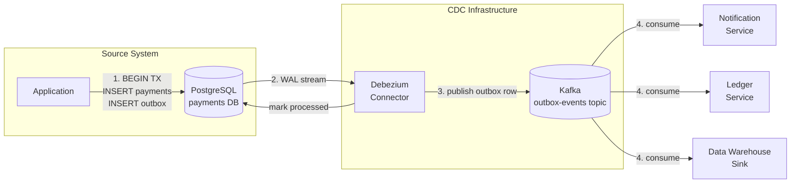

# Change Data Capture (CDC)

## Category

System Integration — Data Synchronisation & Event Sourcing

## Context

Change Data Capture (CDC) extracts every insert, update, and delete from a database's **transaction log** — in real-time, without polling and without changing the source application. It is the canonical solution for keeping heterogeneous systems in sync when you cannot modify the originating service.

The two complementary patterns are:
- **Log-based CDC** (Debezium): reads WAL/binlog directly — no application changes, ultra-low latency
- **Outbox Pattern**: the application writes an event to a dedicated `outbox` table atomically with the business record — CDC then picks it up — guaranteeing exactly-once event emission without a two-phase commit

### CDC Approaches Compared

| Approach | Mechanism | Latency | App Change | Use Case |
|---------|----------|---------|-----------|---------|
| **Log-based** (Debezium) | WAL / binlog | < 1s | None | Any table, no app access |
| **Outbox pattern** | App writes to `outbox` table; CDC reads it | < 1s | Yes (outbox write) | Guaranteed event with domain semantics |
| **Query-based polling** | `SELECT WHERE updated_at > ?` | Seconds+ | None | Simple, but misses deletes |
| **Dual-write** | App writes to DB and Kafka | Low | Yes | Fragile — not recommended |

### The Dual-Write Problem

Why you cannot simply write to the DB and the message broker in the same transaction:

```
1. Write to DB       ✅
2. Write to Kafka    ❌ (broker down, or app crashes)
   → DB committed, event never sent → downstream never notified
```

The Outbox Pattern solves this by making the event write part of the same ACID transaction as the business record. Debezium then reads the `outbox` table via CDC and publishes reliably.

## Pros

- **Log-based CDC**: zero application change; captures all changes including those from DB scripts
- Low latency — changes visible downstream in under one second
- Decouples source and target systems completely
- Outbox pattern guarantees **exactly-once event emission** without distributed transactions
- Enables event sourcing: the DB change log is a complete, replayable history
- Source system does not need to know about consumers

## Cons

- Log-based CDC has operational overhead: Debezium connector, Kafka, schema registry
- WAL-based CDC requires `REPLICA IDENTITY FULL` on Postgres tables to capture full old row on updates
- Sensitive columns (PII) flow through the event stream — requires field-level masking/encryption
- Schema changes in source DB must be handled carefully (ALTER TABLE mid-stream)
- Outbox table must be cleaned up periodically (processed rows accumulate)
- Consumer must be idempotent — CDC can re-emit events on connector restart

## Design Diagram



## Code Sample

### TypeScript — Outbox pattern: atomic write + outbox record

```typescript
// cdc/outbox-writer.ts
import { Pool, PoolClient } from 'pg';

// ── Outbox table DDL ──────────────────────────────────────────────────────────
// CREATE TABLE outbox (
//   id            UUID PRIMARY KEY DEFAULT gen_random_uuid(),
//   aggregate_id  TEXT NOT NULL,
//   aggregate_type TEXT NOT NULL,
//   event_type    TEXT NOT NULL,
//   payload       JSONB NOT NULL,
//   created_at    TIMESTAMPTZ NOT NULL DEFAULT NOW(),
//   processed_at  TIMESTAMPTZ,        -- set by Debezium or cleanup job
//   partition_key TEXT                -- optional: maps to Kafka partition key
// );

export interface OutboxEvent<T = unknown> {
  aggregateId: string;
  aggregateType: string;
  eventType: string;
  payload: T;
  partitionKey?: string;
}

export interface Payment {
  id: string;
  accountId: string;
  amount: number;
  currency: string;
  status: string;
}

// ── Transactional outbox write ────────────────────────────────────────────────
export async function createPaymentWithOutbox(
  pool: Pool,
  payment: Omit<Payment, 'id' | 'status'>,
): Promise<Payment> {
  const client: PoolClient = await pool.connect();

  try {
    await client.query('BEGIN');

    // 1. Write business record
    const paymentResult = await client.query<Payment>(
      `INSERT INTO payments (id, account_id, amount, currency, status, created_at)
       VALUES (gen_random_uuid(), $1, $2, $3, 'pending', NOW())
       RETURNING *`,
      [payment.accountId, payment.amount, payment.currency],
    );
    const created = paymentResult.rows[0];

    // 2. Write outbox event — SAME transaction as the payment
    const event: OutboxEvent<Payment> = {
      aggregateId:   created.id,
      aggregateType: 'Payment',
      eventType:     'payment.created',
      payload:       created,
      partitionKey:  created.accountId, // ensure ordering per account in Kafka
    };

    await client.query(
      `INSERT INTO outbox (aggregate_id, aggregate_type, event_type, payload, partition_key)
       VALUES ($1, $2, $3, $4, $5)`,
      [event.aggregateId, event.aggregateType, event.eventType,
       JSON.stringify(event.payload), event.partitionKey],
    );

    await client.query('COMMIT');
    // ✅ Both payment and outbox row committed atomically.
    // Debezium reads the outbox row via WAL and publishes to Kafka.
    return created;

  } catch (err) {
    await client.query('ROLLBACK');
    throw err;
  } finally {
    client.release();
  }
}

// ── Outbox cleanup job (run hourly) ──────────────────────────────────────────
export async function purgeProcessedOutboxEvents(pool: Pool): Promise<number> {
  const result = await pool.query(
    `DELETE FROM outbox
     WHERE processed_at IS NOT NULL
       AND processed_at < NOW() - INTERVAL '7 days'`,
  );
  console.log(`[outbox-cleanup] deleted ${result.rowCount} processed events`);
  return result.rowCount ?? 0;
}
```

### YAML — Debezium PostgreSQL connector configuration

```json
{
  "name": "payment-outbox-connector",
  "config": {
    "connector.class": "io.debezium.connector.postgresql.PostgresConnector",
    "database.hostname": "postgres.payments.svc.cluster.local",
    "database.port": "5432",
    "database.user": "debezium_reader",
    "database.password": "${file:/opt/kafka/external-configuration/connector.properties:db.password}",
    "database.dbname": "payments",
    "database.server.name": "payments-db",

    "plugin.name": "pgoutput",
    "publication.name": "debezium_publication",
    "slot.name": "debezium_slot",

    "table.include.list": "public.outbox",

    "transforms": "outbox",
    "transforms.outbox.type": "io.debezium.transforms.outbox.EventRouter",
    "transforms.outbox.table.field.event.id": "id",
    "transforms.outbox.table.field.event.key": "aggregate_id",
    "transforms.outbox.table.field.event.payload": "payload",
    "transforms.outbox.table.field.event.type": "event_type",
    "transforms.outbox.route.topic.replacement": "${routedByValue}",

    "key.converter": "org.apache.kafka.connect.storage.StringConverter",
    "value.converter": "io.confluent.connect.avro.AvroConverter",
    "value.converter.schema.registry.url": "http://schema-registry:8081",

    "heartbeat.interval.ms": "10000",
    "tombstones.on.delete": "false"
  }
}
```

### SQL — Postgres WAL prerequisites

```sql
-- Enable logical replication in postgresql.conf
-- wal_level = logical
-- max_replication_slots = 4
-- max_wal_senders = 4

-- Create replication user with minimal privileges
CREATE USER debezium_reader WITH REPLICATION LOGIN PASSWORD 'strong-password';
GRANT CONNECT ON DATABASE payments TO debezium_reader;
GRANT SELECT ON TABLE public.outbox TO debezium_reader;

-- Enable full replica identity so Debezium captures the full old row on UPDATE/DELETE
ALTER TABLE public.outbox REPLICA IDENTITY FULL;

-- Create publication for the outbox table only
CREATE PUBLICATION debezium_publication FOR TABLE public.outbox;
```

## References

- [Debezium Documentation](https://debezium.io/documentation/)
- [Debezium Outbox Event Router](https://debezium.io/documentation/reference/transformations/outbox-event-router.html)
- [Microservices.io — Transactional Outbox](https://microservices.io/patterns/data/transactional-outbox.html)
- [Martin Fowler — Change Data Capture](https://martinfowler.com/articles/change-data-capture.html)
- [PostgreSQL Logical Replication](https://www.postgresql.org/docs/current/logical-replication.html)
