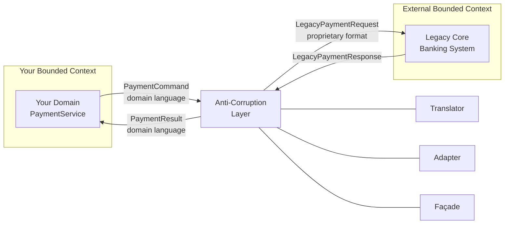

# Anti-Corruption Layer (ACL)

## Category

System Integration — Domain Isolation & Model Translation

## Context

When integrating two systems with different domain models — especially when one is a legacy system with an inconsistent or poorly-designed model — directly exposing the foreign model to your domain corrupts it over time. The **Anti-Corruption Layer (ACL)** is a translation boundary that converts the foreign model into your own domain's language, keeping your bounded context clean.

### Why Models Collide

| Scenario | Without ACL | With ACL |
|---------|------------|---------|
| Legacy CRM uses `CustomerID` (int) | Your domain leaks `CustomerID` everywhere | Your domain uses `AccountHolderId` (UUID); ACL translates |
| External bank uses `ACCT_STATUS_ACTIVE=1` | Magic number `1` spreads through your code | ACL translates `1` → `AccountStatus.Active` |
| Partner sends flat CSV row as a "payment" | Your payment aggregate gets polluted with CSV concerns | ACL maps CSV row → `PaymentCommand` |
| Third-party API uses snake_case | camelCase vs snake_case mismatch everywhere | ACL normalises in one place |

### ACL vs Shared Kernel vs Conformist

| Relationship | Definition | Use When |
|-------------|-----------|---------|
| **ACL** | Translation layer; your model is canonical | You have design authority; consuming a legacy or external system |
| **Shared Kernel** | Both teams share and co-own a common model | Two teams with tight alignment and shared governance |
| **Conformist** | You adopt the upstream model as-is | Upstream has a well-designed model; low value in translating |
| **Open Host Service** | Upstream exposes a stable public protocol | Integrating with a well-documented external API |

## Pros

- Your domain model stays clean — foreign concepts do not bleed in
- Adapter can be swapped (change upstream system) without touching domain logic
- Translation logic is centralised — one place to update when the external API changes
- Enables unit testing of domain logic independent of the external system (mock the ACL)
- Gradual strangler fig migration: ACL routes to old or new implementation transparently

## Cons

- Extra layer increases indirection and initial development time
- Translation bugs live in the ACL and can be subtle
- Performance overhead (object mapping) — usually negligible; use profiler to verify
- ACL must evolve as both source and target models evolve
- Risk of the ACL itself growing into a "god translator" — keep it thin and domain-focused

## Design Diagram



## Code Sample

### TypeScript — ACL translating a legacy banking API into domain types

```typescript
// acl/legacy-banking-acl.ts

// ── External / legacy model (what the bank's API returns) ─────────────────────
interface LegacyPaymentRequest {
  ACCT_NO: string;          // account number (string of digits)
  TXN_AMT: string;          // amount as string "150.00"
  TXN_CCY: string;          // currency code "GBP"
  TXN_REF: string;          // their reference
  CHANNEL: number;          // 1=web, 2=mobile, 3=branch
  PRIORITY: string;         // "N"=normal, "U"=urgent, "S"=same-day
}

interface LegacyPaymentResponse {
  RESP_CODE: string;        // "00"=success, "05"=declined, "96"=system error
  RESP_MSG: string;
  TXN_ID: string;
  TIMESTAMP: string;        // "YYYYMMDDHHMMSS"
}

// ── Your domain model ─────────────────────────────────────────────────────────
export type PaymentPriority = 'standard' | 'urgent' | 'same-day';
export type PaymentChannel = 'web' | 'mobile' | 'branch';
export type PaymentStatus = 'approved' | 'declined' | 'failed';

export interface PaymentCommand {
  accountId: string;
  amount: number;
  currency: string;
  reference: string;
  channel: PaymentChannel;
  priority: PaymentPriority;
}

export interface PaymentResult {
  transactionId: string;
  status: PaymentStatus;
  reason: string | null;
  processedAt: Date;
}

// ── The ACL: translate + call + translate back ────────────────────────────────
export class LegacyBankingACL {
  constructor(private readonly legacyApiBaseUrl: string) {}

  async submitPayment(command: PaymentCommand): Promise<PaymentResult> {
    const legacyRequest = this.toExternalRequest(command);
    const legacyResponse = await this.callLegacyApi(legacyRequest);
    return this.toDomainResult(legacyResponse);
  }

  // ── Translate domain → external ──────────────────────────────────────────────
  private toExternalRequest(command: PaymentCommand): LegacyPaymentRequest {
    return {
      ACCT_NO:  command.accountId,
      TXN_AMT:  command.amount.toFixed(2),   // domain uses number; legacy needs string
      TXN_CCY:  command.currency,
      TXN_REF:  command.reference,
      CHANNEL:  this.channelCode(command.channel),
      PRIORITY: this.priorityCode(command.priority),
    };
  }

  private channelCode(channel: PaymentChannel): number {
    const map: Record<PaymentChannel, number> = { web: 1, mobile: 2, branch: 3 };
    return map[channel];
  }

  private priorityCode(priority: PaymentPriority): string {
    const map: Record<PaymentPriority, string> = {
      standard: 'N',
      urgent:   'U',
      'same-day': 'S',
    };
    return map[priority];
  }

  // ── Translate external → domain ──────────────────────────────────────────────
  private toDomainResult(response: LegacyPaymentResponse): PaymentResult {
    return {
      transactionId: response.TXN_ID,
      status:        this.parseStatus(response.RESP_CODE),
      reason:        response.RESP_CODE !== '00' ? response.RESP_MSG : null,
      processedAt:   this.parseTimestamp(response.TIMESTAMP),
    };
  }

  private parseStatus(code: string): PaymentStatus {
    if (code === '00') return 'approved';
    if (code === '05') return 'declined';
    return 'failed';
  }

  private parseTimestamp(ts: string): Date {
    // "YYYYMMDDHHMMSS" → ISO Date
    const [y, mo, d, h, m, s] = [
      ts.slice(0, 4), ts.slice(4, 6), ts.slice(6, 8),
      ts.slice(8, 10), ts.slice(10, 12), ts.slice(12, 14),
    ];
    return new Date(`${y}-${mo}-${d}T${h}:${m}:${s}Z`);
  }

  // ── HTTP call to legacy system ────────────────────────────────────────────────
  private async callLegacyApi(request: LegacyPaymentRequest): Promise<LegacyPaymentResponse> {
    const response = await fetch(`${this.legacyApiBaseUrl}/transactions/submit`, {
      method: 'POST',
      headers: { 'Content-Type': 'application/json' },
      body: JSON.stringify(request),
    });
    if (!response.ok) {
      throw new Error(`Legacy API error: ${response.status}`);
    }
    return response.json() as Promise<LegacyPaymentResponse>;
  }
}

// ── Domain service — completely unaware of the legacy model ───────────────────
export class PaymentService {
  constructor(private readonly bankingACL: LegacyBankingACL) {}

  async initiatePayment(command: PaymentCommand): Promise<PaymentResult> {
    // Clean domain logic: no RESP_CODE, no ACCT_NO, no TXN_AMT string
    const result = await this.bankingACL.submitPayment(command);

    if (result.status === 'failed') {
      throw new Error(`Payment infrastructure failure: ${result.reason}`);
    }

    return result;
  }
}

// ── Wire-up ───────────────────────────────────────────────────────────────────
const acl = new LegacyBankingACL(process.env.LEGACY_BANK_URL ?? 'https://legacy-bank.internal');
const paymentService = new PaymentService(acl);

const result = await paymentService.initiatePayment({
  accountId:  'GB29NWBK60161331926819',
  amount:     150.00,
  currency:   'GBP',
  reference:  'Invoice #1042',
  channel:    'web',
  priority:   'standard',
});

console.log('Payment result:', result);
```

## References

- [Domain-Driven Design — Eric Evans (Blue Book)](https://www.domainlanguage.com/ddd/)
- [Martin Fowler — Anti-Corruption Layer](https://martinfowler.com/bliki/BoundedContext.html)
- [DDD Reference — Context Mapping](https://www.domainlanguage.com/wp-content/uploads/2016/05/DDD_Reference_2015-03.pdf)
- [Enterprise Integration Patterns — Translator](https://www.enterpriseintegrationpatterns.com/MessageTranslator.html)
