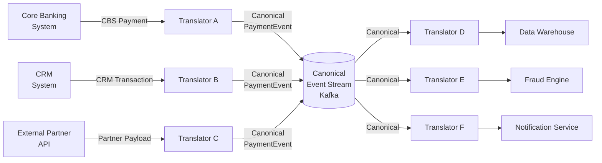

# Canonical Data Model

## Category

System Integration — Data Normalisation & Schema Governance

## Context

In an enterprise with N heterogeneous systems, each has its own data model. A "transaction" in the core banking system, the CRM, the fraud engine, and the data warehouse all mean slightly different things. Without a shared vocabulary, every integration is an N×N translation problem.

The **Canonical Data Model (CDM)** defines a single, authoritative schema for a shared concept — a universal language all systems translate to and from. Integrations become: "source model → canonical → target model" instead of "source A model ↔ source B model" for every pair.

### Without CDM vs With CDM

| Scenario | Without CDM | With CDM |
|---------|------------|---------|
| 5 systems exchange "payment" data | 5×5 = 25 bespoke translators | 5 translators to canonical, 5 from canonical = 10 |
| New system joins | Write N translators | Write 1 in + 1 out translator |
| "amount" field changes type | Update every bilateral translator | Update canonical schema + 2 translators |
| New consumer needs data | Every producer must know about it | Consumer reads from canonical stream |

### Canonical Model Design Rules

| Rule | Rationale |
|------|----------|
| Use domain language, not system language | Outlives any single system |
| Prefer explicit over implicit nulls | Use union types or optional fields, never magic values |
| Timestamp fields always include timezone | Avoid DST bugs |
| Money fields as `{ amount: number, currency: string }` | Never store currency-agnostic amounts |
| IDs are UUIDs, not system-specific auto-increments | System-neutral, globally unique |
| Enum values are strings, not ints | Readable in logs and event streams without a lookup table |
| Version the schema | `"schemaVersion": "2"` — consumers can handle multiple versions |

## Pros

- Reduces N² translator explosion to 2N translators
- Shared vocabulary improves cross-team communication
- Schema Registry enforces canonical shape at publish time
- New consumers wire up quickly — just learn the canonical format
- Audit trail and data warehouse consume one format, not N formats

## Cons

- Canonical model must be designed carefully — bad choices are expensive to change
- Requires governance: who owns the schema? Who approves changes?
- Over-engineering risk: a CDM for 2 systems is overhead; value emerges at 4+
- "Least common denominator" risk: the canonical model loses system-specific richness
- Schema evolution still hard — backwards compatibility discipline is mandatory

## Design Diagram



## Code Sample

### TypeScript — Canonical schema definition + transformer chain

```typescript
// canonical/payment-event.ts

// ── Canonical Payment Event — the universal language ──────────────────────────
export interface Money {
  amount: number;           // always a number, never a string
  currency: string;         // ISO 4217: "GBP", "EUR", "USD"
}

export interface CanonicalParty {
  id: string;               // UUID — system-neutral
  type: 'individual' | 'business';
  name: string;
  accountNumber?: string;   // optional — not always present
}

export type PaymentStatus = 'initiated' | 'pending' | 'settled' | 'failed' | 'reversed';
export type PaymentChannel = 'web' | 'mobile' | 'branch' | 'api' | 'batch';

export interface CanonicalPaymentEvent {
  schemaVersion: '1';
  eventId: string;           // UUID
  eventType: 'payment.initiated' | 'payment.settled' | 'payment.failed' | 'payment.reversed';
  occurredAt: string;        // ISO 8601 with timezone: "2026-04-15T10:00:00Z"
  correlationId: string;

  payment: {
    id: string;
    amount: Money;
    status: PaymentStatus;
    channel: PaymentChannel;
    reference: string;
    description?: string;
  };

  payer:  CanonicalParty;
  payee:  CanonicalParty;

  metadata: {
    sourceSystem: string;    // "core-banking-v2", "crm", "partner-bank"
    sourceEventId: string;   // original ID in the source system
  };
}

// ── Transformer A: Core Banking System → Canonical ───────────────────────────
interface CBSPaymentRecord {
  PMT_ID: string;
  DEBIT_ACCT: string;
  CREDIT_ACCT: string;
  AMOUNT: string;            // string "150.00"
  CCY: string;
  STATUS_CODE: number;       // 1=settled, 2=failed, 3=reversed
  CHANNEL_CODE: string;      // "W"=web, "M"=mobile, "B"=branch
  VALUE_DT: string;          // "YYYYMMDD"
  REF: string;
}

export function fromCBSPayment(
  record: CBSPaymentRecord,
  correlationId: string,
): CanonicalPaymentEvent {
  const statusMap: Record<number, PaymentStatus> = {
    1: 'settled', 2: 'failed', 3: 'reversed',
  };
  const channelMap: Record<string, PaymentChannel> = {
    W: 'web', M: 'mobile', B: 'branch',
  };
  const valueDate = record.VALUE_DT;

  return {
    schemaVersion:  '1',
    eventId:         crypto.randomUUID(),
    eventType:       'payment.settled',
    occurredAt:      `${valueDate.slice(0, 4)}-${valueDate.slice(4, 6)}-${valueDate.slice(6, 8)}T00:00:00Z`,
    correlationId,
    payment: {
      id:        record.PMT_ID,
      amount:    { amount: parseFloat(record.AMOUNT), currency: record.CCY },
      status:    statusMap[record.STATUS_CODE] ?? 'failed',
      channel:   channelMap[record.CHANNEL_CODE] ?? 'api',
      reference: record.REF,
    },
    payer:  { id: crypto.randomUUID(), type: 'individual', name: 'Unknown', accountNumber: record.DEBIT_ACCT },
    payee:  { id: crypto.randomUUID(), type: 'individual', name: 'Unknown', accountNumber: record.CREDIT_ACCT },
    metadata: {
      sourceSystem:  'core-banking-v1',
      sourceEventId: record.PMT_ID,
    },
  };
}

// ── Transformer B: Canonical → Data Warehouse ──────────────────────────────
interface DWPaymentRow {
  payment_id:     string;
  payer_account:  string | null;
  payee_account:  string | null;
  amount_gbp:     number;          // DW stores everything in GBP — needs FX conversion
  status:         string;
  channel:        string;
  settled_at:     string;
  source_system:  string;
}

export function toDWRow(event: CanonicalPaymentEvent, fxRateToGBP: number): DWPaymentRow {
  return {
    payment_id:     event.payment.id,
    payer_account:  event.payer.accountNumber ?? null,
    payee_account:  event.payee.accountNumber ?? null,
    amount_gbp:     event.payment.amount.currency === 'GBP'
                      ? event.payment.amount.amount
                      : event.payment.amount.amount * fxRateToGBP,
    status:         event.payment.status,
    channel:        event.payment.channel,
    settled_at:     event.occurredAt,
    source_system:  event.metadata.sourceSystem,
  };
}
```

### YAML — JSON Schema for canonical payment event (governed in Schema Registry)

```json
{
  "$schema": "http://json-schema.org/draft-07/schema#",
  "$id": "https://schemas.example.com/payments/canonical-payment-event/v1.json",
  "title": "CanonicalPaymentEvent",
  "type": "object",
  "required": ["schemaVersion", "eventId", "eventType", "occurredAt", "payment", "payer", "payee", "metadata"],
  "properties": {
    "schemaVersion": { "type": "string", "enum": ["1"] },
    "eventId":       { "type": "string", "format": "uuid" },
    "eventType":     {
      "type": "string",
      "enum": ["payment.initiated", "payment.settled", "payment.failed", "payment.reversed"]
    },
    "occurredAt":    { "type": "string", "format": "date-time" },
    "correlationId": { "type": "string" },
    "payment": {
      "type": "object",
      "required": ["id", "amount", "status", "channel", "reference"],
      "properties": {
        "id":        { "type": "string" },
        "amount":    {
          "type": "object",
          "required": ["amount", "currency"],
          "properties": {
            "amount":   { "type": "number", "minimum": 0 },
            "currency": { "type": "string", "pattern": "^[A-Z]{3}$" }
          }
        },
        "status":    { "type": "string", "enum": ["initiated","pending","settled","failed","reversed"] },
        "channel":   { "type": "string", "enum": ["web","mobile","branch","api","batch"] },
        "reference": { "type": "string" }
      }
    }
  },
  "additionalProperties": false
}
```

## References

- [Enterprise Integration Patterns — Canonical Data Model](https://www.enterpriseintegrationpatterns.com/CanonicalDataModel.html)
- [Martin Fowler — Canonical Schema](https://martinfowler.com/eaaCatalog/canonicalSchema.html)
- [Confluent Schema Registry](https://docs.confluent.io/platform/current/schema-registry/index.html)
- [JSON Schema](https://json-schema.org/)
- [ISO 4217 Currency Codes](https://www.iso.org/iso-4217-currency-codes.html)
