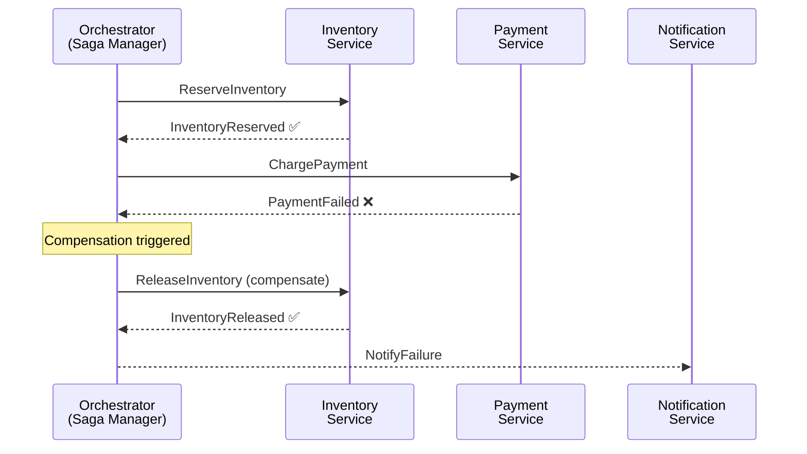

# Saga Pattern

## Category

System Integration — Distributed Transactions & Compensating Actions

## Context

When a business operation spans multiple services (e.g., "reserve inventory → charge payment → create order → notify fulfilment"), you cannot use a traditional ACID transaction because each step hits a different database. The **Saga pattern** breaks the operation into a sequence of local transactions, each publishing an event or message that triggers the next step. If any step fails, a sequence of **compensating transactions** is executed in reverse to undo the previous steps.

### Choreography vs Orchestration

| Dimension | Choreography | Orchestration |
|-----------|-------------|--------------|
| Who drives the flow | Each service reacts to events | Central orchestrator (Saga manager) |
| Coupling | Loose — services only know about events | Orchestrator knows all steps |
| Visibility | Hard — flow is implicit across services | Easy — orchestrator holds the full state |
| Failure handling | Each service must know its compensation | Orchestrator commands compensations |
| Best for | Simple, linear flows with few steps | Complex branching, long-running processes |
| Tools | Kafka / event bus | Temporal, AWS Step Functions, Conductor |

### Saga vs Two-Phase Commit (2PC)

| | Saga | 2PC |
|--|------|-----|
| Consistency model | Eventual | Strong |
| Failure recovery | Compensating transactions | Rollback |
| Availability | High — services can run independently | Low — requires all participants up |
| Latency | Low — no distributed lock | High — locks held until all vote |
| Use in microservices | ✅ Recommended | ❌ Avoid — creates tight coupling |

## Pros

- Works across service and database boundaries — no distributed lock
- Services remain independently deployable
- Orchestration gives full visibility and explicit failure handling
- Temporal/Step Functions provide durable workflow state — survives process restarts
- Compensating transactions are explicit business logic — easy to audit

## Cons

- Eventual consistency — intermediate states are visible to other services
- Compensating transactions must be designed for every step (and they may fail too)
- Choreography becomes hard to trace as the number of steps grows
- Idempotency is mandatory — the same step can be retried
- "Read-your-own-writes" is hard: a service that just completed step 1 may query a DB that hasn't processed the event yet

## Design Diagram



## Code Sample

### TypeScript — Orchestration Saga with state machine + compensation

```typescript
// saga/checkout-saga.ts

// ── Saga state ────────────────────────────────────────────────────────────────
export type SagaStatus =
  | 'STARTED'
  | 'INVENTORY_RESERVED'
  | 'PAYMENT_CHARGED'
  | 'ORDER_CREATED'
  | 'COMPLETED'
  | 'COMPENSATING'
  | 'FAILED';

export interface CheckoutSaga {
  sagaId: string;
  orderId: string;
  status: SagaStatus;
  steps: SagaStep[];
  startedAt: string;
  completedAt?: string;
  error?: string;
}

interface SagaStep {
  name: string;
  status: 'pending' | 'done' | 'compensated' | 'failed';
  completedAt?: string;
}

// ── Services (interfaces — injected; easily mocked in tests) ─────────────────
interface InventoryService {
  reserve(orderId: string, items: OrderItem[]): Promise<void>;
  release(orderId: string): Promise<void>;
}

interface PaymentService {
  charge(orderId: string, amount: Money): Promise<{ transactionId: string }>;
  refund(orderId: string, transactionId: string): Promise<void>;
}

interface OrderService {
  create(saga: CheckoutSagaInput): Promise<{ orderId: string }>;
  cancel(orderId: string): Promise<void>;
}

interface OrderItem { productId: string; quantity: number; }
interface Money { amount: number; currency: string; }
interface CheckoutSagaInput {
  customerId: string;
  items: OrderItem[];
  payment: Money;
}

// ── Orchestrator ──────────────────────────────────────────────────────────────
export class CheckoutSagaOrchestrator {
  // In production: persist saga state to DB between steps (durable saga store)
  private sagas = new Map<string, CheckoutSaga & { transactionId?: string }>();

  constructor(
    private readonly inventory: InventoryService,
    private readonly payment: PaymentService,
    private readonly order: OrderService,
  ) {}

  async execute(input: CheckoutSagaInput): Promise<string> {
    const sagaId = crypto.randomUUID();
    const saga = this.initSaga(sagaId, input);

    try {
      // Step 1: Reserve inventory
      await this.inventory.reserve(saga.orderId, input.items);
      this.updateStep(sagaId, 'reserve-inventory', 'done');
      saga.status = 'INVENTORY_RESERVED';

      // Step 2: Charge payment
      const { transactionId } = await this.payment.charge(saga.orderId, input.payment);
      saga.transactionId = transactionId;
      this.updateStep(sagaId, 'charge-payment', 'done');
      saga.status = 'PAYMENT_CHARGED';

      // Step 3: Create order record
      await this.order.create(input);
      this.updateStep(sagaId, 'create-order', 'done');
      saga.status = 'ORDER_CREATED';

      saga.status = 'COMPLETED';
      saga.completedAt = new Date().toISOString();
      console.log(`[saga] ${sagaId} completed for order ${saga.orderId}`);
      return saga.orderId;

    } catch (err) {
      console.error(`[saga] ${sagaId} failed at ${saga.status}:`, (err as Error).message);
      saga.error = (err as Error).message;
      await this.compensate(saga);
      throw err;
    }
  }

  // ── Compensation: run compensations in reverse order ──────────────────────
  private async compensate(saga: CheckoutSaga & { transactionId?: string }): Promise<void> {
    saga.status = 'COMPENSATING';
    const completedSteps = saga.steps
      .filter(s => s.status === 'done')
      .map(s => s.name)
      .reverse();

    for (const stepName of completedSteps) {
      try {
        switch (stepName) {
          case 'create-order':
            await this.order.cancel(saga.orderId);
            this.updateStep(saga.sagaId, stepName, 'compensated');
            break;
          case 'charge-payment':
            if (saga.transactionId) {
              await this.payment.refund(saga.orderId, saga.transactionId);
              this.updateStep(saga.sagaId, stepName, 'compensated');
            }
            break;
          case 'reserve-inventory':
            await this.inventory.release(saga.orderId);
            this.updateStep(saga.sagaId, stepName, 'compensated');
            break;
        }
      } catch (compErr) {
        // Compensation failed — requires manual intervention / dead-letter saga
        console.error(
          `[saga] compensation failed for step ${stepName}:`,
          (compErr as Error).message,
        );
        this.updateStep(saga.sagaId, stepName, 'failed');
      }
    }

    saga.status = 'FAILED';
  }

  // ── Helpers ───────────────────────────────────────────────────────────────
  private initSaga(
    sagaId: string,
    _input: CheckoutSagaInput,
  ): CheckoutSaga & { transactionId?: string } {
    const saga: CheckoutSaga & { transactionId?: string } = {
      sagaId,
      orderId: crypto.randomUUID(),
      status: 'STARTED',
      steps: [
        { name: 'reserve-inventory', status: 'pending' },
        { name: 'charge-payment',    status: 'pending' },
        { name: 'create-order',       status: 'pending' },
      ],
      startedAt: new Date().toISOString(),
    };
    this.sagas.set(sagaId, saga);
    return saga;
  }

  private updateStep(sagaId: string, stepName: string, status: SagaStep['status']): void {
    const saga = this.sagas.get(sagaId);
    if (!saga) return;
    const step = saga.steps.find(s => s.name === stepName);
    if (step) { step.status = status; step.completedAt = new Date().toISOString(); }
  }
}
```

### YAML — Temporal workflow definition (durable orchestration)

```typescript
// saga/checkout-temporal-workflow.ts
// Temporal provides durable execution — workflow state survives crashes/restarts
import { proxyActivities, sleep } from '@temporalio/workflow';
import type * as activities from './checkout-activities';

const { reserveInventory, chargePayment, createOrder,
        releaseInventory, refundPayment, cancelOrder } =
  proxyActivities<typeof activities>({
    startToCloseTimeout: '10 seconds',
    retry: { maximumAttempts: 3, backoffCoefficient: 2 },
  });

export async function checkoutWorkflow(input: CheckoutSagaInput): Promise<string> {
  let inventoryReserved = false;
  let transactionId: string | undefined;

  try {
    await reserveInventory(input.orderId, input.items);
    inventoryReserved = true;

    const result = await chargePayment(input.orderId, input.payment);
    transactionId = result.transactionId;

    const { orderId } = await createOrder(input);
    return orderId;

  } catch (err) {
    // Compensate in reverse — Temporal retries each compensation automatically
    if (transactionId)     await refundPayment(input.orderId, transactionId);
    if (inventoryReserved) await releaseInventory(input.orderId);
    throw err;
  }
}
```

## References

- [Microservices.io — Saga Pattern](https://microservices.io/patterns/data/saga.html)
- [Chris Richardson — Managing Data Consistency with Sagas](https://www.youtube.com/watch?v=txlSrGVCK18)
- [Temporal — Durable Workflow Execution](https://temporal.io/)
- [AWS Step Functions — Saga Pattern](https://docs.aws.amazon.com/prescriptive-guidance/latest/patterns/implement-the-saga-pattern.html)
- [Enterprise Integration Patterns — Process Manager](https://www.enterpriseintegrationpatterns.com/ProcessManager.html)
