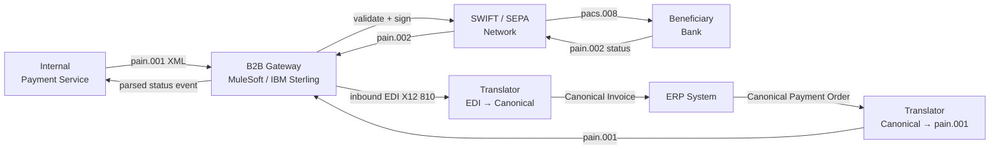

# B2B Integration

## Category

System Integration — Business-to-Business & Inter-organisational Protocols

## Context

B2B integration connects organisations that have different technologies, governance models, and reliability standards. Unlike internal integrations (where you control both ends), B2B exchanges use **industry-standard protocols** because both parties must agree on a format neither owns. In financial services this means ISO 20022, SWIFT, SEPA, and increasingly AS4/PEPPOL.

### B2B Protocol Landscape

| Protocol | Domain | Format | Transport | Body |
|---------|-------|-------|----------|------|
| **EDI X12** | Supply chain (US) | Fixed segments | AS2, FTP | ASC X12 |
| **EDIFACT** | Supply chain (EU/Global) | Fixed segments | AS2, SFTP | UN/CEFACT |
| **ISO 20022** | Payments (SEPA, SWIFT) | XML (pain, camt, pacs) | SWIFT, API | ISO |
| **SWIFT MT** | Interbank (legacy) | Fixed-field | SWIFT FIN | SWIFT |
| **SWIFT MX** | Interbank (modern) | ISO 20022 XML | SWIFT GPI | SWIFT |
| **AS2** | EDI transport | Any payload | HTTPS | IETF RFC 4130 |
| **AS4** | EU B2B transport | SOAP/MIME | HTTPS | OASIS ebMS 3 |
| **PEPPOL** | EU public procurement | UBL XML | AS4 | OpenPEPPOL |

### ISO 20022 Message Types Used in Payments

| Message | Code | Purpose |
|---------|------|---------|
| Customer Credit Transfer | pain.001 | Initiate a payment |
| Payment Status Report | pain.002 | Acknowledge / reject an initiation |
| Direct Debit | pain.008 | Initiate direct debit collection |
| Bank-to-Bank Transfer | pacs.008 | Interbank payment order |
| Payment Return | pacs.004 | Return a previous payment |
| Cash Management Report | camt.053 | End-of-day statement |
| Account Query | camt.060 | Request balance |

### B2B Reliability Requirements

| Requirement | Mechanism |
|------------|----------|
| Non-repudiation | Digital signatures (AS2 MDN, XML-DSIG) |
| Confidentiality | Payload encryption (S/MIME, XML-ENC) |
| Delivery acknowledgement | AS2 MDN, AS4 receipt |
| Idempotency | Message ID deduplication at receiver |
| Audit trail | Immutable log of every inbound/outbound message |

## Pros

- Industry-standard protocols ensure interoperability with any compliant partner
- Non-repudiation and digital signatures satisfy regulatory and audit requirements
- Well-defined error codes, acknowledgement flows, and retry semantics
- Managed B2B gateways (IBM Sterling, TIBCO, MuleSoft) take on certificate management
- PEPPOL and AS4 are increasingly mandated by governments for e-invoicing

## Cons

- Complex standards with steep learning curves (especially SWIFT and EDI)
- Certificate management: partner certificates expire; rotation requires coordination
- AS2/AS4 requires a public endpoint (firewall rules, TLS setup, certificate exchange)
- SWIFT connectivity is expensive and requires accreditation
- ISO 20022 migration (SWIFT CBPR+) requires XML parser replacement and field mapping work
- Testing requires access to partner test environments (often slow to set up)

## Design Diagram



## Code Sample

### TypeScript — ISO 20022 pain.001 builder and validator

```typescript
// b2b/pain001-builder.ts
import { create } from 'xmlbuilder2';

// ── Types ─────────────────────────────────────────────────────────────────────
interface CreditTransferInstruction {
  paymentId: string;           // unique end-to-end reference
  amount: number;
  currency: string;
  valueDate: string;           // YYYY-MM-DD
  creditor: {
    name: string;
    iban: string;
    bic: string;
    address: { street: string; city: string; country: string }; // ISO 3166-1 alpha-2
  };
  debtor: {
    name: string;
    iban: string;
    bic: string;
  };
  remittanceInfo: string;      // unstructured: max 140 chars
}

// ── pain.001.001.09 XML builder ───────────────────────────────────────────────
export function buildPain001(
  messageId: string,
  creationDate: string,
  transactions: CreditTransferInstruction[],
): string {
  const totalAmount = transactions.reduce((sum, t) => sum + t.amount, 0);

  const doc = create({ version: '1.0', encoding: 'UTF-8' })
    .ele('Document', {
      xmlns: 'urn:iso:std:iso:20022:tech:xsd:pain.001.001.09',
      'xmlns:xsi': 'http://www.w3.org/2001/XMLSchema-instance',
    })
      .ele('CstmrCdtTrfInitn')
        // Group Header
        .ele('GrpHdr')
          .ele('MsgId').txt(messageId).up()
          .ele('CreDtTm').txt(creationDate).up()
          .ele('NbOfTxs').txt(String(transactions.length)).up()
          .ele('CtrlSum').txt(totalAmount.toFixed(2)).up()
          .ele('InitgPty')
            .ele('Nm').txt('ACME Corporation Ltd').up()
          .up()
        .up();

  for (const txn of transactions) {
    doc
      .ele('PmtInf')
        .ele('PmtInfId').txt(`PMT-${txn.paymentId}`).up()
        .ele('PmtMtd').txt('TRF').up()           // TRF = Credit Transfer
        .ele('ReqdExctnDt')
          .ele('Dt').txt(txn.valueDate).up()
        .up()
        // Debtor
        .ele('Dbtr')
          .ele('Nm').txt(txn.debtor.name).up()
        .up()
        .ele('DbtrAcct')
          .ele('Id').ele('IBAN').txt(txn.debtor.iban).up().up()
        .up()
        .ele('DbtrAgt')
          .ele('FinInstnId').ele('BICFI').txt(txn.debtor.bic).up().up()
        .up()
        // Transaction
        .ele('CdtTrfTxInf')
          .ele('PmtId')
            .ele('EndToEndId').txt(txn.paymentId).up()
          .up()
          .ele('Amt')
            .ele('InstdAmt', { Ccy: txn.currency }).txt(txn.amount.toFixed(2)).up()
          .up()
          // Creditor agent
          .ele('CdtrAgt')
            .ele('FinInstnId').ele('BICFI').txt(txn.creditor.bic).up().up()
          .up()
          // Creditor
          .ele('Cdtr')
            .ele('Nm').txt(txn.creditor.name).up()
            .ele('PstlAdr')
              .ele('StrtNm').txt(txn.creditor.address.street).up()
              .ele('TwnNm').txt(txn.creditor.address.city).up()
              .ele('Ctry').txt(txn.creditor.address.country).up()
            .up()
          .up()
          .ele('CdtrAcct')
            .ele('Id').ele('IBAN').txt(txn.creditor.iban).up().up()
          .up()
          // Remittance info
          .ele('RmtInf')
            .ele('Ustrd').txt(txn.remittanceInfo.slice(0, 140)).up()
          .up()
        .up()
      .up();
  }

  return doc.end({ prettyPrint: true });
}

// ── Inbound pain.002 parser (payment status report) ──────────────────────────
import { XMLParser } from 'fast-xml-parser';

export type StatusCode = 'ACCP' | 'RJCT' | 'PDNG' | 'ACSC';

export interface PaymentStatusReport {
  originalMessageId: string;
  status: StatusCode;
  statusReason?: string;
  transactions: Array<{
    endToEndId: string;
    status: StatusCode;
    reason?: string;
  }>;
}

export function parsePain002(xml: string): PaymentStatusReport {
  const parser = new XMLParser({ ignoreAttributes: false, removeNSPrefix: true });
  const obj = parser.parse(xml);
  const grpSts = obj.Document?.CstmrPmtStsRpt?.OrgnlGrpInfAndSts;
  const txInfos = obj.Document?.CstmrPmtStsRpt?.OrgnlPmtInfAndSts?.TxInfAndSts;
  const txList = Array.isArray(txInfos) ? txInfos : txInfos ? [txInfos] : [];

  return {
    originalMessageId: grpSts?.OrgnlMsgId ?? '',
    status: grpSts?.GrpSts ?? 'PDNG',
    statusReason: grpSts?.StsRsnInf?.Rsn?.Cd,
    transactions: txList.map((t: Record<string, unknown>) => ({
      endToEndId: (t.OrgnlEndToEndId as string) ?? '',
      status:     (t.TxSts as StatusCode) ?? 'PDNG',
      reason:     ((t.StsRsnInf as Record<string, unknown>)?.Rsn as Record<string, unknown>)?.Cd as string | undefined,
    })),
  };
}

// ── Usage ─────────────────────────────────────────────────────────────────────
const xml = buildPain001('MSG-20260415-001', '2026-04-15T09:00:00', [
  {
    paymentId:     'E2E-TXN-001',
    amount:        1250.00,
    currency:      'EUR',
    valueDate:     '2026-04-16',
    debtor:        { name: 'ACME Corp', iban: 'GB29NWBK60161331926819', bic: 'NWBKGB2L' },
    creditor:      { name: 'Supplier GmbH', iban: 'DE89370400440532013000', bic: 'COBADEFFXXX',
                     address: { street: 'Hauptstraße 1', city: 'Frankfurt', country: 'DE' } },
    remittanceInfo: 'Invoice INV-2026-042',
  },
]);
console.log(xml);
```

## References

- [ISO 20022 Message Catalogue](https://www.iso20022.org/catalogue-messages/iso-20022-messages-archive)
- [SWIFT — ISO 20022 Migration](https://www.swift.com/standards/iso-20022)
- [PEPPOL — Pan-European Public Procurement Online](https://peppol.org/)
- [AS2 Protocol RFC 4130](https://datatracker.ietf.org/doc/html/rfc4130)
- [AS4 OASIS Standard](https://docs.oasis-open.org/ebxml-msg/ebms/v3.0/profiles/AS4-profile/v1.0/AS4-profile-v1.0.html)
- [xmlbuilder2](https://github.com/oozcitak/xmlbuilder2)
- [fast-xml-parser](https://github.com/NaturalIntelligence/fast-xml-parser)
