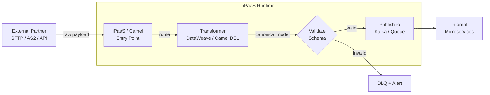

# iPaaS & Integration Platforms

## Category

System Integration — Integration Platform as a Service & Workflow Orchestration

## Context

An **iPaaS** (Integration Platform as a Service) provides a runtime, a connector library, and a routing engine for wiring systems together — without requiring teams to build and operate their own message broker infrastructure. The spectrum runs from fully visual no-code tools (Zapier) through code-first open-source frameworks (Apache Camel) to durable workflow engines designed for long-running processes (Temporal).

### Platform Comparison

| Platform | Style | Best For | Key Strength |
|---------|-------|---------|-------------|
| **Apache Camel** | Code-first, Java/Quarkus | Enterprise integrations with custom logic | 300+ connectors, EIP patterns, Kubernetes-native |
| **MuleSoft Anypoint** | Visual + DataWeave code | Large enterprise, B2B, SAP/Salesforce | Managed platform, DataWeave transformation DSL |
| **Temporal** | Code-first (TypeScript/Go/Java) | Long-running workflows, Saga orchestration | Durable execution — survives crashes |
| **Azure Logic Apps** | Visual + ARM/Bicep | Azure-native, SaaS connectors | 800+ connectors, event-grid triggered |
| **AWS Step Functions** | Visual + ASL JSON | Lambda orchestration, state machines | Tight AWS service integration |
| **n8n** | Visual, self-hosted | Internal automation | Open source, code nodes for escape hatch |

### When to Use Each

```
Need durable long-running process (hours/days)?
  └── Temporal or AWS Step Functions

Connecting cloud SaaS apps (Salesforce, ServiceNow, JIRA)?
  └── Azure Logic Apps, MuleSoft, or n8n

High-throughput, complex routing, protocol mediation?
  └── Apache Camel (JVM) or MuleSoft

B2B with AS2/EDI/SWIFT?
  └── MuleSoft Anypoint B2B or IBM Sterling

Lambda orchestration on AWS?
  └── AWS Step Functions
```

## Pros

- Pre-built connectors eliminate weeks of custom client code
- Visual tooling accelerates flow design and stakeholder communication
- Managed platforms (Logic Apps, MuleSoft Cloud) reduce operational overhead
- Temporal / Step Functions provide automatic retry, timeout, and state persistence
- Apache Camel integrates into any JVM service (Quarkus, Spring) as a library — no extra runtime
- Error handling, retries, and dead-letter routing are platform primitives

## Cons

- Vendor lock-in: complex MuleSoft flows are hard to migrate off-platform
- Visual tools hide complexity — debugging is harder than reading code
- Temporal requires running a cluster (Temporal Cloud or self-hosted)
- Cost: Logic Apps per-execution pricing can surprise for high-volume flows
- Apache Camel has a steep learning curve for non-Java teams
- For simple integrations, iPaaS adds unnecessary indirection

## Design Diagram



## Code Sample

### TypeScript — Temporal workflow: durable B2B onboarding flow

```typescript
// ipaas/partner-onboarding-workflow.ts
import {
  proxyActivities,
  defineSignal,
  setHandler,
  condition,
  sleep,
} from '@temporalio/workflow';
import type * as activities from './partner-activities';

interface PartnerOnboardingInput {
  partnerId: string;
  partnerName: string;
  integrationType: 'api' | 'sftp' | 'as2';
  contactEmail: string;
}

// Signals — external systems can send signals to a running workflow
const approvedSignal  = defineSignal<[{ approvedBy: string }]>('approved');
const rejectedSignal  = defineSignal<[{ reason: string }]>('rejected');
const testPassedSignal = defineSignal('testPassed');

const {
  createPartnerRecord,
  sendWelcomeEmail,
  provisionSFTPCredentials,
  provisionAPIKeys,
  runConnectivityTest,
  activatePartner,
  notifyPartnerActivated,
  flagForManualReview,
} = proxyActivities<typeof activities>({
  startToCloseTimeout: '30 seconds',
  retry: { maximumAttempts: 3, backoffCoefficient: 2 },
});

export async function partnerOnboardingWorkflow(input: PartnerOnboardingInput): Promise<void> {
  // Step 1: Create record
  await createPartnerRecord(input);
  await sendWelcomeEmail(input.contactEmail, input.partnerName);

  // Step 2: Provision credentials based on integration type
  if (input.integrationType === 'sftp') {
    await provisionSFTPCredentials(input.partnerId);
  } else if (input.integrationType === 'api') {
    await provisionAPIKeys(input.partnerId);
  }

  // Step 3: Connectivity test — wait for external test signal (up to 48 hours)
  await runConnectivityTest(input.partnerId);

  let testPassed  = false;
  let approved    = false;
  let approvedBy  = '';
  let rejectReason = '';

  // Register signal handlers
  setHandler(testPassedSignal, () => { testPassed = true; });
  setHandler(approvedSignal,   ({ approvedBy: by }) => { approved = true; approvedBy = by; });
  setHandler(rejectedSignal,   ({ reason }) => { rejectReason = reason; });

  // Wait for test result (48hr deadline)
  const testCompleted = await condition(() => testPassed, '48 hours');
  if (!testCompleted) {
    await flagForManualReview(input.partnerId, 'Connectivity test not completed in 48h');
    return;
  }

  // Wait for compliance approval (72hr deadline)
  const reviewCompleted = await condition(() => approved || !!rejectReason, '72 hours');
  if (!reviewCompleted || rejectReason) {
    await flagForManualReview(input.partnerId, rejectReason || 'Approval not received in 72h');
    return;
  }

  // Step 4: Activate
  await activatePartner(input.partnerId, approvedBy);
  await notifyPartnerActivated(input.contactEmail, input.partnerName);

  console.log(`[workflow] Partner ${input.partnerId} onboarding complete`);
}
```

### YAML — Apache Camel route (Quarkus Camel) — SFTP → Kafka

```java
// camel/SftpToKafkaRoute.java
import org.apache.camel.builder.RouteBuilder;
import org.springframework.stereotype.Component;

@Component
public class SftpToKafkaRoute extends RouteBuilder {

    @Override
    public void configure() {

        // Error handling: log + move to error folder after 3 retries
        errorHandler(
            deadLetterChannel("file:{{sftp.error.dir}}")
                .maximumRedeliveries(3)
                .redeliveryDelay(2000)
                .backOffMultiplier(2)
                .log("Failed to process file: ${header.CamelFileName}")
        );

        from("sftp://{{sftp.host}}:{{sftp.port}}/incoming"
             + "?username={{sftp.user}}"
             + "&privateKeyFile={{sftp.key.path}}"
             + "&antInclude=*.ndjson"
             + "&move=.processed"
             + "&moveFailed=.failed"
             + "&delay=30000"           // poll every 30s
             + "&idempotent=true"
             + "&idempotentRepository=#fileIdempotentRepository")

            .routeId("sftp-inbound")
            .log("Processing file: ${header.CamelFileName} (${header.CamelFileLength} bytes)")

            // Validate file is not empty
            .filter(simple("${header.CamelFileLength} > 0"))

            // Add correlation ID for observability
            .setHeader("X-Correlation-ID", simple("${random(100000,999999)}"))

            // Process each NDJSON line as a separate message
            .split(body().tokenize("<br/>")).streaming()
                .filter(simple("${body} != ''"))
                .unmarshal().json()                         // parse JSON line
                .marshal().json()                           // re-serialize canonical
                .to("kafka:payment-events"
                    + "?brokers={{kafka.brokers}}"
                    + "&securityProtocol=SASL_SSL"
                    + "&saslMechanism=SCRAM-SHA-512"
                    + "&saslJaasConfig={{kafka.sasl.jaas}}")
            .end()

            .log("Completed file: ${header.CamelFileName}");
    }
}
```

## References

- [Apache Camel Documentation](https://camel.apache.org/docs/)
- [Temporal — Durable Workflow Engine](https://temporal.io/docs)
- [MuleSoft Anypoint Platform](https://docs.mulesoft.com/)
- [Azure Logic Apps](https://learn.microsoft.com/en-us/azure/logic-apps/)
- [AWS Step Functions](https://docs.aws.amazon.com/step-functions/)
- [n8n — Open Source Integration](https://docs.n8n.io/)
- [Enterprise Integration Patterns — Process Manager](https://www.enterpriseintegrationpatterns.com/ProcessManager.html)
