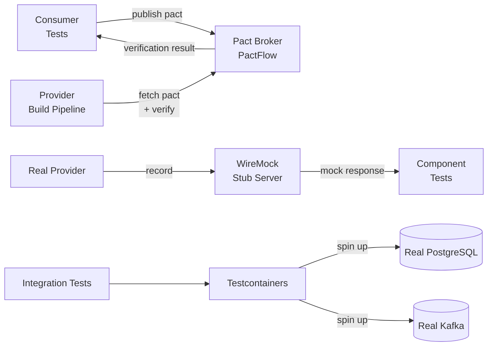

# Integration Testing

## Category

System Integration — Testing Strategy & Quality Assurance

## Context

Integration tests verify that services communicate correctly — schemas match, HTTP contracts are honoured, and messages flow between systems as expected. The two production-grade approaches are:

- **Consumer-Driven Contract Testing (Pact)**: the consumer defines what it needs from the provider; the provider verifies it without a live consumer — catching contract breaks in CI, not production.
- **Service Virtualisation (WireMock)**: replace a live dependency with a programmable fake that returns controlled responses — eliminating test environment dependencies in CI.

### Testing Pyramid for Integration

| Level | Tool | Scope | Speed | Coverage |
|-------|------|-------|-------|---------|
| Unit | Jest / Vitest | Single service logic | Fast | Business logic |
| Contract | Pact | API contract between producer/consumer | Fast | Schema compatibility |
| Component | WireMock | Service with mocked dependencies | Medium | Service behaviour |
| Integration | Docker Compose / Testcontainers | Service + real DB + broker | Slow | Data layer |
| E2E | Playwright / Cypress | Full user journey | Slowest | Happy path |

### Consumer-Driven Contract vs Provider-Driven Contract

| | Consumer-Driven Contracts | Provider-Driven (OpenAPI) |
|--|--------------------------|--------------------------|
| Who defines the contract | Consumer | Provider |
| Breaks detected | At provider publish time | At consumer integration time |
| Tool | Pact | Prism, Dredd |
| Best for | Microservices needing breaking-change protection | Public APIs with multiple consumers |

## Pros

- Pact catches breaking API changes before they reach production
- WireMock eliminates flaky tests caused by real external dependencies
- Contracts are versioned and stored in PactFlow — audit trail of compatibility
- `can-i-deploy` gate in CI prevents deployments that would break known consumers
- Testcontainers provides real DBs/brokers in CI with zero shared-state issues

## Cons

- Pact contracts must be maintained alongside code — stale contracts give false confidence
- WireMock stubs drift from reality if not regenerated from real interactions
- Contract testing does not replace integration tests — it complements them
- Setting up PactFlow (the Pact broker) adds operational overhead
- Testcontainers slow CI pipelines when services require large Docker images

## Design Diagram



## Code Sample

### TypeScript — Pact consumer contract test

```typescript
// tests/contracts/payment-consumer.pact.spec.ts
import { PactV3, MatchersV3 } from '@pact-foundation/pact';
import { like, string, decimal, fromProviderState } from '@pact-foundation/pact/src/v3/matchers';
import path from 'path';

const { like: l, string: s, decimal: d } = MatchersV3;

const provider = new PactV3({
  consumer: 'notification-service',
  provider: 'payment-service',
  dir: path.resolve(__dirname, '../pacts'),
  logLevel: 'warn',
});

describe('Payment Service contract (consumer: notification-service)', () => {
  describe('GET /v1/payments/:id', () => {
    it('returns a payment by ID', async () => {
      await provider
        .given('payment pay_001 exists')
        .uponReceiving('a request for payment pay_001')
        .withRequest({
          method: 'GET',
          path: '/v1/payments/pay_001',
          headers: { Authorization: s('Bearer token') },
        })
        .willRespondWith({
          status: 200,
          headers: { 'Content-Type': 'application/json' },
          body: {
            id: s('pay_001'),
            amount: {
              amount:   d(150.00),
              currency: s('GBP'),
            },
            status:    s('pending'),
            createdAt: s('2026-04-15T10:00:00Z'),
            // Notification service only needs these fields — extra fields are OK (lenient matching)
          },
        })
        .executeTest(async (mockServer) => {
          const response = await fetch(`${mockServer.url}/v1/payments/pay_001`, {
            headers: { Authorization: 'Bearer test-token' },
          });

          expect(response.status).toBe(200);
          const body = await response.json();
          expect(body.id).toBeDefined();
          expect(body.amount.currency).toBe('GBP');
        });
    });

    it('returns 404 when payment does not exist', async () => {
      await provider
        .given('payment nonexistent does not exist')
        .uponReceiving('a request for a nonexistent payment')
        .withRequest({
          method: 'GET',
          path: '/v1/payments/nonexistent',
          headers: { Authorization: s('Bearer token') },
        })
        .willRespondWith({
          status: 404,
          body: {
            type:   s('https://errors.example.com/not-found'),
            title:  s('Payment not found'),
            status: l(404),
          },
        })
        .executeTest(async (mockServer) => {
          const response = await fetch(`${mockServer.url}/v1/payments/nonexistent`, {
            headers: { Authorization: 'Bearer test-token' },
          });
          expect(response.status).toBe(404);
        });
    });
  });
});
```

### TypeScript — Pact provider verification

```typescript
// tests/contracts/payment-provider.pact.spec.ts
import { Verifier } from '@pact-foundation/pact';
import path from 'path';
import { startApp, stopApp } from '../helpers/app-harness';

describe('Payment Service — provider verification', () => {
  let appUrl: string;

  beforeAll(async () => {
    appUrl = await startApp();

    // Seed state for provider state handlers
  });
  afterAll(stopApp);

  it('verifies all consumer pacts', async () => {
    const verifier = new Verifier({
      provider: 'payment-service',
      providerBaseUrl: appUrl,

      // Fetch pacts from PactFlow (in production)
      pactBrokerUrl: process.env.PACT_BROKER_URL ?? 'http://localhost:9292',
      pactBrokerToken: process.env.PACT_BROKER_TOKEN,
      publishVerificationResult: process.env.CI === 'true',
      providerVersion: process.env.GIT_SHA ?? '1.0.0',

      // State handlers — set up DB fixtures per state
      stateHandlers: {
        'payment pay_001 exists': async () => {
          await seedPayment({ id: 'pay_001', amount: 150, currency: 'GBP', status: 'pending' });
        },
        'payment nonexistent does not exist': async () => {
          await deletePayment('nonexistent');
        },
      },
    });

    await verifier.verifyProvider();
  });
});

async function seedPayment(payment: object): Promise<void> { /* DB insert */ }
async function deletePayment(id: string): Promise<void> { /* DB delete */ }
```

### TypeScript — WireMock component test

```typescript
// tests/component/payment-notification.spec.ts
import { WireMock } from 'wiremock-captain';
import { IBody } from 'wiremock-captain/dist/types';

describe('NotificationService — component tests with WireMock', () => {
  let wm: WireMock;

  beforeAll(async () => {
    wm = new WireMock('http://localhost:8080');   // WireMock running in Docker
  });

  afterEach(async () => {
    await wm.clearAllExceptDefault();             // reset stubs between tests
  });

  it('sends a notification when payment is settled', async () => {
    // Stub the payment service response
    await wm.register(
      {
        method: 'GET',
        endpoint: '/v1/payments/pay_123',
      },
      {
        status: 200,
        body: {
          id: 'pay_123',
          amount: { amount: 250, currency: 'EUR' },
          status: 'settled',
          payeeName: 'Alice Smith',
        } as unknown as IBody,
      },
    );

    // Stub the email service
    await wm.register(
      { method: 'POST', endpoint: '/v1/notifications/email' },
      { status: 202 },
    );

    // Call the unit under test
    const { NotificationService } = await import('../../src/notification-service');
    const svc = new NotificationService(
      'http://localhost:8080',   // payment service → WireMock
      'http://localhost:8080',   // email service → WireMock
    );

    await svc.notifyPaymentSettled('pay_123');

    // Verify WireMock received the email notification
    const emailCalls = await wm.getRequestsForAPI('POST', '/v1/notifications/email');
    expect(emailCalls.length).toBe(1);
    expect(JSON.parse(emailCalls[0].body)).toMatchObject({
      recipient: 'Alice Smith',
      type: 'payment-settled',
    });
  });
});
```

### YAML — CI pipeline with Pact `can-i-deploy` gate

```yaml
# .github/workflows/deploy.yml
name: Deploy

on:
  push:
    branches: [main]

jobs:
  test-and-deploy:
    runs-on: ubuntu-latest
    steps:
      - uses: actions/checkout@v4

      - name: Run tests + publish consumer pacts
        run: |
          npm ci
          npm test
        env:
          PACT_BROKER_URL: ${{ secrets.PACT_BROKER_URL }}
          PACT_BROKER_TOKEN: ${{ secrets.PACT_BROKER_TOKEN }}

      - name: can-i-deploy gate
        uses: pact-foundation/pact-js-cli-action@v0.3.0
        with:
          command: can-i-deploy
          args: >
            --pacticipant notification-service
            --version ${{ github.sha }}
            --to-environment production
        env:
          PACT_BROKER_BASE_URL: ${{ secrets.PACT_BROKER_URL }}
          PACT_BROKER_TOKEN: ${{ secrets.PACT_BROKER_TOKEN }}

      - name: Deploy
        if: success()
        run: kubectl rollout restart deployment/notification-service
```

## References

- [Pact — Consumer-Driven Contract Testing](https://docs.pact.io/)
- [PactFlow — Managed Pact Broker](https://pactflow.io/docs/)
- [WireMock — API Stubbing](https://wiremock.org/docs/)
- [Testcontainers — Real dependencies in CI](https://testcontainers.com/)
- [Sven Johann — Testing Microservices (Martin Fowler blog)](https://martinfowler.com/articles/microservice-testing/)
