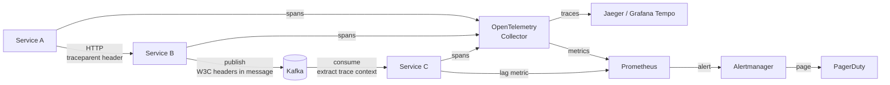

# Integration Observability

## Category

System Integration — Distributed Tracing, Monitoring & SLOs

## Context

A message entering your integration backbone may cross 5 services, 3 queues, and 2 external APIs before producing a side effect. Without observability, failures manifest as "the thing didn't happen" with no trace of where it stopped. Integration observability requires three disciplines working together: **correlation IDs** for linking logs across hops, **distributed tracing** for timing and causality, and **integration health metrics** (lag, DLQ depth, error rate) that drive SLO alerting.

### Observability Signals for Integration

| Signal | What It Measures | Tool |
|-------|----------------|------|
| **Logs** | What happened + correlation context | OpenTelemetry → Loki / Splunk |
| **Traces** | End-to-end latency and causality | OpenTelemetry → Jaeger / Tempo |
| **Metrics** | Consumer lag, DLQ depth, error rate, retry count | Prometheus + Grafana |
| **Alerts** | SLO breach, SLA violation | Alertmanager / PagerDuty |

### W3C Trace Context Headers

Every HTTP call and message must carry W3C Trace Context headers so tracing tools can stitch spans:

```
traceparent: 00-4bf92f3577b34da6a3ce929d0e0e4736-00f067aa0ba902b7-01
tracestate:  vendor1=opaqueValue
```

Format: `version-traceid-parentid-flags`

### Key Integration Metrics to Track

| Metric | Alert Threshold |
|--------|---------------|
| Consumer lag (messages behind) | > 10,000 or growing for > 5 min |
| DLQ message count | > 0 (any message in DLQ = production failure) |
| Integration error rate | > 1% per 5-minute window |
| File SLA breach | File not received by expected arrival time |
| Circuit breaker open events | Any open event triggers warning |
| Message processing time (p99) | > SLA threshold per integration |

## Pros

- Correlation IDs make it possible to find all log lines for a single business transaction across all services
- Distributed traces replace hours of log hunting with a visual timeline
- DLQ depth = 0 is a simple, actionable SLO target
- Integration metrics expose consumer lag before it becomes a user-facing problem
- OpenTelemetry is vendor-neutral — same instrumentation works with Jaeger, Tempo, Datadog, Dynatrace

## Cons

- Instrumenting every service requires code changes (middleware, interceptors)
- Trace context propagation must work through message brokers, not just HTTP calls
- High-cardinality trace data is expensive to store — sampling is necessary at scale
- Alert fatigue: too many low-quality alerts train teams to ignore them

## Design Diagram



## Code Sample

### TypeScript — OpenTelemetry instrumentation + correlation propagation

```typescript
// observability/tracing.ts — initialise OpenTelemetry (call before any other imports)
import { NodeSDK } from '@opentelemetry/sdk-node';
import { OTLPTraceExporter } from '@opentelemetry/exporter-trace-otlp-http';
import { OTLPMetricExporter } from '@opentelemetry/exporter-metrics-otlp-http';
import { PeriodicExportingMetricReader } from '@opentelemetry/sdk-metrics';
import { getNodeAutoInstrumentations } from '@opentelemetry/auto-instrumentations-node';
import { Resource } from '@opentelemetry/resources';
import { ATTR_SERVICE_NAME, ATTR_SERVICE_VERSION } from '@opentelemetry/semantic-conventions';

const sdk = new NodeSDK({
  resource: new Resource({
    [ATTR_SERVICE_NAME]:    process.env.SERVICE_NAME ?? 'payment-service',
    [ATTR_SERVICE_VERSION]: process.env.APP_VERSION  ?? '1.0.0',
  }),
  traceExporter: new OTLPTraceExporter({
    url: process.env.OTEL_EXPORTER_OTLP_ENDPOINT ?? 'http://otel-collector:4318/v1/traces',
  }),
  metricReader: new PeriodicExportingMetricReader({
    exporter: new OTLPMetricExporter({
      url: process.env.OTEL_EXPORTER_OTLP_ENDPOINT ?? 'http://otel-collector:4318/v1/metrics',
    }),
    exportIntervalMillis: 15_000,
  }),
  instrumentations: [getNodeAutoInstrumentations()],  // auto-instruments http, express, pg, etc.
});

sdk.start();
process.on('SIGTERM', () => sdk.shutdown());
```

```typescript
// observability/kafka-trace-propagator.ts
// Propagate W3C Trace Context through Kafka message headers
import { trace, context, propagation } from '@opentelemetry/api';
import { Producer, Message, Consumer, EachMessagePayload } from 'kafkajs';

// ── Producer: inject trace context into message headers ───────────────────────
export function withTraceHeaders(message: Message): Message {
  const carrier: Record<string, string> = {};
  propagation.inject(context.active(), carrier);

  return {
    ...message,
    headers: {
      ...message.headers,
      traceparent: carrier['traceparent'] ?? '',
      tracestate:  carrier['tracestate']  ?? '',
    },
  };
}

// ── Consumer: extract trace context from message headers ──────────────────────
export function extractTraceContext(
  payload: EachMessagePayload,
  handler: (payload: EachMessagePayload) => Promise<void>,
): Promise<void> {
  const { message } = payload;

  const carrier: Record<string, string> = {
    traceparent: message.headers?.traceparent?.toString() ?? '',
    tracestate:  message.headers?.tracestate?.toString()  ?? '',
  };

  const parentContext = propagation.extract(context.active(), carrier);
  const tracer = trace.getTracer('kafka-consumer');

  return context.with(parentContext, () =>
    tracer.startActiveSpan(
      `process ${payload.topic}`,
      { attributes: {
        'messaging.system':             'kafka',
        'messaging.destination':        payload.topic,
        'messaging.kafka.partition':    String(payload.partition),
        'messaging.kafka.consumer_group': process.env.KAFKA_GROUP_ID ?? 'unknown',
      }},
      async (span) => {
        try {
          await handler(payload);
          span.setStatus({ code: 0 });
        } catch (err) {
          span.recordException(err as Error);
          span.setStatus({ code: 2, message: (err as Error).message });
          throw err;
        } finally {
          span.end();
        }
      },
    ),
  );
}
```

```typescript
// observability/integration-metrics.ts
// Custom metrics for integration health monitoring
import { metrics } from '@opentelemetry/api';

const meter = metrics.getMeter('integration-metrics', '1.0.0');

// DLQ depth gauge — exported to Prometheus, alert if > 0
export const dlqDepthGauge = meter.createObservableGauge('integration.dlq.depth', {
  description: 'Number of messages in the dead-letter queue',
  unit: 'messages',
});

// Consumer lag histogram — alert if p99 > threshold
export const processingDurationHistogram = meter.createHistogram(
  'integration.message.processing_duration_ms',
  { description: 'Message processing duration', unit: 'ms' },
);

// Integration error counter
export const integrationErrorCounter = meter.createCounter('integration.errors.total', {
  description: 'Total integration errors',
});

// ── Usage in consumer ─────────────────────────────────────────────────────────
export async function processWithMetrics(
  topic: string,
  handler: () => Promise<void>,
): Promise<void> {
  const start = Date.now();
  try {
    await handler();
    processingDurationHistogram.record(Date.now() - start, {
      'messaging.destination': topic, result: 'success',
    });
  } catch (err) {
    processingDurationHistogram.record(Date.now() - start, {
      'messaging.destination': topic, result: 'error',
    });
    integrationErrorCounter.add(1, { topic, error: (err as Error).constructor.name });
    throw err;
  }
}
```

### YAML — Prometheus alerting rules for integration health

```yaml
# prometheus/integration-alerts.yaml
groups:
  - name: integration

    rules:
      # DLQ alert — any message in DLQ is a production failure
      - alert: DLQMessagePresent
        expr: integration_dlq_depth > 0
        for: 1m
        labels:
          severity: critical
        annotations:
          summary: "Messages in dead-letter queue: {{ $labels.topic }}"
          runbook: "https://wiki.internal/runbooks/dlq-remediation"

      # Consumer lag — growing lag means consumers can't keep up
      - alert: KafkaConsumerLagHigh
        expr: kafka_consumer_group_lag > 10000
        for: 5m
        labels:
          severity: warning
        annotations:
          summary: "Consumer lag {{ $value }} on {{ $labels.topic }}/{{ $labels.consumer_group }}"

      # Integration error rate
      - alert: IntegrationErrorRateHigh
        expr: |
          rate(integration_errors_total[5m]) /
          rate(integration_message_processing_duration_ms_count[5m]) > 0.01
        for: 5m
        labels:
          severity: warning
        annotations:
          summary: "Integration error rate > 1% on {{ $labels.topic }}"

      # File SLA breach — expected file not received
      - alert: InboundFileMissing
        expr: |
          time() - integration_last_file_received_timestamp{source="partner-bank"} > 3600
        labels:
          severity: critical
        annotations:
          summary: "Partner bank file not received in last 1 hour"
```

## References

- [OpenTelemetry — Getting Started (Node.js)](https://opentelemetry.io/docs/languages/js/getting-started/nodejs/)
- [W3C Trace Context Specification](https://www.w3.org/TR/trace-context/)
- [Prometheus Alerting Rules](https://prometheus.io/docs/prometheus/latest/configuration/alerting_rules/)
- [Kafka Consumer Lag Monitoring](https://www.confluent.io/blog/monitor-kafka-consumer-lag/)
- [Grafana Tempo — Distributed Tracing](https://grafana.com/docs/tempo/)
