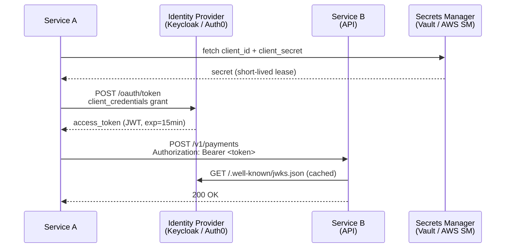

# Integration Security

## Category

System Integration — Authentication, Transport Security & Data Protection

## Context

Integration points are high-value attack surfaces: they cross network boundaries, often carry sensitive financial data, and must authenticate machine-to-machine (M2M) — without a human logging in. Security in integration spans transport encryption (mTLS), identity (OAuth2 client credentials), message integrity (signing), and secrets hygiene.

### Security Controls per Integration Style

| Integration Style | Auth | Transport | Integrity |
|------------------|------|----------|----------|
| HTTP / REST | OAuth2 CC, API key | TLS 1.2+ | HMAC-SHA256 signature header |
| Message queue | SASL/SCRAM, mTLS | TLS | Message-level signing (optional) |
| Kafka | SASL/SCRAM-SHA-512, mTLS | TLS 1.3 | Schema Registry schema validation |
| SFTP | SSH key pair (ED25519) | SSH | PGP file signing + checksum file |
| AS2 / AS4 | Certificate exchange | HTTPS | S/MIME signing + MDN receipt |
| Webhook (inbound) | HMAC-SHA256 signature | TLS | Replay protection (timestamp + nonce) |

### OAuth2 Client Credentials Flow (M2M)

```
Service A (client) → POST /oauth/token
  { grant_type: client_credentials, client_id, client_secret }
  → Access Token (JWT, short-lived: 5–15 min)

Service A → API B
  Authorization: Bearer <token>
  → API B validates token signature + scope
```

**Key rules:**
- Tokens are short-lived (≤15 min) — stolen token expires quickly
- `client_secret` is stored in a secrets manager, never in code or environment files
- One client ID per service — never shared credentials
- Use scopes to limit what each integration is allowed to do

### mTLS vs OAuth2 Token

| | OAuth2 Client Credentials | mTLS |
|--|--------------------------|------|
| Authentication | Client ID + secret → token | Certificate presented at TLS handshake |
| Rotation | Rotate secret in secrets manager | Update certificate before expiry |
| Authorisation | Scopes in token | IP/Subject CN allowlist |
| Best for | HTTP APIs, cloud services | Internal service mesh, Kafka, SFTP |
| Complexity | Low (standard OAuth2) | Medium (PKI management) |

## Pros

- OAuth2 client credentials is a well-understood, standard M2M pattern
- mTLS establishes mutual identity at the transport layer — even before any application code runs
- HMAC webhook signatures prevent replay attacks and message forging
- Short-lived tokens limit the blast radius of a stolen credential
- Secrets rotation (via Vault / AWS Secrets Manager) is automated with zero downtime
- API key hashing (bcrypt/Argon2) means a DB breach does not expose working keys

## Cons

- Certificate management for mTLS requires a PKI (cert generation, rotation, distribution)
- OAuth2 token validation on every request adds ~1ms (mitigated by local JWK cache)
- Client secrets in environment variables are a common leak vector — use a secrets manager
- HMAC replay protection requires timestamp validation with clock skew tolerance
- API keys in request logs are a common PCI compliance failure — log headers must be scrubbed

## Design Diagram



## Code Sample

### TypeScript — OAuth2 client credentials with token caching + Vault secret fetch

```typescript
// security/m2m-auth-client.ts
import { SecretsManagerClient, GetSecretValueCommand } from '@aws-sdk/client-secrets-manager';

// ── Types ─────────────────────────────────────────────────────────────────────
interface ClientCredentials {
  clientId: string;
  clientSecret: string;
}

interface TokenResponse {
  access_token: string;
  expires_in: number;     // seconds
  token_type: 'Bearer';
}

interface CachedToken {
  token: string;
  expiresAt: number;      // ms since epoch
}

// ── AWS Secrets Manager client ────────────────────────────────────────────────
async function fetchCredentials(secretArn: string): Promise<ClientCredentials> {
  const sm = new SecretsManagerClient({ region: process.env.AWS_REGION ?? 'eu-west-1' });
  const { SecretString } = await sm.send(new GetSecretValueCommand({ SecretId: secretArn }));
  if (!SecretString) throw new Error(`Empty secret: ${secretArn}`);
  return JSON.parse(SecretString) as ClientCredentials;
}

// ── OAuth2 M2M token client ───────────────────────────────────────────────────
export class M2MAuthClient {
  private cachedToken: CachedToken | null = null;
  private readonly clockSkewMs = 30_000;  // refresh 30s before expiry

  constructor(
    private readonly tokenUrl: string,
    private readonly secretArn: string,     // Never pass secret directly — read from SM
    private readonly scope: string,
  ) {}

  async getToken(): Promise<string> {
    // Return cached token if still valid
    if (this.cachedToken && Date.now() < this.cachedToken.expiresAt) {
      return this.cachedToken.token;
    }

    const { clientId, clientSecret } = await fetchCredentials(this.secretArn);

    const response = await fetch(this.tokenUrl, {
      method: 'POST',
      headers: { 'Content-Type': 'application/x-www-form-urlencoded' },
      body: new URLSearchParams({
        grant_type:    'client_credentials',
        client_id:     clientId,
        client_secret: clientSecret,         // sent over TLS only
        scope:         this.scope,
      }),
    });

    if (!response.ok) {
      throw new Error(`Token request failed: ${response.status}`);
    }

    const data = (await response.json()) as TokenResponse;

    // Cache with clock-skew buffer
    this.cachedToken = {
      token:     data.access_token,
      expiresAt: Date.now() + (data.expires_in * 1000) - this.clockSkewMs,
    };

    return this.cachedToken.token;
  }
}

// ── Axios interceptor — auto-attach bearer token to every request ─────────────
import axios from 'axios';

const authClient = new M2MAuthClient(
  process.env.TOKEN_URL    ?? 'https://auth.example.com/oauth/token',
  process.env.SECRET_ARN   ?? 'arn:aws:secretsmanager:eu-west-1:...',
  'payments:read payments:write',
);

const apiClient = axios.create({ baseURL: process.env.PAYMENT_API_URL });

apiClient.interceptors.request.use(async (config) => {
  const token = await authClient.getToken();
  config.headers.Authorization = `Bearer ${token}`;
  return config;
});
```

### TypeScript — Inbound webhook signature validation (HMAC-SHA256)

```typescript
// security/webhook-verifier.ts
import { createHmac, timingSafeEqual } from 'crypto';
import express, { Request, Response, NextFunction } from 'express';

const WEBHOOK_SECRET = process.env.WEBHOOK_SIGNING_SECRET;
if (!WEBHOOK_SECRET) throw new Error('WEBHOOK_SIGNING_SECRET is required');

const MAX_AGE_MS = 5 * 60 * 1000;   // 5-minute replay window

export function webhookSignatureMiddleware(
  req: Request,
  res: Response,
  next: NextFunction,
): void {
  const signature = req.headers['x-signature-sha256'] as string;
  const timestamp  = req.headers['x-webhook-timestamp'] as string;

  if (!signature || !timestamp) {
    res.status(401).json({ error: 'Missing signature headers' });
    return;
  }

  // Replay protection — reject if timestamp is > 5 minutes old
  const ts = parseInt(timestamp, 10);
  if (isNaN(ts) || Date.now() - ts > MAX_AGE_MS) {
    res.status(401).json({ error: 'Webhook timestamp too old (replay attack protection)' });
    return;
  }

  // Compute expected signature: HMAC-SHA256 over "timestamp.rawBody"
  // Raw body must be preserved (use express.raw() before this middleware)
  const rawBody = (req as Request & { rawBody?: Buffer }).rawBody;
  if (!rawBody) {
    res.status(400).json({ error: 'Raw body not available' });
    return;
  }

  const payload  = `${timestamp}.${rawBody.toString('utf8')}`;
  const expected = createHmac('sha256', WEBHOOK_SECRET)
    .update(payload)
    .digest('hex');

  const receivedHex = signature.startsWith('sha256=')
    ? signature.slice(7)
    : signature;

  // Constant-time comparison prevents timing attacks
  const receivedBuf = Buffer.from(receivedHex, 'hex');
  const expectedBuf = Buffer.from(expected,    'hex');

  if (receivedBuf.length !== expectedBuf.length || !timingSafeEqual(receivedBuf, expectedBuf)) {
    res.status(401).json({ error: 'Invalid webhook signature' });
    return;
  }

  next();
}

// Express app — preserve raw body for signature verification
const app = express();
app.use(express.raw({
  type: 'application/json',
  verify: (req, _res, buf) => {
    (req as Request & { rawBody?: Buffer }).rawBody = buf;
  },
}));
app.use(express.json());     // parse after raw capture

app.post('/webhooks/payment', webhookSignatureMiddleware, (req: Request, res: Response) => {
  console.log('[webhook] verified payload:', req.body);
  res.status(200).json({ received: true });
});
```

### YAML — Kafka SASL/TLS configuration

```yaml
# kafka/client-config.yml
bootstrap.servers: kafka-broker-1:9093,kafka-broker-2:9093,kafka-broker-3:9093
security.protocol: SASL_SSL

# TLS
ssl.ca.location: /etc/kafka/certs/ca.crt
ssl.endpoint.identification.algorithm: https    # validate broker hostname

# SASL SCRAM-SHA-512 — credentials stored in Kubernetes secret
sasl.mechanism: SCRAM-SHA-512
sasl.username: ${KAFKA_USERNAME}                 # injected from k8s secret
sasl.password: ${KAFKA_PASSWORD}                 # injected from k8s secret

# Producer idempotency (required for exactly-once)
enable.idempotence: true
acks: all

# Consumer
group.id: payment-service
auto.offset.reset: earliest
enable.auto.commit: false                        # manual commit after processing
```

### Terraform — Automated secret rotation with AWS Secrets Manager

```hcl
# terraform/secrets-rotation.tf
resource "aws_secretsmanager_secret" "payment_api_credentials" {
  name                    = "payment-service/api-credentials"
  recovery_window_in_days = 7

  # Automatic rotation every 30 days
}

resource "aws_secretsmanager_secret_rotation" "payment_api_credentials" {
  secret_id           = aws_secretsmanager_secret.payment_api_credentials.id
  rotation_lambda_arn = aws_lambda_function.secret_rotator.arn

  rotation_rules {
    automatically_after_days = 30
  }
}

# Lambda that rotates the client secret in the IdP and updates Secrets Manager
resource "aws_lambda_function" "secret_rotator" {
  function_name = "payment-api-credentials-rotator"
  runtime       = "nodejs22.x"
  handler       = "dist/rotator.handler"
  role          = aws_iam_role.secret_rotator.arn

  environment {
    variables = {
      IDP_URL    = var.idp_url
      CLIENT_ID  = var.client_id
    }
  }
}
```

## References

- [OAuth 2.0 Client Credentials Grant (RFC 6749)](https://datatracker.ietf.org/doc/html/rfc6749#section-4.4)
- [mTLS in Envoy / Istio](https://istio.io/latest/docs/concepts/security/#mutual-tls-authentication)
- [AWS Secrets Manager — Automatic Rotation](https://docs.aws.amazon.com/secretsmanager/latest/userguide/rotating-secrets.html)
- [Stripe — Webhook Signature Verification](https://stripe.com/docs/webhooks/signatures)
- [OWASP — API Security Top 10](https://owasp.org/www-project-api-security/)
- [Kafka — SSL/SASL Authentication](https://kafka.apache.org/documentation/#security)
